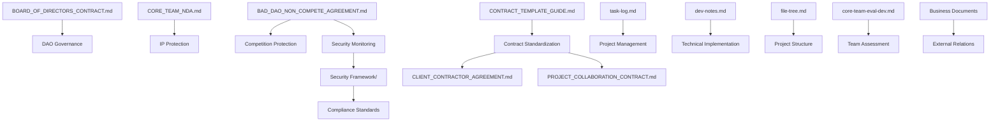

# 🌲 BAD DAO Project Structure

## 📁 Project Organization

```
BAD_DAO/
├── 📄 Legal Documents/
│   ├── BOARD_OF_DIRECTORS_CONTRACT.md         # Governance structure with 51/49 split
│   ├── CORE_TEAM_NDA.md                       # Confidentiality with $250k penalty
│   ├── BAD_DAO_NON_COMPETE_AGREEMENT.md       # Protection against competition + security monitoring
│   ├── CONTRACT_TEMPLATE_GUIDE.md             # Standardized contract formatting
│   ├── CLIENT_CONTRACTOR_AGREEMENT.md         # External collaboration framework
│   └── PROJECT_COLLABORATION_CONTRACT.md      # Partnership framework
│
├── 📄 Core Documentation/
│   ├── task-log.md                            # Task tracking and progress
│   ├── dev-notes.md                           # Technical implementation details
│   └── file-tree.md                           # Project structure (this file)
│
├── 📄 Security Framework/                     # New directory for security implementation
│   ├── tracking-system-spec.md                # Specification for IP tracking system (planned)
│   ├── security-audit-framework.md            # Audit protocols and schedule (planned)
│   ├── compliance-documentation.md            # Regulatory compliance verification (planned)
│   └── encryption-system-design.md            # Remote security enforcement design (planned)
│
├── 📄 Evaluation System/
│   ├── CORE-TEAM-EVAL_v1_0_0/                 # Core team evaluation implementation
│   └── core-team-eval-dev.md                  # Evaluation system documentation
│
├── 📄 Templates/
│   ├── AI-DEV-TEMPLATES/                      # AI development templates
│   └── _TEMPLATES/                            # General project templates
│
├── 📄 Automation/
│   └── Cursor-AI-x-GitHub-Project-Automation-Toolkit/  # Automation tools
│
└── 📄 Business Documents/
    ├── build-a-dao-proposals/                 # Proposals for DAO building
    ├── BrickLabs_FullPartnershipAgreement.md  # Full partnership agreement
    ├── BrickLabs_BuildaDAO_partnership.md     # Partnership details
    ├── 2-pager.md                             # Short project description
    ├── dao-signing-delegation-voting.md       # DAO signing and voting protocols
    ├── Build a DAO - 2-pager.md               # Project brief
    └── Build a DAO - Business Plan.md         # Business planning document
```

## 📊 Document Metrics

| Document Category | Count | Total Size (KB) | Avg. Size (KB) |
|-------------------|-------|-----------------|----------------|
| Legal Documents | 6 | 121 | 20.2 |
| Core Documentation | 3 | 33 | 11.0 |
| Security Framework | 0 (4 planned) | 0 | 0 |
| Evaluation System | 2 | 10+ | 5.0+ |
| Business Documents | 7 | 63 | 9.0 |

## 🔄 Document Relationships



## 📦 Component Architecture

### Legal Framework
- **Governance Layer**: Board structure, voting mechanisms, decision protocols
- **Confidentiality Layer**: Information protection, breach penalties, enforcement
- **Competition Layer**: Non-compete provisions, exit procedures, violation handling
- **Security Layer**: Tracking, monitoring, auditing, and enforcement mechanisms
- **Standardization Layer**: Template systems, formatting rules, integration specs

### Security Framework
- **Tracking Layer**: Watermarking, fingerprinting, metadata collection
- **Monitoring Layer**: Access monitoring, behavioral analytics, anomaly detection
- **Compliance Layer**: Regulatory framework adherence, HIPAA, Ocean, GOV/DOD standards
- **Enforcement Layer**: Remote security actions, selective encryption, forensics

### Core Documentation
- **Task Tracking**: Progress monitoring, completion verification, dependency management
- **Technical Details**: Implementation decisions, system architecture, configuration
- **Project Structure**: File organization, relationships, metrics tracking

### Evaluation System
- **Assessment Framework**: 3D interactive system for team evaluation
- **Game Mechanics**: Mini-games for skill assessment, engagement mechanisms
- **Data Collection**: Performance metrics, progress tracking, skill mapping

## 🔗 Integration Points

| Component | Integrates With | Purpose |
|-----------|-----------------|---------|
| Legal Framework | Governance System | Decision protocols and enforcement |
| Legal Framework | Member Management | NDA and non-compete enforcement |
| Security Framework | All Work Products | IP protection and tracking |
| Security Framework | Legal Framework | Compliance enforcement |
| Evaluation System | Team Structure | Skill assessment and role assignment |
| Documentation | Development Process | Process tracking and improvement |
| Templates | All Components | Standardization and efficiency |

## 📈 Growth Metrics

| Component | Current Size | Growth Rate | Projected Size (EOY) |
|-----------|--------------|-------------|----------------------|
| Legal Documents | 6 docs, 121KB | +2 docs/month | 30 docs, ~600KB |
| Core Documentation | 3 docs, 33KB | +10KB/month | 3+ docs, ~150KB |
| Security Framework | 0 docs (planned) | +1 doc/month | 12 docs, ~240KB |
| Evaluation System | 2 components | +1 component/quarter | 6 components |
| Business Documents | 7 docs, 63KB | +1 doc/month | 19 docs, ~200KB |

---

*Last updated: [Current Date]* 