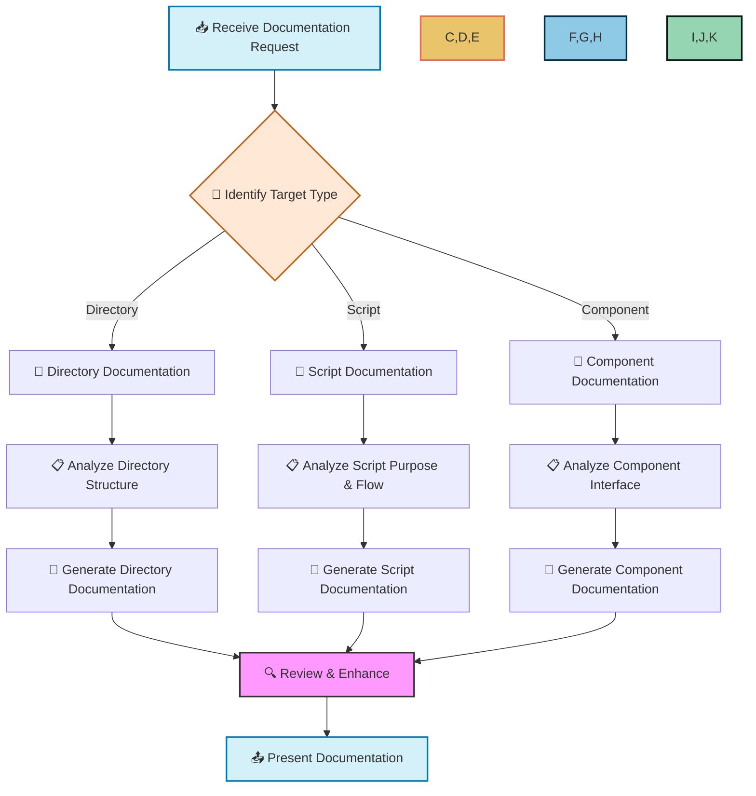
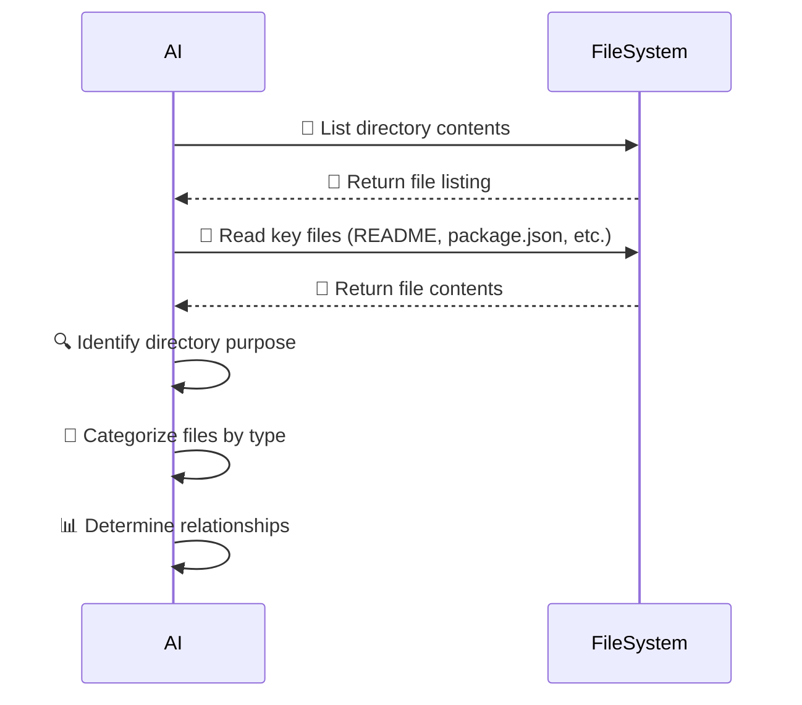
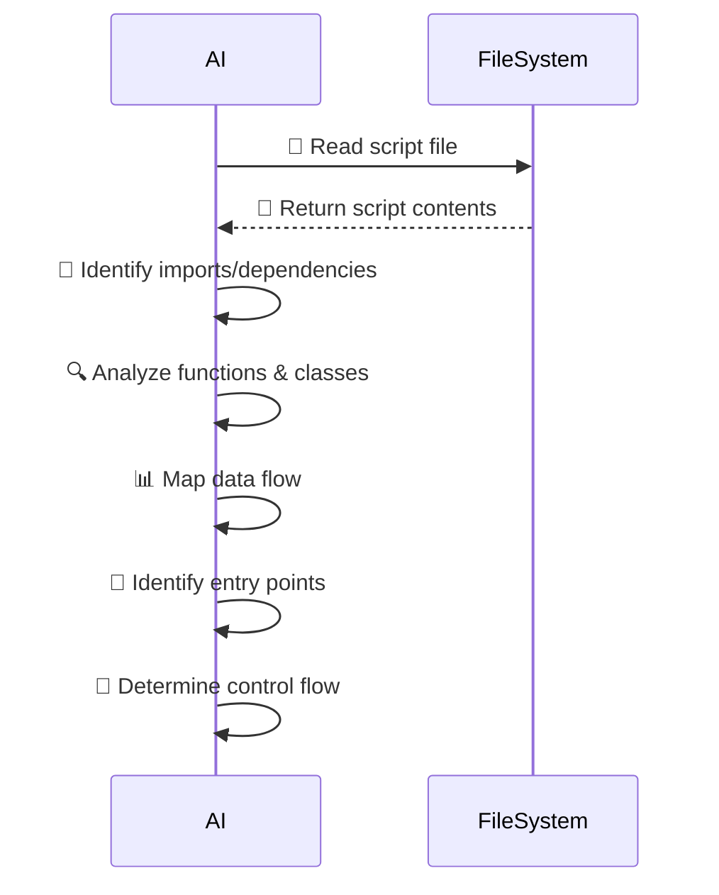
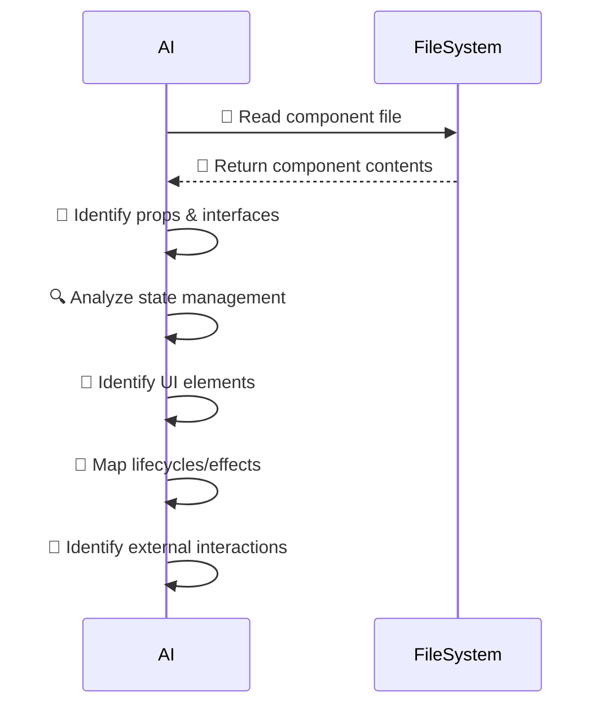
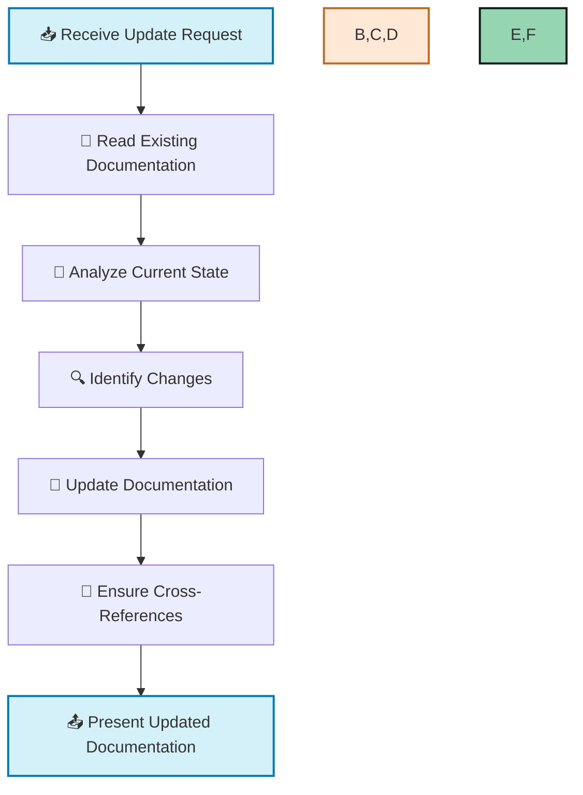
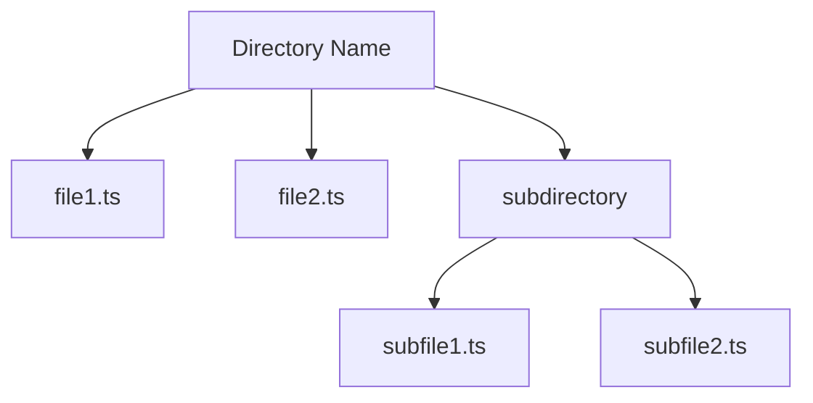
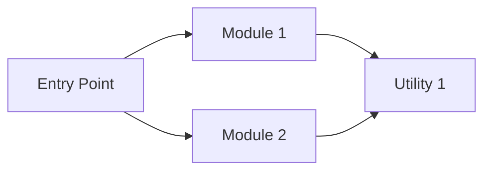
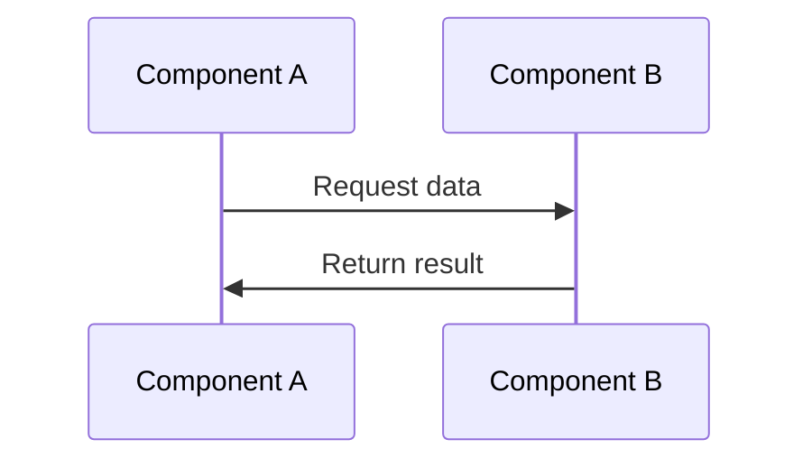
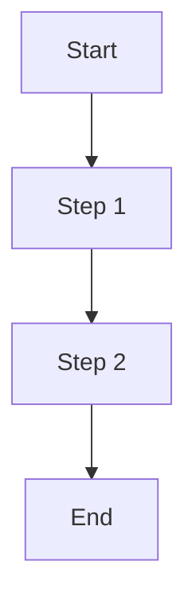

# 🤖 AI Documentation Workflow

> Guide for AI assistant to generate and update documentation following project standards

## 📑 Table of Contents

- [🎯 Purpose](#-purpose)
- [📋 Documentation Request Types](#-documentation-request-types)
- [🔄 Documentation Workflow](#-documentation-workflow)
- [📁 Directory Documentation](#-directory-documentation)
- [📜 Script Documentation](#-script-documentation)
- [🧩 Component Documentation](#-component-documentation)
- [🔄 Update Workflow](#-update-workflow)
- [📊 Documentation Templates](#-documentation-templates)
- [📝 Dev Notes Format](#-dev-notes-format)
- [🔗 Cross-References](#-cross-references)

## 🎯 Purpose [⬆️](#-table-of-contents)

This document provides a standardized workflow for the AI assistant to create and update documentation for project files and directories. When requested to "add documentation" or "update documentation" for any file or folder, follow this process to ensure consistency and completeness.

All documentation should adhere to the standards defined in [document-formatting-standards.md](./document-formatting-standards.md).

## 📋 Documentation Request Types [⬆️](#-table-of-contents)

Handle the following documentation request types:

1. **Create Documentation**: Generate new documentation for a file or directory
2. **Update Documentation**: Modify existing documentation to reflect current state
3. **Dev Notes**: Create or update developer notes for understanding implementation details
4. **README Updates**: Add or update information in README.md files

## 🔄 Documentation Workflow [⬆️](#-table-of-contents)



## 📁 Directory Documentation [⬆️](#-table-of-contents)

When documenting a directory:

### 1. 📋 Analyze Directory Structure



1. List all files and subdirectories
2. Identify entry points and key files
3. Analyze package.json/configuration files (if present)
4. Determine the directory's purpose and responsibilities
5. Identify dependencies and relationships

### 2. 📊 Generate Documentation [⬆️](#-table-of-contents)

Create a `README.md` in the directory with:

1. **📘 Directory Name & Purpose**: Brief description of the directory's role
2. **📑 Contents Overview**: Summary of what's contained and how it's organized
3. **🔗 Key Files**: List of the most important files with descriptions
4. **📊 Structure Diagram**: Visual representation of the directory structure
5. **🔄 Workflows**: Common usage patterns or workflows
6. **📌 Usage Examples**: How to use the components/scripts in this directory
7. **🔗 Dependencies**: External dependencies and relationships

For detailed internal documentation, create a `dev-notes.md` file.

## 📜 Script Documentation [⬆️](#-table-of-contents)

When documenting a script:

### 1. 📋 Analyze Script [⬆️](#-table-of-contents)



1. Identify the script's purpose and main functionality
2. List imports and dependencies
3. Identify main functions, classes, and their purposes
4. Analyze data flow and control flow
5. Identify inputs, outputs, and side effects
6. Note any command-line interfaces or API endpoints

### 2. 📝 Generate Documentation [⬆️](#-table-of-contents)

Create or update header documentation in the script file:

```typescript
/**
 * 📄 Script Name
 * 
 * 🎯 Purpose: Brief description of what this script does
 * 
 * 📥 Inputs:
 * - Input 1: Description
 * - Input 2: Description
 * 
 * 📤 Outputs:
 * - Output 1: Description
 * - Output 2: Description
 * 
 * 🔄 Usage:
 * ```bash
 * # Example command
 * node script.js --option value
 * ```
 * 
 * 🧩 Dependencies:
 * - Dependency 1: Purpose
 * - Dependency 2: Purpose
 * 
 * 🔗 Related Files:
 * - File 1: Relationship
 * - File 2: Relationship
 */
```

For TypeScript CLI scripts, create detailed help text and ensure proper error handling.

Additionally, create a section in the directory's `dev-notes.md` for the script.

## 🧩 Component Documentation [⬆️](#-table-of-contents)

When documenting a component:

### 1. 📋 Analyze Component [⬆️](#-table-of-contents)



1. Identify the component's purpose and functionality
2. List props and their types
3. Analyze state management
4. Identify UI elements and structure
5. Note lifecycle methods or effects
6. Identify external interactions (API calls, events)

### 2. 📝 Generate Documentation [⬆️](#-table-of-contents)

Create or update header documentation in the component file:

```typescript
/**
 * 🧩 ComponentName
 * 
 * 🎯 Purpose: Brief description of what this component does
 * 
 * 📥 Props:
 * @param {Type} propName - Description
 * @param {Type} propName - Description
 * 
 * 📊 State:
 * - stateName: Description and purpose
 * 
 * 🔄 Lifecycle/Effects:
 * - Effect 1: Description and dependencies
 * 
 * 📌 Example:
 * ```jsx
 * <ComponentName prop1="value" prop2={value} />
 * ```
 * 
 * 🧩 Sub-Components:
 * - SubComponent1: Purpose
 * - SubComponent2: Purpose
 * 
 * 🔗 Related Components:
 * - Component1: Relationship
 * - Component2: Relationship
 */
```

Additionally, create a section in the directory's `dev-notes.md` for the component.

## 🔄 Update Workflow [⬆️](#-table-of-contents)

When updating existing documentation:



1. Read the existing documentation
2. Analyze the current state of the code or directory
3. Identify differences between documentation and current state
4. Update documentation to reflect current state
5. Ensure all cross-references remain valid
6. Format according to standards in document-formatting-standards.md

## 📊 Documentation Templates [⬆️](#-table-of-contents)

### 📁 Directory README.md Template [⬆️](#-table-of-contents)

```markdown
# 📁 Directory Name

> Brief description of the directory's purpose

## 📑 Contents

- 📄 [file1.ts](./file1.ts) - Description of file1
- 📄 [file2.ts](./file2.ts) - Description of file2
- 📁 [subdirectory](./subdirectory/) - Description of subdirectory

## 🎯 Purpose

Detailed explanation of the directory's purpose and role in the project.

## 🔗 Key Files

- **📄 Entry Point**: [mainFile.ts](./mainFile.ts)
- **📄 Configuration**: [config.ts](./config.ts)
- **📄 Types/Interfaces**: [types.ts](./types.ts)

## 📊 Structure



## 🚀 Usage

```typescript
// Example of how to use the components or scripts in this directory
import { Component } from './file1';

const instance = new Component();
instance.doSomething();
```

---

Made with Power, Love, and AI •  ⚡️❤️🤖 •  POWERBRIDGE.AI
```

### 📄 dev-notes.md Template [⬆️](#-table-of-contents)

```markdown
# 📝 Developer Notes: Directory Name

> Internal documentation for developers working with this module

## 📑 Table of Contents

- [🏗️ Architecture](#-architecture)
- [📄 Key Files](#-key-files)
- [🔄 Workflows](#-workflows)
- [📝 Implementation Details](#-implementation-details)
- [🔗 Dependencies](#-dependencies)
- [🧪 Testing](#-testing)
- [📌 Known Issues](#-known-issues)

## 🏗️ Architecture [⬆️](#-table-of-contents)

Detailed explanation of the architecture with diagrams.



## 📄 Key Files [⬆️](#-table-of-contents)

### 📜 file1.ts [⬆️](#-table-of-contents)

Purpose: Handles X functionality

Key functions:
- `function1()`: Description
- `function2()`: Description

Implementation notes:
- Note 1
- Note 2

### 📜 file2.ts [⬆️](#-table-of-contents)

Purpose: Manages Y data

Key classes:
- `Class1`: Description
- `Class2`: Description

Implementation notes:
- Note 1
- Note 2

## 🔄 Workflows [⬆️](#-table-of-contents)

### 🔄 Workflow 1 [⬆️](#-table-of-contents)



Description of workflow 1.

### 🔄 Workflow 2 [⬆️](#-table-of-contents)

Description of workflow 2.

## 📝 Implementation Details [⬆️](#-table-of-contents)

Detailed technical notes about implementation choices, algorithms, and patterns.

## 🔗 Dependencies [⬆️](#-table-of-contents)

- **External Package 1**: Purpose and usage
- **External Package 2**: Purpose and usage
- **Internal Module 1**: Relationship and dependencies

## 🧪 Testing [⬆️](#-table-of-contents)

Information about testing approach, test coverage, and important test cases.

## 📌 Known Issues [⬆️](#-table-of-contents)

- Issue 1: Description and potential workarounds
- Issue 2: Description and potential workarounds

---

Made with Power, Love, and AI •  ⚡️❤️🤖 •  POWERBRIDGE.AI
```

## 📝 Dev Notes Format [⬆️](#-table-of-contents)

For each script or component, include a section in the directory's `dev-notes.md`:

```markdown
### 📜 scriptName.ts [⬆️](#-table-of-contents)

**🎯 Purpose**: Brief description

**📥 Inputs**:
- Input 1: Description
- Input 2: Description

**📤 Outputs**:
- Output 1: Description
- Output 2: Description

**🔄 Flow**:


**📝 Implementation Notes**:
- Note 1
- Note 2

**🚧 Technical Debt/TODOs**:
- TODO 1
- TODO 2

**🔗 Related Files**:
- File 1: Relationship
- File 2: Relationship
```

## 🔗 Cross-References [⬆️](#-table-of-contents)

Maintain consistency by:

1. Ensuring all file references use relative links
2. Updating related documentation when a file is updated
3. Maintaining a project-wide file relationship graph
4. Referencing related files in each document

When a file references or is referenced by another file, ensure both documents reflect this relationship.

---

Made with Power, Love, and AI •  ⚡️❤️🤖 •  POWERBRIDGE.AI

---

Made with Power, Love, and AI •  ⚡️❤️🤖 •  POWERBRIDGE.AI