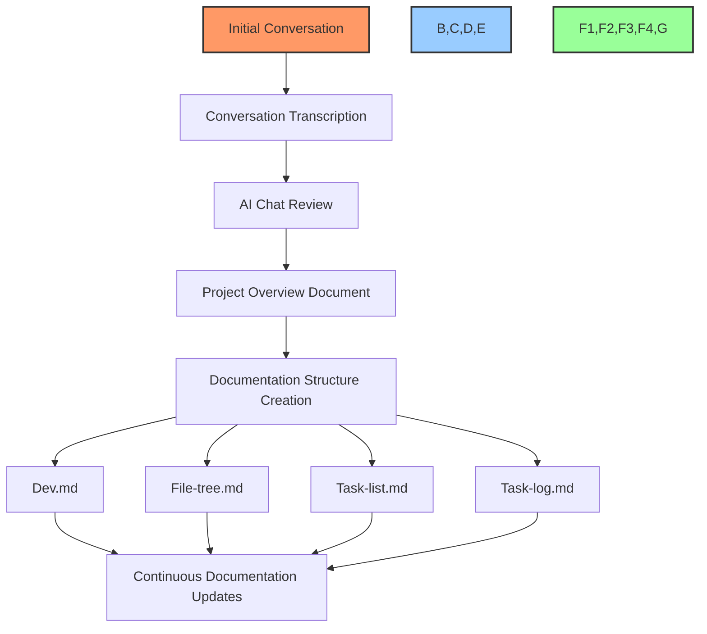

# AI-Enhanced Documentation Workflow Template

## 🎯 Purpose

This document serves as a template and guide for the standardized process of using AI to transform conversations into structured project documentation. Follow this workflow to ensure consistency, thoroughness, and efficiency across all projects.

## 📋 Workflow Overview



## 📝 Step-by-Step Process

### Phase 1: Information Gathering

#### Step 1: Initial Conversation
- Conduct a detailed conversation about the project
- Include stakeholders, developers, and relevant team members
- Cover project goals, requirements, constraints, and timeline
- Discuss technical approach and implementation details
- Explore potential challenges and solutions
- Consider business objectives and success metrics

#### Step 2: Conversation Transcription
- Record the conversation (with permission)
- Transcribe the conversation verbatim
- Preserve all ideas, concerns, and discussion points
- Maintain speaker identification where relevant
- Save the transcription as a raw text file

### Phase 2: AI Processing

#### Step 3: Initial AI Analysis (Chat Review)
- Submit the transcription to ChatGPT (4.0 or 4 Reasoning)
- Use this prompt template:

```
I'm sharing a transcription of a conversation about a project. Please:
1. Summarize the main points of this conversation
2. Identify the core project objectives
3. List key features or components discussed
4. Note any technical requirements mentioned
5. Highlight any unresolved questions or areas needing clarification
6. Organize your response into clear sections with bullet points

Here's the conversation:
[PASTE TRANSCRIPTION HERE]
```

#### Step 4: Expanded Project Overview
- Submit the AI's summary for further expansion with this prompt:

```
Based on this summary, please:
1. Derive comprehensive project goals and objectives
2. Identify specific tasks and subtasks that were discussed
3. Suggest any important aspects that may have been overlooked
4. Propose a high-level timeline if none was discussed
5. Structure this into a formal project overview document with:
   - Executive summary
   - Project scope
   - Core objectives
   - Key deliverables
   - Technical approach
   - Resource requirements
   - Risk assessment
   - Timeline
   - Success metrics

Assume the project is fully funded and prioritize completion speed unless otherwise specified.
```

### Phase 3: Documentation Creation

#### Step 5: Core Documentation Structure
- Create a dedicated project folder with the following structure:

```
project_name/
├── dev/
│   ├── dev.md
│   ├── file-tree.md
│   ├── task-list.md
│   └── task-log.md
├── README.md
└── project-overview.md
```

#### Step 6: Generate Documentation Templates
- Use AI to create initial versions of each document with these prompts:

##### For dev.md:
```
Please create a detailed dev.md document for this project that includes:
1. System architecture overview
2. Component relationships and interactions
3. Implementation status (using emoji indicators)
4. Technical specifications for each component
5. Database schema (if applicable)
6. API endpoints (if applicable)
7. Performance requirements
8. Technical risks and mitigation strategies
9. Development workflows
10. Testing requirements

Use the following mermaid diagrams:
- Component architecture diagram
- Data flow diagram
- Process workflow diagram

Format this as a professional markdown document with clear headings, code blocks, and emoji indicators for status (🔴 Not Started, 🟡 In Progress, 🟢 Completed, ⭕️ Blocked, 🔵 Testing, ✅ Verified).
```

##### For file-tree.md:
```
Please create a file-tree.md document that outlines:
1. The complete directory structure for this project
2. Brief descriptions of each file and directory's purpose
3. Status indicators for implementation (✅ Completed, 🟡 In Progress, 🔴 Not Started)
4. Component relationships and dependencies
5. File groupings by feature or functionality
6. Implementation status metrics
7. Size metrics (where applicable)
8. Feature mapping to files

Format this as a codeblock for the directory structure and use markdown for explanations and status.
```

##### For task-list.md:
```
Based on the project overview, please create a comprehensive task-list.md that:
1. Breaks down all work into clear, actionable tasks
2. Organizes tasks by phase or component
3. Includes detailed acceptance criteria for each task
4. Assigns priority levels (P0-P3) to each task
5. Estimates complexity or effort (1-5) for each task
6. Identifies dependencies between tasks
7. Tags tasks by type (frontend, backend, documentation, etc.)
8. Includes task IDs (e.g. PROJ-001)

Format this as a markdown document with tables, bullet points, and clear organization.
```

##### For task-log.md:
```
Please create a starter task-log.md template that:
1. Includes sections for daily progress updates
2. Has templates for task progress, completion summaries, and technical metrics
3. Includes status indicators for each task
4. Provides sections for risk management
5. Includes performance tracking metrics
6. Has clear cross-references to other documentation files
7. Includes review notes sections
8. Provides structure for next action planning

Use standardized status indicators (🔴 Not Started, 🟡 In Progress, 🟢 Completed, ⭕️ Blocked, 🔵 Testing, ✅ Verified) and include template sections that can be copied and filled in for each update.
```

### Phase 4: Documentation Updates and Maintenance

#### Step 7: Documentation Update Workflow
- Update documentation files in this specific order:
  1. First update `file-tree.md` with structural changes
  2. Then update `dev.md` with technical details
  3. Finally update `task-log.md` with progress information

- Use these checklist templates for updates:

##### For file-tree.md updates:
- [ ] Added new files and directories
- [ ] Updated status indicators
- [ ] Updated component relationships
- [ ] Verified accuracy of structure
- [ ] Updated implementation metrics
- [ ] Added new feature mappings
- [ ] Cross-referenced with other documentation

##### For dev.md updates:
- [ ] Added technical specifications for new components
- [ ] Updated implementation status
- [ ] Refined architecture diagrams
- [ ] Added/updated API documentation
- [ ] Added/updated database schema
- [ ] Documented technical decisions
- [ ] Updated performance metrics
- [ ] Documented challenges and solutions

##### For task-list.md updates:
- [ ] Added new tasks
- [ ] Updated existing task statuses
- [ ] Refined acceptance criteria
- [ ] Updated priority levels
- [ ] Re-evaluated dependencies
- [ ] Added detailed subtasks
- [ ] Aligned with current project scope
- [ ] Cross-referenced with other docs

##### For task-log.md updates:
- [ ] Added daily progress updates
- [ ] Documented completed tasks
- [ ] Updated implementation metrics
- [ ] Documented technical challenges
- [ ] Updated risk assessments
- [ ] Recorded performance metrics
- [ ] Added next steps and action items
- [ ] Included review notes

## 📊 Standard Status Indicators

Use these standardized status indicators consistently across all documentation:

- 🔴 **Not Started** - Task is defined but work hasn't begun
- 🟡 **In Progress** - Task is currently being implemented
- 🟢 **Completed** - Implementation is finished but not verified
- ⭕️ **Blocked** - Task cannot proceed due to dependencies or issues
- 🔵 **Testing** - Implementation is complete and being tested
- ✅ **Verified** - Task is completed, tested and verified

## 📑 Documentation Templates

### Template 1: Task Progress Update

```markdown
## Task Progress - [Date]

### Current Implementation
🎯 Task: [Task ID] - [Task Name]
📊 Progress: [Percentage]

#### Changes Made
- [Status] [Component]
- [Description of changes]

#### Technical Metrics
- [Metric]: [Value]
- [Metric]: [Value]

#### Next Steps
1. [Next task/action]
2. [Next task/action]
3. [Next task/action]

See file-tree.md Section X.Y for component structure
See dev.md Section X.Y for implementation details
```

### Template 2: Implementation Notes

```markdown
## Implementation Notes - [Date]

### [Component] Enhancement
✨ New Features:
- [Feature name]
  * [Implementation details]
  * [Technical decisions]
  * [Performance characteristics]

🔧 Configuration:
```json
{
    "setting": "value",
    "another_setting": "value"
}
```

📊 Performance Impact:
- Before: [Baseline metrics]
- After: [New metrics]
- Improvement: [Percentage]
```

### Template 3: Task Completion Summary

```markdown
## Task Completion Summary - [Date]

### Task Overview
🎯 Task: [Task ID] - [Task Name]
📂 Files Modified:
- `[path]` - [summary of changes]
- `[path]` - [summary of changes]

### Implementation Details
✨ Changes Made:
- [Detailed description of changes]
- [Technical approach]
- [Challenges and solutions]

### Testing & Commands
✅ Tests:
- [Test results]
- [Coverage metrics]
- [Performance metrics]

🖥️ Commands:
```bash
[commands used]
```

### Project Impact
🎯 Purpose:
- [How this impacts the project]
- [Benefits delivered]
- [Goals achieved]

### Next Steps
➡️ Follow-up:
- [Related task IDs]
- [Future enhancements]
- [Documentation updates needed]
```

## 🔄 Cross-Referencing System

Maintain clear cross-references between documentation files:

1. **Task Reference Format**
   - In `task-log.md`: `[PROJ-123] - Task Name`
   - In `dev.md`: `Implementation for [PROJ-123] - Task Name`
   - In `file-tree.md`: `Files for [PROJ-123] - Task Name`

2. **Implementation Reference Format**
   - In `task-log.md`: `See dev.md Section X.Y for implementation details`
   - In `file-tree.md`: `See dev.md Section X.Y for implementation details`
   - In `dev.md`: `Implementation for task-log.md task [PROJ-123]`

3. **Structure Reference Format**
   - In `task-log.md`: `See file-tree.md Section X.Y for component structure`
   - In `dev.md`: `See file-tree.md Section X.Y for component layout`
   - In `file-tree.md`: `Components implementing task-log.md task [PROJ-123]`

## ⚙️ AI Prompt Templates for Documentation Updates

### Task Log Update Prompt

```
Please update the task-log.md file with this new progress:

Task ID: [ID]
Task Name: [Name]
Status: [Status]
Progress: [Percentage]
Changes made:
[List changes]

Technical metrics:
[List metrics]

Current blockers:
[List blockers if any]

Next steps:
[List next steps]

Use the standard Task Progress template and maintain cross-references to dev.md and file-tree.md.
```

### Dev Notes Update Prompt

```
Please update the dev.md file with these new technical details:

Component: [Component Name]
New features:
[List features]

Implementation details:
[Technical details]

Performance metrics:
[Metrics]

Update the implementation status indicators accordingly and ensure all sections are properly cross-referenced with task-log.md and file-tree.md.
```

### File Tree Update Prompt

```
Please update the file-tree.md with these new files and components:

New files:
[List new files with paths]

Updated components:
[List updated components]

Implementation status:
[Status updates]

Ensure all sections are properly cross-referenced with dev.md and task-log.md.
```

## 📝 Workflow Automation Tips

1. **Use Standard Commands**
   - Create aliases or scripts for common documentation updates
   - Set up automated file generation for repetitive sections
   - Use templating tools to maintain consistency

2. **Regular Documentation Reviews**
   - Schedule weekly documentation audits
   - Verify cross-references are accurate
   - Ensure status indicators are up-to-date
   - Check that all sections are properly formatted

3. **Continuous Integration**
   - Add documentation verification to CI pipelines
   - Automate status updates based on code changes
   - Generate metrics reports automatically

4. **AI-Assisted Updates**
   - Use AI to suggest documentation updates based on code changes
   - Implement automated prompts for routine updates
   - Leverage AI for formatting and consistency checks

## 🔍 Documentation Quality Checklist

Before considering documentation complete, verify:

- [ ] All core files are created and populated
- [ ] Implementation status indicators are accurate
- [ ] Cross-references between documents are correct
- [ ] Technical details are comprehensive and clear
- [ ] Task statuses reflect actual project state
- [ ] Code examples are properly formatted
- [ ] Performance metrics are documented
- [ ] Risk assessments are up-to-date
- [ ] Next steps are clearly identified
- [ ] All diagrams are accurate and readable

## 🚀 Getting Started

To implement this workflow on a new project:

1. Copy this entire template directory to your new project
2. Conduct initial project conversation and transcribe it
3. Follow Phase 2 to process with AI
4. Create documentation structure following Phase 3
5. Begin implementing and updating according to Phase 4

Remember: Always update documentation in the correct order (file-tree → dev → task-log) to maintain consistency and accuracy across all files.

---

Made with Power, Love, and AI •  ⚡️❤️🤖 •  POWERBRIDGE.AI