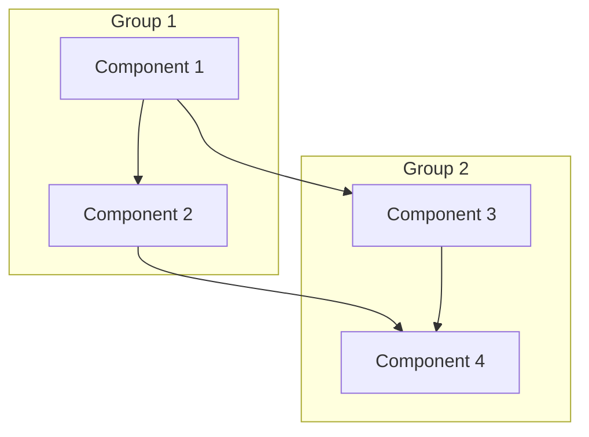
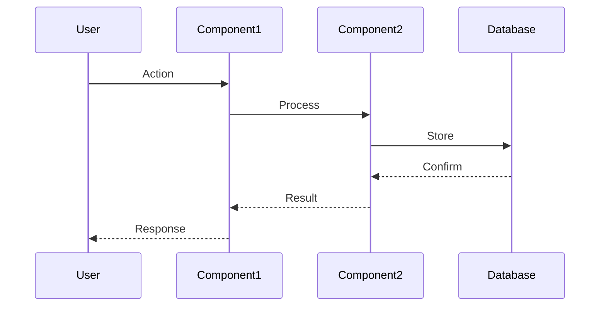

# Core Documentation Templates

This file contains copy-paste ready templates for the core documentation files in our standardized workflow.

## Table of Contents
- [Project Overview Template](#project-overview-template)
- [Dev.md Template](#devmd-template)
- [File-tree.md Template](#file-treemd-template)
- [Task-list.md Template](#task-listmd-template)
- [Task-log.md Template](#task-logmd-template)

## Project Overview Template

```markdown
# Project Name - Overview

## Executive Summary

[Provide a concise 2-3 paragraph summary of the project, its purpose, and its value proposition.]

## Project Scope

[Define what is included in and excluded from the project. Be specific about boundaries.]

### In Scope
- [Item 1]
- [Item 2]
- [Item 3]

### Out of Scope
- [Item 1]
- [Item 2]
- [Item 3]

## Core Objectives

1. [Primary Objective]: [Description]
2. [Secondary Objective]: [Description]
3. [Tertiary Objective]: [Description]

## Key Deliverables

1. [Deliverable 1]
   - [Description]
   - [Acceptance criteria]

2. [Deliverable 2]
   - [Description]
   - [Acceptance criteria]

3. [Deliverable 3]
   - [Description]
   - [Acceptance criteria]

## Technical Approach

[Describe the high-level technical approach, methodologies, frameworks, and technologies to be used.]

### Technology Stack
- **Frontend**: [Technologies]
- **Backend**: [Technologies]
- **Database**: [Technologies]
- **Infrastructure**: [Technologies]
- **Testing**: [Technologies]

## Resource Requirements

### Team Composition
- [Role 1]: [Requirements]
- [Role 2]: [Requirements]
- [Role 3]: [Requirements]

### Infrastructure
- [Resource 1]: [Specifications]
- [Resource 2]: [Specifications]
- [Resource 3]: [Specifications]

## Risk Assessment

| Risk | Probability | Impact | Mitigation Strategy |
|------|------------|--------|---------------------|
| [Risk 1] | [High/Medium/Low] | [High/Medium/Low] | [Strategy] |
| [Risk 2] | [High/Medium/Low] | [High/Medium/Low] | [Strategy] |
| [Risk 3] | [High/Medium/Low] | [High/Medium/Low] | [Strategy] |

## Timeline

| Phase | Timeframe | Key Milestones |
|-------|-----------|----------------|
| Phase 1: [Name] | [Duration] | [Milestone 1], [Milestone 2] |
| Phase 2: [Name] | [Duration] | [Milestone 1], [Milestone 2] |
| Phase 3: [Name] | [Duration] | [Milestone 1], [Milestone 2] |
| Phase 4: [Name] | [Duration] | [Milestone 1], [Milestone 2] |

## Success Metrics

| Metric | Target | Measurement Method |
|--------|--------|-------------------|
| [Metric 1] | [Target value] | [Method] |
| [Metric 2] | [Target value] | [Method] |
| [Metric 3] | [Target value] | [Method] |

## Stakeholders

| Name | Role | Responsibility |
|------|------|----------------|
| [Name] | [Role] | [Responsibility] |
| [Name] | [Role] | [Responsibility] |
| [Name] | [Role] | [Responsibility] |

## Open Questions & Decisions Needed

1. [Question 1]
2. [Question 2]
3. [Question 3]
```

## Dev.md Template

```markdown
# Project Name - Development Documentation

## 📋 Overview

[Provide a concise overview of the project from a development perspective, including its purpose and primary technical goals.]

## 🏗️ System Architecture

### Core Components
1. **[Component 1]**
   - Location: `[filepath]`
   - Purpose: [Description]
   - Features:
     - [Feature 1]
     - [Feature 2]
     - [Feature 3]

2. **[Component 2]**
   - Location: `[filepath]`
   - Purpose: [Description]
   - Features:
     - [Feature 1]
     - [Feature 2]
     - [Feature 3]

3. **[Component 3]**
   - Location: `[filepath]`
   - Purpose: [Description]
   - Features:
     - [Feature 1]
     - [Feature 2]
     - [Feature 3]

### Component Relationships



## 📊 Data Flow



## 📋 Implementation Status

### Core Components
- [🟡] Component 1 - In Progress
- [🔴] Component 2 - Not Started
- [🟢] Component 3 - Completed
- [🔵] Component 4 - Testing
- [✅] Component 5 - Verified

### Integrations
- [🟡] Integration 1 - In Progress
- [🔴] Integration 2 - Not Started
- [⭕️] Integration 3 - Blocked
- [🟢] Integration 4 - Completed

## 💾 Database Schema

### Table: [Table 1]
| Column | Type | Constraints | Description |
|--------|------|-------------|-------------|
| id | INTEGER | PRIMARY KEY | Unique identifier |
| field1 | VARCHAR(255) | NOT NULL | Description |
| field2 | TIMESTAMP | DEFAULT NOW() | Description |

### Table: [Table 2]
| Column | Type | Constraints | Description |
|--------|------|-------------|-------------|
| id | INTEGER | PRIMARY KEY | Unique identifier |
| field1 | VARCHAR(255) | NOT NULL | Description |
| reference_id | INTEGER | FOREIGN KEY | References Table1(id) |

## 🌐 API Endpoints

### [Group 1] Endpoints

#### `GET /api/resource`
- **Purpose**: Retrieve resources
- **Parameters**:
  - `limit` (integer, optional): Maximum number of results
  - `offset` (integer, optional): Result offset
- **Response**:
  ```json
  {
    "data": [
      {
        "id": 1,
        "attribute": "value"
      }
    ],
    "metadata": {
      "total": 100,
      "limit": 10,
      "offset": 0
    }
  }
  ```

#### `POST /api/resource`
- **Purpose**: Create new resource
- **Body**:
  ```json
  {
    "attribute": "value"
  }
  ```
- **Response**:
  ```json
  {
    "id": 1,
    "attribute": "value",
    "created_at": "timestamp"
  }
  ```

## ⚡ Performance Requirements

| Operation | Performance Target |
|-----------|-------------------|
| [Operation 1] | [Target] |
| [Operation 2] | [Target] |
| [Operation 3] | [Target] |

## 🛡️ Technical Risks and Mitigation

| Risk | Probability | Impact | Mitigation Strategy |
|------|------------|--------|---------------------|
| [Risk 1] | [High/Medium/Low] | [High/Medium/Low] | [Strategy] |
| [Risk 2] | [High/Medium/Low] | [High/Medium/Low] | [Strategy] |
| [Risk 3] | [High/Medium/Low] | [High/Medium/Low] | [Strategy] |

## 🔄 Development Workflow

1. **Feature Development**
   - Create feature branch from main
   - Implement feature with tests
   - Create pull request
   - Code review
   - Merge to main

2. **Deployment Process**
   - Run automated tests
   - Build artifacts
   - Deploy to staging
   - Run integration tests
   - Deploy to production

3. **Release Cycle**
   - Weekly feature releases
   - Daily hotfixes if needed
   - Version tagging format: vX.Y.Z

## 🧪 Testing Requirements

### Unit Testing
- Minimum 90% code coverage
- Test all edge cases
- Mock external dependencies

### Integration Testing
- Test all API endpoints
- Verify database interactions
- Test third-party integrations

### Performance Testing
- Load test with X concurrent users
- Stress test beyond expected capacity
- Measure response times under various loads

## 🚀 Next Steps

1. [Next step 1]
2. [Next step 2]
3. [Next step 3]

## 📝 Technical Decisions Log

### Decision: [Title]
- **ID**: DEC-[number]
- **Context**: [Background information]
- **Options Considered**:
  1. [Option 1]
  2. [Option 2]
  3. [Option 3]
- **Decision**: [Chosen option]
- **Rationale**: [Reasoning]
- **Implications**: [Consequences]
- **Status**: [Implemented/Pending/Revised]
```

## File-tree.md Template

```markdown
# Project Name - File Structure

## Directory Structure

```
project_name/
├── src/                      # Source code [🟡 In Progress]
│   ├── components/          # UI components
│   │   ├── common/         # Shared components
│   │   └── specific/       # Feature-specific components
│   ├── services/           # Business logic services
│   ├── models/             # Data models
│   ├── utils/              # Utility functions
│   └── config/             # Configuration files
├── api/                     # API layer [🔴 Not Started]
│   ├── routes/             # API routes
│   ├── controllers/        # Request handlers
│   ├── middleware/         # API middleware
│   └── models/             # API data models
├── database/                # Database scripts [✅ Completed]
│   ├── migrations/         # Schema migrations
│   ├── seeds/              # Seed data
│   └── models/             # Database models
├── tests/                   # Test suite [🟡 In Progress]
│   ├── unit/               # Unit tests
│   ├── integration/        # Integration tests
│   └── fixtures/           # Test fixtures
├── docs/                    # Documentation [🟡 In Progress]
│   ├── api/                # API documentation
│   ├── dev/                # Developer documentation
│   └── user/               # User documentation
└── scripts/                 # Utility scripts [✅ Completed]
    ├── setup.sh            # Setup script
    ├── build.sh            # Build script
    └── deploy.sh           # Deployment script
```

## Component Relationships

1. Core Components [🟡 In Progress]
   - `src/components` contains UI components
   - `src/services` implements business logic
   - `src/models` defines data structures
   - `src/utils` provides common functionality

2. API Layer [🔴 Not Started]
   - `api/routes` defines API endpoints
   - `api/controllers` implements request handling
   - `api/middleware` processes requests
   - `api/models` defines API data structures

3. Database Layer [✅ Completed]
   - `database/migrations` manages schema evolution
   - `database/seeds` provides initial data
   - `database/models` defines database structure

## Implementation Status

### Frontend Components [🟡 In Progress]
- Common components: 80% complete
- Feature components: 40% complete
- Styling system: 60% complete
- State management: 70% complete

### Backend Services [🟡 In Progress]
- Authentication: 100% complete
- Data services: 50% complete
- External integrations: 30% complete
- Caching layer: 0% complete

### API Implementation [🔴 Not Started]
- RESTful endpoints: 0% complete
- GraphQL endpoints: 0% complete
- Documentation: 0% complete
- Testing: 0% complete

### Database Implementation [✅ Completed]
- Schema design: 100% complete
- Migrations: 100% complete
- Seed data: 100% complete
- Query optimization: 100% complete

## Size Metrics

| Component | Files | Lines of Code | Status |
|-----------|-------|--------------|--------|
| Frontend | 45 | ~5,000 | 🟡 In Progress |
| Backend | 30 | ~3,500 | 🟡 In Progress |
| API | 0 | 0 | 🔴 Not Started |
| Database | 20 | ~1,500 | ✅ Completed |
| Tests | 35 | ~4,000 | 🟡 In Progress |
| Documentation | 15 | ~2,000 | 🟡 In Progress |

## Feature Mapping

1. User Authentication
   - `src/services/auth`: Authentication service
   - `src/components/common/auth`: Auth components
   - `database/models/user.js`: User model
   - `api/routes/auth.js`: Auth endpoints (planned)

2. Data Management
   - `src/services/data`: Data service
   - `src/components/specific/data`: Data components
   - `database/models/data.js`: Data model
   - `api/routes/data.js`: Data endpoints (planned)

3. Reporting
   - `src/services/reports`: Report generation
   - `src/components/specific/reports`: Report components
   - `database/models/report.js`: Report model
   - `api/routes/reports.js`: Report endpoints (planned)
```

## Task-list.md Template

```markdown
# Project Name - Task List

## Phase 1: Project Setup [Week 1]

### Infrastructure Setup

| ID | Task | Priority | Complexity | Type | Dependencies | Status |
|----|------|----------|------------|------|--------------|--------|
| PROJ-001 | Set up development environment | P0 | 2 | devops | - | 🔴 |
| PROJ-002 | Configure CI/CD pipeline | P1 | 3 | devops | PROJ-001 | 🔴 |
| PROJ-003 | Set up staging environment | P1 | 3 | devops | PROJ-001 | 🔴 |

#### PROJ-001: Set up development environment
- **Description**: Create a standardized development environment for all team members
- **Acceptance Criteria**:
  - Docker environment for local development
  - Documentation for setup process
  - Automated setup script
- **Assignee**: TBD
- **Estimated hours**: 8

#### PROJ-002: Configure CI/CD pipeline
- **Description**: Implement continuous integration and deployment pipeline
- **Acceptance Criteria**:
  - Automated testing on commit
  - Automated builds on merge to main
  - Deployment to staging environment
- **Assignee**: TBD
- **Estimated hours**: 16

#### PROJ-003: Set up staging environment
- **Description**: Create staging environment for testing
- **Acceptance Criteria**:
  - Environment matches production configuration
  - Automated deployment from CI/CD
  - Monitoring and logging
- **Assignee**: TBD
- **Estimated hours**: 12

### Database Setup

| ID | Task | Priority | Complexity | Type | Dependencies | Status |
|----|------|----------|------------|------|--------------|--------|
| PROJ-004 | Design database schema | P0 | 4 | backend | - | 🔴 |
| PROJ-005 | Implement database migrations | P1 | 3 | backend | PROJ-004 | 🔴 |
| PROJ-006 | Create seed data | P2 | 2 | backend | PROJ-005 | 🔴 |

#### PROJ-004: Design database schema
- **Description**: Create comprehensive database schema for the application
- **Acceptance Criteria**:
  - Entity relationship diagram
  - Schema SQL scripts
  - Performance considerations documented
- **Assignee**: TBD
- **Estimated hours**: 16

#### PROJ-005: Implement database migrations
- **Description**: Set up database migration system for schema evolution
- **Acceptance Criteria**:
  - Migration scripts for initial schema
  - Up and down migrations
  - Integration with deployment process
- **Assignee**: TBD
- **Estimated hours**: 8

#### PROJ-006: Create seed data
- **Description**: Generate seed data for development and testing
- **Acceptance Criteria**:
  - Realistic test data
  - Seed scripts for different environments
  - Documentation for data generation
- **Assignee**: TBD
- **Estimated hours**: 6

## Phase 2: Core Implementation [Weeks 2-3]

### Backend Implementation

| ID | Task | Priority | Complexity | Type | Dependencies | Status |
|----|------|----------|------------|------|--------------|--------|
| PROJ-007 | Implement authentication service | P0 | 4 | backend | PROJ-004 | 🔴 |
| PROJ-008 | Create data access layer | P0 | 4 | backend | PROJ-004 | 🔴 |
| PROJ-009 | Implement business logic services | P1 | 5 | backend | PROJ-008 | 🔴 |

#### PROJ-007: Implement authentication service
- **Description**: Create authentication and authorization system
- **Acceptance Criteria**:
  - User registration and login
  - Role-based access control
  - JWT token generation and validation
  - Password reset functionality
- **Assignee**: TBD
- **Estimated hours**: 24

#### PROJ-008: Create data access layer
- **Description**: Implement data access layer for database operations
- **Acceptance Criteria**:
  - Repository pattern implementation
  - CRUD operations for all entities
  - Query optimization
  - Transaction support
- **Assignee**: TBD
- **Estimated hours**: 20

#### PROJ-009: Implement business logic services
- **Description**: Create services implementing core business logic
- **Acceptance Criteria**:
  - Service layer for all main features
  - Unit tests for business logic
  - Error handling and validation
  - Logging and monitoring
- **Assignee**: TBD
- **Estimated hours**: 40

## Phase 3: API and Frontend [Weeks 4-6]

### API Implementation

| ID | Task | Priority | Complexity | Type | Dependencies | Status |
|----|------|----------|------------|------|--------------|--------|
| PROJ-010 | Design API specification | P0 | 3 | api | - | 🔴 |
| PROJ-011 | Implement API endpoints | P1 | 4 | api | PROJ-009, PROJ-010 | 🔴 |
| PROJ-012 | Create API documentation | P2 | 2 | documentation | PROJ-011 | 🔴 |

### Frontend Implementation

| ID | Task | Priority | Complexity | Type | Dependencies | Status |
|----|------|----------|------------|------|--------------|--------|
| PROJ-013 | Design UI components | P1 | 3 | frontend | - | 🔴 |
| PROJ-014 | Implement state management | P1 | 4 | frontend | - | 🔴 |
| PROJ-015 | Create feature components | P1 | 5 | frontend | PROJ-013, PROJ-014 | 🔴 |

## Phase 4: Testing and Deployment [Weeks 7-8]

### Testing

| ID | Task | Priority | Complexity | Type | Dependencies | Status |
|----|------|----------|------------|------|--------------|--------|
| PROJ-016 | Implement unit tests | P1 | 3 | testing | All implementation tasks | 🔴 |
| PROJ-017 | Create integration tests | P1 | 4 | testing | All implementation tasks | 🔴 |
| PROJ-018 | Perform load testing | P2 | 3 | testing | All implementation tasks | 🔴 |

### Deployment

| ID | Task | Priority | Complexity | Type | Dependencies | Status |
|----|------|----------|------------|------|--------------|--------|
| PROJ-019 | Set up production environment | P0 | 4 | devops | - | 🔴 |
| PROJ-020 | Create deployment documentation | P1 | 2 | documentation | PROJ-019 | 🔴 |
| PROJ-021 | Perform production deployment | P0 | 3 | devops | All previous tasks | 🔴 |

## Priority Levels
- **P0**: Critical - Must be completed for project success
- **P1**: High - Important features that should be implemented
- **P2**: Medium - Desired features that add significant value
- **P3**: Low - Nice-to-have features that can be deferred

## Complexity Scale
- **1**: Very simple, few hours of work
- **2**: Simple, less than a day of work
- **3**: Moderate, 1-2 days of work
- **4**: Complex, 3-5 days of work
- **5**: Very complex, more than a week of work
```

## Task-log.md Template

```markdown
# Project Name - Task Log

## Project Initialization - [Date]

### Current Implementation
🎯 Task: [PROJ-001] Project Setup
📊 Progress: 25%

#### Changes Made
- Created project repository
- Initialized core documentation files:
  - file-tree.md: Project structure documentation
  - dev.md: Technical implementation details
  - task-list.md: Task breakdown and requirements
  - task-log.md: Progress tracking
- Set up basic directory structure
- Created initial README.md

#### Technical Metrics
- Documentation files: 5
- Total tasks defined: 21
- Initial priority tasks: 8
- Directory structure: Basic
- Package initialization: Complete
- Core implementation: 0%

#### Next Steps
1. Complete development environment setup
2. Configure CI/CD pipeline
3. Begin database schema design

## Implementation Plan

### Phase 1: Project Setup [Week 1]
- Development environment
- CI/CD pipeline
- Database schema
- Initial infrastructure

### Phase 2: Core Implementation [Weeks 2-3]
- Authentication system
- Data access layer
- Business logic services
- Core functionality

### Phase 3: API and Frontend [Weeks 4-6]
- API specification
- API endpoints
- UI components
- Feature implementation

### Phase 4: Testing and Deployment [Weeks 7-8]
- Unit and integration testing
- Performance testing
- Production deployment
- Documentation completion

## Daily Progress

### [Date] - Project Initialization
- ✅ Created project repository
- ✅ Set up documentation structure
- ✅ Defined implementation plan
- ✅ Created basic directory structure
- 🟡 Task PROJ-001: Environment Setup - In Progress

### [Date] - Task PROJ-001 Progress
- ✅ Created Docker configuration
- ✅ Set up development database
- ✅ Configured basic build system
- 🔵 Testing environment setup
- 🔴 Pending: Documentation completion

### Implementation Details
See dev.md Section 1.1 for technical specifications of the development environment.

### Blockers & Dependencies
- None currently

## Task Status Overview

### Phase 1 Status
- Task PROJ-001: 🟡 In Progress (75%)
- Task PROJ-002: 🔴 Not Started
- Task PROJ-003: 🔴 Not Started
- Task PROJ-004: 🔴 Not Started
- Task PROJ-005: 🔴 Not Started
- Task PROJ-006: 🔴 Not Started

### Phase 2 Status
- All tasks: 🔴 Not Started

### Phase 3 Status
- All tasks: 🔴 Not Started

### Phase 4 Status
- All tasks: 🔴 Not Started

## Performance Tracking

### Current Metrics
- Tasks Completed: 0/21
- Documentation Coverage: 30%
- Test Coverage: 0%

### Target Metrics
- Task Completion Rate: 5 tasks/week
- Documentation Coverage: 100%
- Test Coverage: >90%

## Risk Management

### Current Risks
1. **Timeline Constraints**
   - Risk: Medium
   - Mitigation: Prioritize core functionality

2. **Technical Complexity**
   - Risk: Medium
   - Mitigation: Regular architecture reviews

3. **Resource Availability**
   - Risk: Low
   - Mitigation: Clear resource planning

## Review Notes

### Code Review Status
- Initial setup pending review
- Documentation structure approved
- Task breakdown validated

### Documentation Review
- Initial documentation structure approved
- Task breakdown validated
- Implementation plan reviewed

## Next Actions
1. Complete environment setup
2. Document setup procedures
3. Begin database schema design
4. Set up CI/CD pipeline

## Task Progress - [Date]

### Current Implementation
🎯 Task: [PROJ-004] Database Schema Design
📊 Progress: 90%

#### Changes Made
- [🟢] Core Schema Implementation
  * Created entity relationship diagram
  * Defined table structures
  * Added indexes and constraints
  * Documented relationships
- [✅] Test Schema Implementation
  * Created test database schema
  * Added test data
  * Validated constraints
- [🟡] Performance Optimization
  * Added primary indexes
  * Created secondary indexes
  * Optimized query paths

#### Technical Metrics
- Tables Created: 15
- Relationships: 22
- Indexes: 35
- Constraints: 42
- Schema Documentation: Complete
- Performance Testing: 75% Complete

#### Next Steps
1. Complete performance optimization
2. Begin migration script development
3. Document query patterns

See file-tree.md Section 2.1 for database structure
See dev.md Section 2.3 for schema specifications

## Task Completion Summary - [Date]

### Task Overview
🎯 Task: [PROJ-001] Development Environment Setup
📂 Files Modified:
- `docker-compose.yml` - Environment configuration
- `Dockerfile` - Application container definition
- `scripts/setup.sh` - Setup automation script
- `docs/development.md` - Developer documentation

### Implementation Details
✨ Changes Made:
- Created Docker-based development environment
- Set up database container with persistence
- Added application server configuration
- Created setup automation script
- Documented setup procedures

### Testing & Commands
✅ Tests:
- Environment startup verification: Passed
- Database connectivity: Passed
- Application server: Passed

🖥️ Commands:
```bash
./scripts/setup.sh
docker-compose up -d
docker-compose ps
```

### Project Impact
🎯 Purpose:
Provides standardized development environment for all team members

### Next Steps
➡️ Follow-up:
1. Complete PROJ-002: CI/CD Pipeline
2. Begin PROJ-004: Database Schema Design
3. Update documentation with advanced usage

See dev.md Section 1.1 for technical specifications
See task-list.md Task PROJ-001 for validation status
```

You can copy these templates directly into your project and customize them as needed. They provide a comprehensive foundation for documenting your project according to the workflow described in the ai-enhanced-documentation-workflow.md file.

---

Made with Power, Love, and AI •  ⚡️❤️🤖 •  POWERBRIDGE.AI