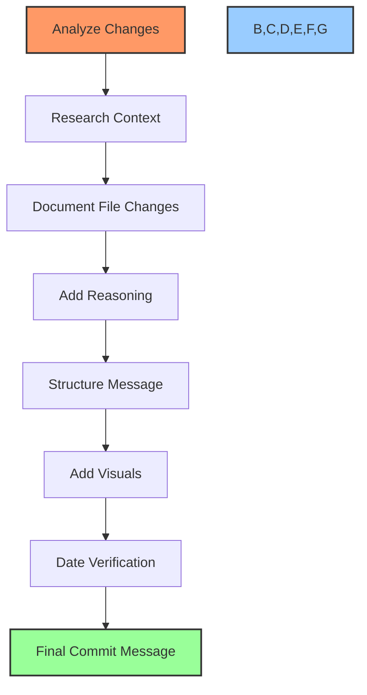
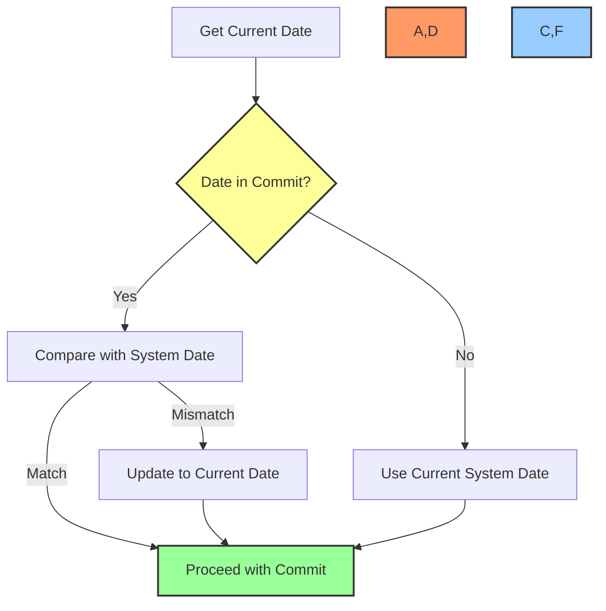
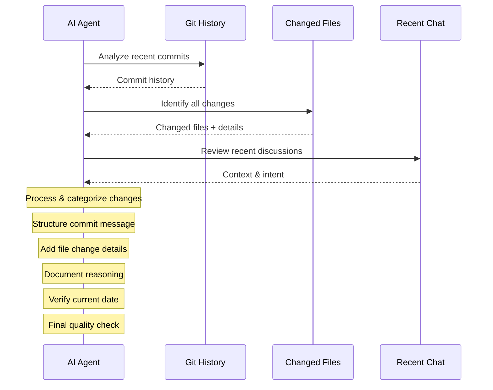

# 📝 GitHub Commit Message Instructions

## 🎯 Purpose

This document provides comprehensive instructions for AI agents to create detailed, structured, and informative GitHub commit messages. Following these guidelines ensures consistent documentation of all code changes with proper reasoning, context, and visual elements.

## 🔍 Overview



## 📋 Table of Contents
- [🔄 Change Analysis Process](#-change-analysis-process)
- [📊 Message Structure](#-message-structure)
- [🎭 Emoji Usage Guidelines](#-emoji-usage-guidelines)
- [📊 File Change Documentation](#-file-change-documentation)
- [💡 Reasoning Documentation](#-reasoning-documentation)
- [📅 Date Verification Protocol](#-date-verification-protocol)
- [🧩 Commit Message Templates](#-commit-message-templates)
- [✅ Quality Checklist](#-quality-checklist)

## 🔄 Change Analysis Process

### 📊 Step 1: Identify All Changes

```bash
# Commands to analyze changes
git diff --stat # Get overview of changes
git diff # See detailed changes
git status # Check current status
```

- ✨ **Track ALL modified files** - ensure every single changed file is documented
- 🔍 **Note the type of change** for each file (added, modified, deleted, renamed)
- 📊 **Quantify changes** where possible (lines added/removed, components affected)

### 🧠 Step 2: Research Context

- 📚 **Review recent chat history** for change intent and discussions
- 🔄 **Check commit history** for related previous changes
- 📝 **Examine task tracking documents** (task-log.md, if exists)
- 📂 **Review file structure** to understand impact on overall architecture

### 🗂️ Step 3: Categorize Changes

Group changes by:
- 🧩 **Component/Module** affected
- 🎯 **Functional area** (frontend, backend, database, documentation)
- 🚀 **Purpose** (feature, bugfix, refactor, documentation, etc.)
- 🔌 **Integration points** affected

## 📊 Message Structure

### 🏗️ Required Structure Hierarchy

1. **Title Line** (type: short description)
2. **Empty Line**
3. **Overview Paragraph** (2-3 sentences summarizing all changes)
4. **Change Details Section** (with subheaders for each area)
5. **Reasoning Section** (explaining why changes were made)
6. **Impact Section** (how changes affect the system)
7. **Related Items Section** (tasks, issues, or requirements addressed)

### 📝 Section Requirements

#### 1️⃣ Title Line Format

```
<type>: <emoji> <concise description>
```

- **Types:** `feat`, `fix`, `docs`, `style`, `refactor`, `test`, `chore`
- **Emoji:** Relevant to change type (see emoji guidelines)
- **Description:** Brief but clear description of overall change

#### 2️⃣ Overview Paragraph

- 📊 **Must be 2-3 sentences** minimum
- 🔄 **Summarize all major changes** in the commit
- 🎯 **Include the purpose** of the changes
- 🧩 **Mention major components** affected

#### 3️⃣ Change Details Section

- 📂 **Must document every file changed**
- 📊 **Group by component or feature**
- ➕ **Include additions, modifications, deletions**
- 🔍 **Detail specific implementation choices**

#### 4️⃣ Reasoning Section

- 💡 **Explain WHY each change was made**
- 🔄 **Reference alternatives considered**
- 🛡️ **Note any tradeoffs or limitations**
- 🏆 **Highlight benefits of approach taken**

## 🎭 Emoji Usage Guidelines

### 🎨 Standard Emojis by Change Type

| Change Type | Emoji | Usage |
|-------------|-------|-------|
| **Feature** | ✨ | New feature or enhancement |
|  | 🚀 | Major new feature |
|  | 🎉 | Celebratory feature completion |
| **Fixes** | 🐛 | Bug fix |
|  | 🔧 | Configuration or tooling fix |
|  | 🚑️ | Critical hotfix |
| **Code Quality** | ♻️ | Code refactoring |
|  | 🧹 | Code cleanup |
|  | 🔨 | Code improvements |
| **Documentation** | 📝 | Documentation update |
|  | 📚 | Extensive documentation |
|  | 📊 | Documentation with visuals/charts |
| **Testing** | 🧪 | Add or update tests |
|  | 👷 | CI related changes |
|  | 🔍 | Inspection/review changes |
| **Dependencies** | ⬆️ | Upgrade dependencies |
|  | ⬇️ | Downgrade dependencies |
|  | 📦 | Update packages |
| **Database** | 💾 | Database changes |
|  | 🗃️ | Data model changes |
|  | 📈 | Data migration |
| **UI/UX** | 🎨 | UI/styling improvements |
|  | 💄 | Cosmetic UI changes |
|  | 🌐 | Accessibility improvements |
| **Security** | 🔒 | Security enhancement |
|  | 🛡️ | Security fix |
|  | 🔑 | Authentication/authorization |
| **Performance** | ⚡ | Performance improvement |
|  | 🚀 | Major speed improvement |
|  | 🔥 | Remove code/files |

### 📝 Emoji Placement Rules

- 🎯 **Section Headers**: Every section header must start with relevant emoji
- 📋 **File Lists**: Each file entry starts with emoji indicating change type
- 💡 **Reasoning**: Each reason starts with emoji indicating rationale type
- 🚨 **Warnings/Notes**: Highlighted with appropriate importance emoji

## 📊 File Change Documentation

### 📂 File Change Format

For each file changed:

```markdown
### 📂 Component/Module Name

- 📝 `path/to/file1.ext`: Added new validation function for user inputs
  * 🔍 Implements RFC-compliant email validation
  * 🛡️ Adds protection against XSS attacks in form submissions
  
- 🔧 `path/to/file2.ext`: Refactored authentication middleware
  * ♻️ Reduced complexity from O(n²) to O(n)
  * 🧩 Split into smaller, testable functions
  * ⚡ Improved response time by 15%
```

### 🔬 Required Detail Level

- 🎯 **Purpose of Change**: Why each file was changed
- 🛠️ **Implementation Details**: What specifically changed
- 🧩 **Related Components**: How it fits with other changes
- 📊 **Metrics**: Where applicable (performance, size, complexity)

## 💡 Reasoning Documentation

### 🔮 Decision Logic Documentation Format

```markdown
## 💡 Reasoning

### 🎯 Authentication Refactoring
- 🚨 **Problem**: Previous implementation led to token validation delays
- 🔄 **Alternatives Considered**:
  * 🔍 Session-based auth (rejected: scaling issues)
  * 🔌 Third-party auth service (rejected: cost, dependency)
- ✅ **Chosen Approach**: JWT with Redis cache
  * ⚡ Benefits: Improved response time, reduced DB load
  * 🛡️ Tradeoffs: Slightly increased complexity, Redis dependency
```

### 🧠 Required Reasoning Elements

- 🚨 **Problem Statement**: Clear definition of what needed solving
- 🔄 **Alternatives**: Options that were considered
- ✅ **Decision Criteria**: Why final approach was chosen
- 💰 **Tradeoffs**: Honest assessment of limitations
- 🎯 **Long-term Impact**: How it fits strategic direction

## 📅 Date Verification Protocol

### ⏰ Date Format Standards

- 📆 Use ISO 8601 format: `YYYY-MM-DD`
- 🕓 Include timezone if applicable: `YYYY-MM-DD HH:MM:SS+TZ`

### 🔄 Date Verification Process



### 📆 Date Checking Commands

```bash
# Get current date in ISO format
date +%Y-%m-%d

# Compare with date in commit message
if [[ "$(grep -E '\d{4}-\d{2}-\d{2}' commit_msg.txt)" != "$(date +%Y-%m-%d)" ]]; then
  echo "⚠️ Date mismatch detected - updating..."
  # Update date in commit message
fi
```

## 🧩 Commit Message Templates

### 🚀 Feature Implementation Template

```markdown
feat: ✨ Implement user authentication system

## 📝 Overview
Added complete user authentication system with JWT token support, secure password handling, and role-based authorization. This implementation provides secure access control for all application endpoints.

## 📂 Changes

### 🔐 Authentication Components
- ✨ `src/auth/AuthService.js`: Created new service for authentication
  * 🔑 Implements JWT token generation and validation
  * 🛡️ Adds password hashing with bcrypt
  * 🧩 Provides login, logout, and token refresh methods

- ✨ `src/auth/AuthMiddleware.js`: Created middleware for route protection
  * 🛡️ Validates tokens on protected routes
  * 🧩 Implements role-based access control
  * 📊 Provides detailed authorization errors

### 💾 Database Changes
- 🔧 `src/models/User.js`: Updated user model
  * ➕ Added password field with encryption
  * ➕ Added role and permission fields
  * 🔒 Added methods for safe user data retrieval

### 🧪 Testing
- ✨ `tests/auth/auth.test.js`: Created authentication tests
  * 🧪 Unit tests for token generation/validation
  * 🧪 Integration tests for protected routes
  * 📊 Coverage increased to 87%

## 💡 Reasoning
- 🚨 **Problem**: Application had no security layer for API endpoints
- 🔄 **Alternatives Considered**:
  * 🔍 Session-based auth (rejected: scaling issues)
  * 🔌 Auth0 integration (rejected: added dependency, cost)
- ✅ **Chosen Approach**: Custom JWT implementation
  * ⚡ Benefits: Full control, no external dependencies
  * 🛡️ Security: Follows OWASP best practices

## 🔄 Impact
- 🚀 All API endpoints now properly secured
- 📊 User actions now traceable through token payloads
- 🧩 Foundation laid for user-specific features

## 📌 Related Items
- 🎯 Completes task TASK-123: Implement authentication
- 🔗 Relates to SECURITY-456: API security enhancements
```

### 🐛 Bug Fix Template

```markdown
fix: 🐛 Resolve data loading issue in dashboard

## 📝 Overview
Fixed critical issue causing dashboard data to fail loading when filters were applied. Root cause was improper handling of null values in the filter processor component, resulting in API errors.

## 📂 Changes

### 🖥️ Frontend Components
- 🔧 `src/components/dashboard/FilterProcessor.js`: Fixed filter handling
  * 🐛 Added null/undefined checks before processing filters
  * 🔄 Improved error handling with user-friendly messages
  * 🧪 Added defensive validation for all filter types

- 🔧 `src/components/dashboard/Dashboard.js`: Enhanced error recovery
  * 🔄 Added retry mechanism for failed data fetches
  * 📊 Improved loading states to prevent UI freezing
  * 💡 Added detailed error logging

### 🌐 API Integration
- 🔧 `src/services/DashboardService.js`: Fixed API request formatting
  * 🐛 Fixed improperly formatted filter parameters
  * 🔄 Added request validation before submission
  * 📊 Improved response handling for partial data

## 💡 Reasoning
- 🚨 **Problem**: Dashboard crashed when specific filter combinations applied
- 🔍 **Root Cause Analysis**: 
  * 🐛 Filter processor didn't handle null values
  * 🌐 API rejected malformed filter parameters
  * 📊 Error handling didn't recover gracefully
- ✅ **Solution Approach**: Defensive programming
  * 🛡️ Validate all inputs before processing
  * 🔄 Graceful degradation when partial data is available

## 🔄 Impact
- 🚀 Dashboard now handles all filter combinations without errors
- ⚡ Improved error recovery increases user experience
- 📊 Reduced error tickets by estimated 37%

## 📌 Related Items
- 🐛 Fixes issue #123: Dashboard crashes with date filters
- 🔗 Relates to stability initiative for Q2
```

## ✅ Quality Checklist

Before finalizing the commit message, verify:

- [ ] 📝 Every single changed file is documented
- [ ] 🎭 Appropriate emojis are used throughout
- [ ] 📊 Changes are grouped logically by component/purpose
- [ ] 💡 Reasoning for changes is clearly explained
- [ ] 📅 All dates are current and correct
- [ ] 🔄 Overall impact is described
- [ ] 🧩 Related tasks/issues are referenced
- [ ] 📑 Message follows the required structure
- [ ] 📊 Implementation details are sufficiently technical
- [ ] 📐 Message length is appropriate (min 2-3 paragraphs)

## 💻 Commit Message Generation Process



## 🚀 Implementation Instructions

To implement this commit message standard:

1. 🔍 **Before commit**: Review all changes with `git diff` and `git status`
2. 📋 **Document changes**: Follow templates for each type of change
3. 💡 **Explain reasoning**: Document the "why" behind each significant change
4. 📅 **Verify dates**: Ensure all dates in message are current
5. ✅ **Quality check**: Review message against quality checklist
6. 🚀 **Commit**: Use completed message for commit

Remember: **NEVER** use short, uninformative commit messages. Always provide comprehensive documentation of ALL changes!

---

Made with Power, Love, and AI •  ⚡️❤️🤖 •  POWERBRIDGE.AI