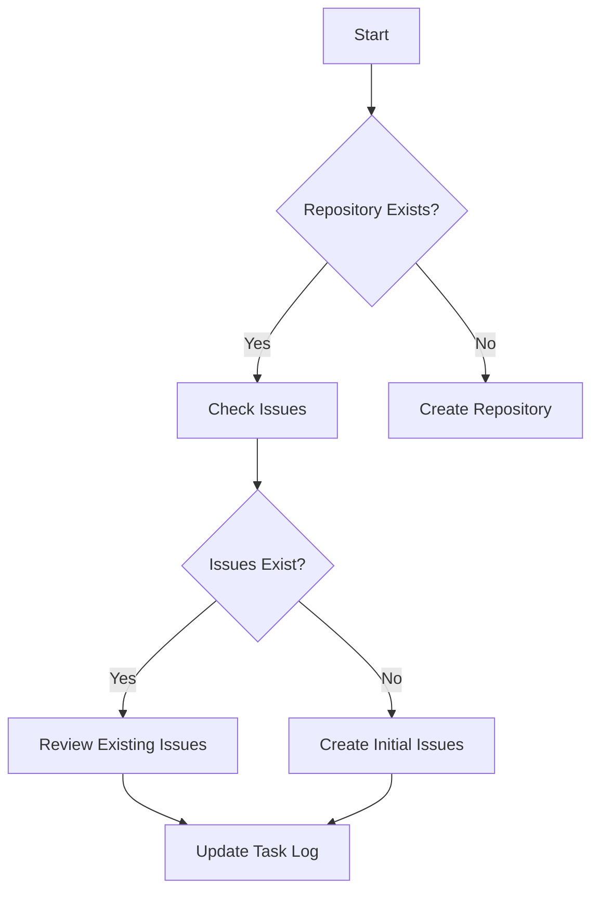
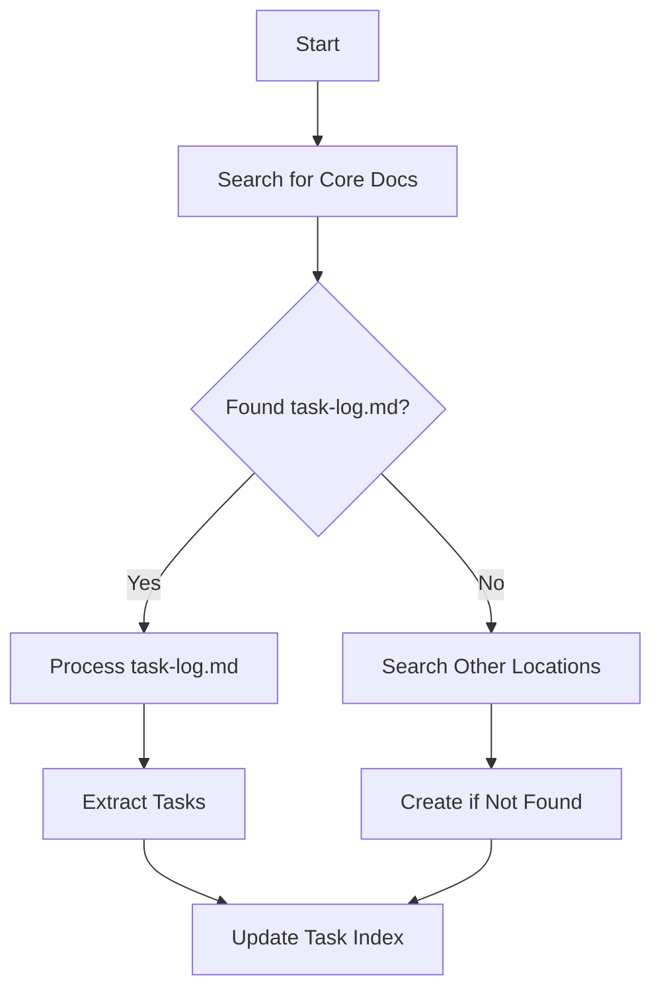
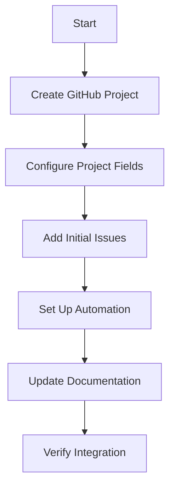

# 🤖 AI Assistant Automation Workflow

## ⚡ READ ME FIRST - Quick Start Guide

As an AI assistant, follow these steps to quickly orient yourself and begin automation:

### 1️⃣ Initial Orientation
1. **Check Current Context**
   - Look for repository name in conversation
   - Check current working directory
   - Note any files already discussed/attached

2. **Document Discovery**
   ```bash
   # Quick scan for core docs
   find . -name "task-log.md" -o -name "task-list.md" -o -name "dev-notes.md"
   ```

3. **Repository Status**
   ```bash
   # Check repo existence and status
   gh repo view PowerBridge-ai/GAIN_CHAIN
   ```

### 2️⃣ Quick Reference Map
- 🔍 **Need to find files?** → Go to [Document Discovery](#document-discovery)
- 🛠️ **Need commands?** → Go to [Command Reference](#command-reference)
- ✅ **Need checklists?** → Go to [Validation Checklists](#validation-checklists)
- 📝 **Need templates?** → Go to [Documentation Standards](#documentation-standards)
- 🚨 **Having issues?** → Go to [Error Recovery](#error-recovery)

### 3️⃣ Critical Reminders
- ALWAYS check repository existence first
- ALWAYS scan for existing documentation before creating new
- ALWAYS follow the document processing order
- NEVER skip validation checklists
- NEVER assume documentation is complete without verification

### 4️⃣ Quick Validation Sequence
1. Repository exists? → Check
2. Core docs present? → Scan
3. Project created? → Verify
4. Issues formatted? → Review
5. Documentation linked? → Validate

### 5️⃣ Emergency Procedures
- 🚫 **Command fails?** → Try MCP commands first, then GitHub CLI
- 📄 **Missing docs?** → Check all search locations before creating new
- 🔗 **Broken links?** → Verify paths relative to workspace root
- ❌ **Project creation fails?** → Follow [Error Recovery](#error-recovery) steps

## 📋 Table of Contents
- [🎯 Purpose](#purpose)
- [📚 Core Documentation Files](#core-documentation-files)
- [🔄 Workflow Processes](#workflow-processes)
- [🛠️ Command Reference](#command-reference)
- [📊 Project Management](#project-management)
- [🔍 Document Discovery](#document-discovery)
- [✅ Validation Checklists](#validation-checklists)

## 🎯 Purpose

This document serves as the master reference for AI assistant automation, consolidating all workflows, commands, and processes needed to manage GitHub projects and documentation effectively. This is a self-instruction manual for AI assistants to ensure consistent and reliable project management automation.

## 📚 Core Documentation Files

### Required Documentation Files
1. **Project Management**
   - `task-log.md`: Progress tracking and updates
   - `task-list.md`: Comprehensive task breakdown
   - `dev-notes.md`: Technical implementation details
   - `file-tree.md`: Project structure documentation
   - `file-details.md`: Detailed file descriptions

2. **Workflow Documentation**
   - `checkpoint-workflow.md`: Progress checkpointing
   - `directory-scan-workflow.md`: File discovery
   - `documentation-workflow.md`: Documentation standards
   - `project-board-workflow.md`: GitHub project management
   - `task-update-workflow.md`: Task status updates

3. **Project Documentation**
   - `project-overview.md`: High-level project description
   - `gchain-architecture-framework.md`: Technical architecture
   - `g-chain-dev-guide.md`: Development guidelines

4. **Management Tools**
   - `github-project-management.md`: GitHub management guide
   - `github-project-management.ps1`: PowerShell automation
   - `project-creation-guide.md`: Project setup guide
   - `project-management-task-log.md`: Management progress
   - `task-index.md`: Task document index

## 🔄 Workflow Processes

### 1. Initial Repository Check


### 2. Document Discovery Process


### 3. Project Creation Workflow


## 🛠️ Command Reference

### Repository Management
```bash
# Check repository existence
gh repo view PowerBridge-ai/GAIN_CHAIN

# Create repository if needed
mcp_github_create_repository -name "GAIN_CHAIN" -description "GainChain AI Development"
```

### Project Creation
```bash
# Create GitHub project
gh project create --owner PowerBridge-ai --title "GainChain AI Development"

# Add issues to project
gh project item-add PROJECT_NUMBER --owner PowerBridge-ai --url ISSUE_URL

# Configure project fields
gh api graphql -f query=@create-status-field.graphql
```

### Issue Management
```bash
# Create new issue
mcp_github_create_issue -owner "PowerBridge-ai" -repo "GAIN_CHAIN" -title "[ONBOARD-001] 🖥️ Implement Project Type Selection Component" -body "..."

# Update issue
mcp_github_update_issue -owner "PowerBridge-ai" -repo "GAIN_CHAIN" -issue_number NUMBER -body "..."

# Add issue comment
mcp_github_add_issue_comment -owner "PowerBridge-ai" -repo "GAIN_CHAIN" -issue_number NUMBER -body "..."
```

### Document Search
```bash
# Search for task documents
find . -name "task-log.md" -o -name "task-list.md" -o -name "dev-notes.md"

# Grep for specific content
grep -r "task" --include="*.md" .
```

## 📊 Project Management

### 1. Initial Setup Checklist
- [ ] Check repository existence
- [ ] Verify core documentation files
- [ ] Create GitHub project
- [ ] Configure project fields
- [ ] Set up automation rules

### 2. Documentation Integration
- [ ] Scan for existing documentation
- [ ] Create missing core documents
- [ ] Update task index
- [ ] Cross-reference documents
- [ ] Verify documentation links

### 3. Issue Creation Process
1. Check existing issues
2. Create initial onboarding issue
3. Add to GitHub project
4. Set initial status
5. Update task documentation

## 🔍 Document Discovery

### Search Locations
1. Root directory
   ```bash
   ./task-log.md
   ./task-list.md
   ./dev-notes.md
   ```

2. Development directories
   ```bash
   ./src/*/dev/task-log.md
   ./src/*/dev/task-list.md
   ./src/*/dev/dev-notes.md
   ```

3. Documentation directories
   ```bash
   ./docs/task-log.md
   ./docs/task-list.md
   ./docs/dev-notes.md
   ```

### Document Processing Order
1. Process `task-log.md` first
2. Cross-reference with `task-list.md`
3. Update `dev-notes.md` with technical details
4. Maintain `file-tree.md` structure
5. Update `task-index.md`

## ✅ Validation Checklists

### Repository Setup
- [ ] Repository exists
- [ ] Core documentation present
- [ ] GitHub project created
- [ ] Project fields configured
- [ ] Initial issues created

### Documentation Validation
- [ ] All core files present
- [ ] Documentation properly formatted
- [ ] Cross-references accurate
- [ ] Task status up-to-date
- [ ] Index maintained

### Issue Management
- [ ] Issues properly formatted
- [ ] Status fields set
- [ ] Project assignment complete
- [ ] Documentation updated
- [ ] Cross-references maintained

## 🔄 Regular Maintenance

### Daily Tasks
1. Check for new documentation
2. Update task status
3. Maintain cross-references
4. Update progress tracking

### Weekly Tasks
1. Verify documentation accuracy
2. Update task index
3. Clean up project board
4. Generate progress reports

## 📝 Documentation Standards

### Issue Format
```markdown
## [TASK-ID] 📝 Task Title

### Task Description
[Detailed description]

### Acceptance Criteria
- [ ] Criterion 1
- [ ] Criterion 2

### Technical Requirements
- Component: [Component Name]
- Dependencies: [List]
- Priority: [P0-P3]

### Documentation Updates
- [ ] task-log.md updated
- [ ] file-tree.md updated
- [ ] dev-notes.md updated
```

### Status Update Format
```markdown
## Task Progress - [Date]

### Current Implementation
🎯 Task: [Task ID] - [Task Name]
📊 Progress: [Percentage]

#### Changes Made
- [Status] [Component]
- [Description of changes]

#### Technical Metrics
- [Metric]: [Value]

#### Next Steps
1. [Next task/action]
```

## 🔗 Integration Points

### 1. Documentation Integration
- Links with `documentation-workflow.md`
- Connects to `checkpoint-workflow.md`
- Integrates with `task-update-workflow.md`

### 2. Project Management
- Follows `project-board-workflow.md`
- Uses `github-project-management.ps1`
- References `project-creation-guide.md`

### 3. Task Management
- Updates `task-index.md`
- Maintains `task-log.md`
- References `task-list.md`

## 🚨 Error Recovery

### Common Issues
1. **Project Creation Fails**
   - Verify owner permissions
   - Check project name uniqueness
   - Try alternative creation method

2. **Documentation Not Found**
   - Expand search locations
   - Check alternative paths
   - Create if necessary

3. **Issue Creation Fails**
   - Verify repository access
   - Check issue format
   - Try MCP commands first

### Recovery Steps
1. Log error details
2. Check permissions
3. Verify command syntax
4. Try alternative approach
5. Document resolution

## 📚 Reference Documentation

### Core Workflows
- [Checkpoint Workflow](./checkpoint-workflow.md)
- [Directory Scan Workflow](./directory-scan-workflow.md)
- [Documentation Workflow](./documentation-workflow.md)
- [Project Board Workflow](./project-board-workflow.md)
- [Task Update Workflow](./task-update-workflow.md)

### Management Guides
- [GitHub Project Management](../github-project-management.md)
- [Project Creation Guide](../project-creation-guide.md)
- [Task Management Log](../project-management-task-log.md)

### Development Documentation
- [Development Guide](../../dev-notes.md)
- [Architecture Framework](../../gchain-architecture-framework.md)
- [Project Overview](../../project-overview.md)

---

Made with Power, Love, and AI •  ⚡️❤️🤖 •  POWERBRIDGE.AI