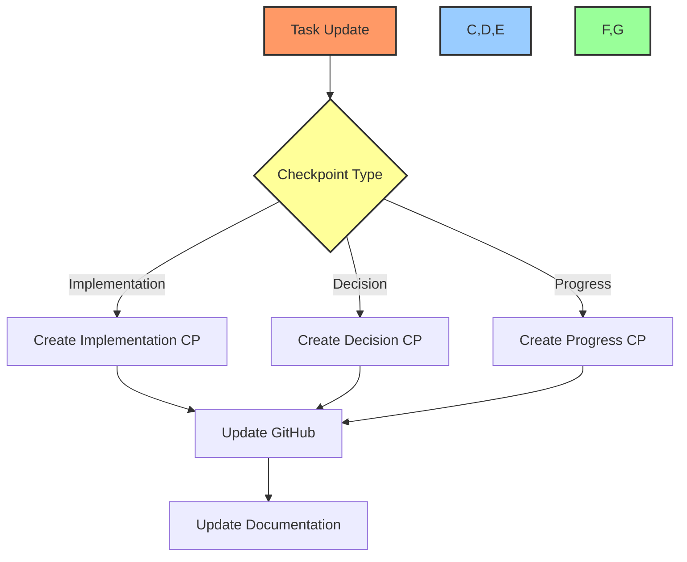

# 🔄 Checkpoint Workflow Guide

## 📋 Table of Contents
- [🎯 Purpose](#purpose)
- [📊 Checkpoint Types](#checkpoint-types)
- [🔄 Creation Process](#creation-process)
- [📝 Templates](#templates)
- [🔍 Examples](#examples)

## 🎯 Purpose

This document outlines the workflow for creating and managing development checkpoints that track progress, decisions, and implementation details. It integrates with:
- GitHub Issues
- Project Documentation
- Task Management
- Progress Tracking

## 📊 Checkpoint Types

### 1. Implementation Checkpoint
```markdown
## 📝 Implementation Checkpoint - [Date]

### 🎯 Task Reference
- Issue: #123
- Title: [Task Title]
- Status: [Current Status]

### 📊 Progress
- Completion: [Percentage]
- Time Spent: [Hours]
- Remaining: [Estimate]

### 🔧 Technical Details
- Components Modified: [List]
- Dependencies Added: [List]
- Configuration Changes: [Details]

### 📋 Documentation Updates
- [ ] task-log.md
- [ ] file-tree.md
- [ ] dev-notes.md
```

### 2. Decision Checkpoint
```markdown
## 🤔 Decision Checkpoint - [Date]

### 🎯 Context
- Issue: #123
- Area: [Technical Area]
- Impact: [Scope]

### 📋 Decision
- Choice: [Selected Option]
- Alternatives: [Other Options]
- Rationale: [Explanation]

### 📊 Impact Analysis
- Benefits: [List]
- Risks: [List]
- Mitigation: [Steps]
```

### 3. Progress Checkpoint
```markdown
## 📈 Progress Checkpoint - [Date]

### 🎯 Sprint Overview
- Completed: [Tasks]
- In Progress: [Tasks]
- Blocked: [Tasks]

### 📊 Metrics
- Velocity: [Points/Tasks]
- Quality: [Metrics]
- Coverage: [Percentage]

### 📋 Next Steps
1. [Action Item 1]
2. [Action Item 2]
3. [Action Item 3]
```

## 🔄 Creation Process

### Workflow Diagram


### Automation Commands
```powershell
# Create implementation checkpoint
function New-ImplementationCheckpoint {
    param(
        [string]$IssueNumber,
        [string]$Progress,
        [string]$TimeSpent,
        [string[]]$Components,
        [string[]]$Dependencies
    )
    
    $timestamp = Get-Date -Format "yyyy-MM-dd HH:mm"
    $checkpoint = @"
## 📝 Implementation Checkpoint - $timestamp

### 🎯 Task Reference
- Issue: #$IssueNumber
- Status: In Progress
- Progress: $Progress
- Time: $TimeSpent

### 🔧 Technical Details
Components Modified:
$(foreach ($comp in $Components) {"- $comp"})

Dependencies Added:
$(foreach ($dep in $Dependencies) {"- $dep"})

### 📋 Documentation
- [ ] task-log.md updated
- [ ] file-tree.md updated
- [ ] dev-notes.md updated
"@
    
    # Add to issue
    Add-IssueComment -IssueNumber $IssueNumber -Comment $checkpoint
    
    # Update task log
    Add-Content -Path "DEV/task-log.md" -Value $checkpoint
}

# Create decision checkpoint
function New-DecisionCheckpoint {
    param(
        [string]$IssueNumber,
        [string]$Area,
        [string]$Decision,
        [string]$Rationale,
        [string[]]$Alternatives
    )
    
    $timestamp = Get-Date -Format "yyyy-MM-dd HH:mm"
    $checkpoint = @"
## 🤔 Decision Checkpoint - $timestamp

### 🎯 Context
- Issue: #$IssueNumber
- Area: $Area

### 📋 Decision
- Choice: $Decision
- Rationale: $Rationale

Alternatives Considered:
$(foreach ($alt in $Alternatives) {"- $alt"})
"@
    
    # Add to issue
    Add-IssueComment -IssueNumber $IssueNumber -Comment $checkpoint
    
    # Update dev notes
    Add-Content -Path "DEV/dev-notes.md" -Value $checkpoint
}

# Create progress checkpoint
function New-ProgressCheckpoint {
    param(
        [string]$SprintNumber,
        [hashtable]$TaskStatus,  # @{ "Completed" = @(123, 124); "InProgress" = @(125) }
        [hashtable]$Metrics
    )
    
    $timestamp = Get-Date -Format "yyyy-MM-dd HH:mm"
    $checkpoint = @"
## 📈 Progress Checkpoint - Sprint $SprintNumber - $timestamp

### 🎯 Task Status
Completed:
$(foreach ($task in $TaskStatus["Completed"]) {"- #$task"})

In Progress:
$(foreach ($task in $TaskStatus["InProgress"]) {"- #$task"})

### 📊 Metrics
$(foreach ($key in $Metrics.Keys) {"- $key: $($Metrics[$key])"})
"@
    
    # Update task log
    Add-Content -Path "DEV/task-log.md" -Value $checkpoint
    
    # Add to each active issue
    foreach ($task in $TaskStatus["InProgress"]) {
        Add-IssueComment -IssueNumber $task -Comment $checkpoint
    }
}
```

## 📝 Examples

### 1. Implementation Checkpoint
```powershell
# Create implementation checkpoint
New-ImplementationCheckpoint `
    -IssueNumber "123" `
    -Progress "75%" `
    -TimeSpent "4h" `
    -Components @(
        "AI Model - LSTM Implementation",
        "Data Pipeline - Feature Engineering"
    ) `
    -Dependencies @(
        "TensorFlow 2.x",
        "NumPy 1.21+"
    )

# Update project board
Update-TaskStatus -IssueNumber "123" -NewStatus "In Progress" -ProjectNumber "1"
```

### 2. Decision Checkpoint
```powershell
# Document technical decision
New-DecisionCheckpoint `
    -IssueNumber "123" `
    -Area "Model Architecture" `
    -Decision "LSTM with Attention" `
    -Rationale @"
- Better performance on variable-length sequences
- Improved focus on relevant market signals
- Lower latency compared to alternatives
"@ `
    -Alternatives @(
        "Simple LSTM",
        "Transformer",
        "GRU"
    )
```

### 3. Progress Checkpoint
```powershell
# Create sprint checkpoint
New-ProgressCheckpoint `
    -SprintNumber "1" `
    -TaskStatus @{
        "Completed" = @(123, 124)
        "InProgress" = @(125, 126)
    } `
    -Metrics @{
        "Velocity" = "8 points/day"
        "Coverage" = "92%"
        "Quality" = "Pass"
    }
```

## 🔍 Best Practices

1. **Checkpoint Creation**
   - Create at meaningful points
   - Include all relevant details
   - Link to related issues
   - Update documentation

2. **Documentation Integration**
   - Maintain consistent format
   - Cross-reference issues
   - Include metrics
   - Track decisions

3. **Maintenance**
   - Regular reviews
   - Clean old checkpoints
   - Update templates
   - Verify links

## 📋 Integration Points

### 1. GitHub Integration
- Link checkpoints to issues
- Update project board
- Track progress
- Document decisions

### 2. Documentation Updates
- Update task-log.md
- Modify file-tree.md
- Maintain dev-notes.md
- Create checkpoints

### 3. Project Management
- Track sprint progress
- Monitor metrics
- Update timelines
- Review milestones

## 🔄 Regular Tasks

1. **Daily**
   - Create implementation checkpoints
   - Update task status
   - Document decisions

2. **Weekly**
   - Create progress checkpoints
   - Review metrics
   - Update documentation

3. **Monthly**
   - Archive old checkpoints
   - Update templates
   - Review effectiveness

---

Made with Power, Love, and AI •  ⚡️❤️🤖 •  POWERBRIDGE.AI