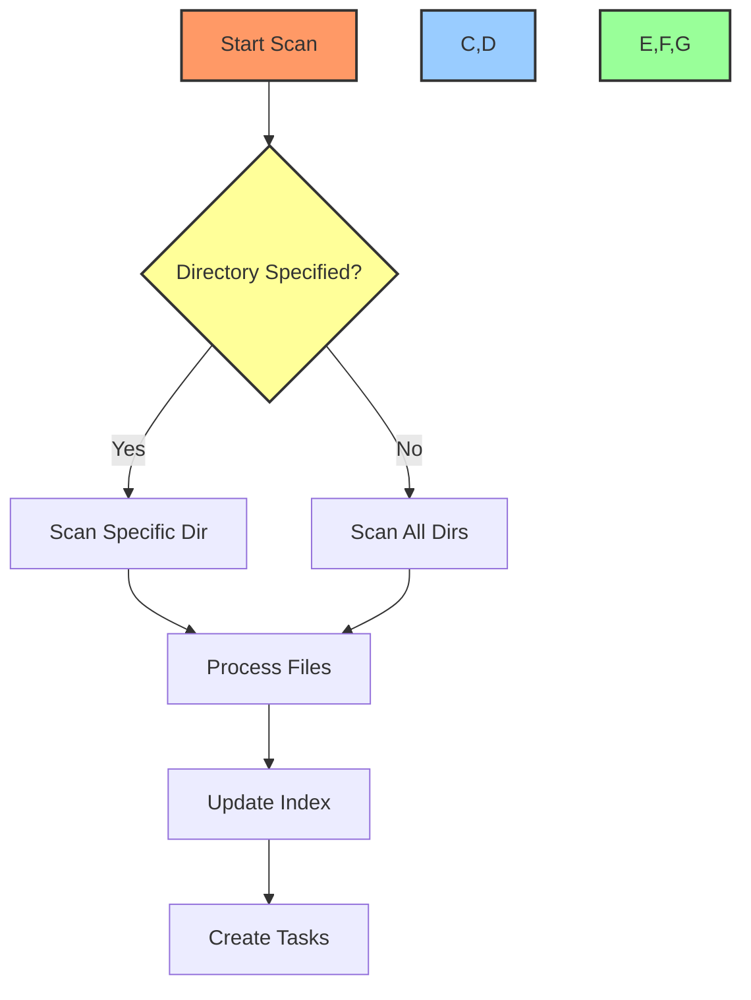
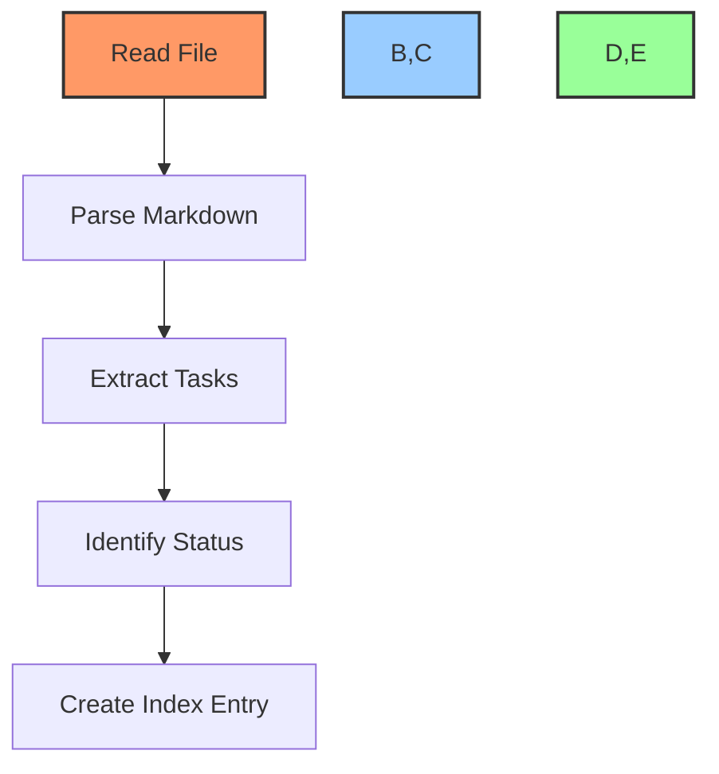

# 🔍 Directory Scanning Workflow Guide

## 📋 Table of Contents
- [🎯 Purpose](#purpose)
- [🛠️ Scanning Process](#scanning-process)
- [📊 File Processing](#file-processing)
- [🔄 Integration Steps](#integration-steps)
- [📝 Examples](#examples)

## 🎯 Purpose

This document outlines the workflow for scanning directories to locate and process task-related markdown files, including:
- Task logs (task-log.md)
- Task lists (task-list.md)
- Project documentation
- Integration with project management

## 🛠️ Scanning Process

### Directory Scan Flow


### Scanning Commands
```powershell
# Scan specific directory
function Scan-TaskDocuments {
    param(
        [string]$Directory = ".",
        [string[]]$FilePatterns = @("task-log.md", "task-list.md")
    )
    
    $files = Get-ChildItem -Path $Directory -Recurse -Include $FilePatterns
    
    $results = @()
    foreach ($file in $files) {
        $results += @{
            Path = $file.FullName
            Type = if ($file.Name -eq "task-log.md") { "TaskLog" } else { "TaskList" }
            LastModified = $file.LastWriteTime
            RelativePath = $file.FullName.Replace($Directory, "").TrimStart("\")
        }
    }
    
    return $results
}

# Process found files
function Process-TaskFiles {
    param(
        [array]$Files
    )
    
    foreach ($file in $Files) {
        Write-Output "Processing $($file.Path)..."
        
        # Read file content
        $content = Get-Content $file.Path -Raw
        
        # Extract tasks
        $tasks = Extract-Tasks -Content $content
        
        # Update index
        Update-TaskIndex -File $file -Tasks $tasks
    }
}
```

## 📊 File Processing

### Task Extraction Process


### Processing Functions
```powershell
# Extract tasks from content
function Extract-Tasks {
    param(
        [string]$Content
    )
    
    $tasks = @()
    $lines = $Content -split "`n"
    
    foreach ($line in $lines) {
        if ($line -match "^[-*] \[([ xX])\] (.+)$") {
            $tasks += @{
                Title = $matches[2]
                Status = if ($matches[1] -match "[xX]") { "Complete" } else { "Pending" }
                Line = $line
            }
        }
    }
    
    return $tasks
}

# Update task index
function Update-TaskIndex {
    param(
        [hashtable]$File,
        [array]$Tasks
    )
    
    $indexEntry = @"
## 📄 $($File.RelativePath)
Type: $($File.Type)
Last Modified: $($File.LastModified)

### Tasks Found:
$(foreach ($task in $Tasks) {"- [$($task.Status)] $($task.Title)"})

"@
    
    Add-Content -Path "DEV/_TOOLS/task-index.md" -Value $indexEntry
}
```

## 🔄 Integration Steps

### 1. Initial Setup
```powershell
# Create necessary files
New-Item -Path "DEV/_TOOLS/task-index.md" -ItemType File -Force
New-Item -Path "DEV/_TOOLS/project-tasks.md" -ItemType File -Force

# Initialize index
Set-Content -Path "DEV/_TOOLS/task-index.md" -Value @"
# 📋 Task Document Index

## 🔍 Overview
This file maintains an index of all task-related markdown files in the project.

## 📊 File Listing
"@
```

### 2. Regular Updates
```powershell
# Scan and update process
$files = Scan-TaskDocuments
Process-TaskFiles -Files $files

# Update project management
foreach ($file in $files) {
    Add-TasksToProject -File $file
}
```

## 📝 Examples

### 1. Scan Specific Directory
```powershell
# Scan src directory
$srcFiles = Scan-TaskDocuments -Directory "./src"
Process-TaskFiles -Files $srcFiles
```

### 2. Full Project Scan
```powershell
# Scan entire project
$allFiles = Scan-TaskDocuments
Process-TaskFiles -Files $allFiles
```

### 3. Update Project Tasks
```powershell
# Process and update
$files = Scan-TaskDocuments
foreach ($file in $files) {
    $tasks = Extract-Tasks -Content (Get-Content $file.Path -Raw)
    Update-TaskIndex -File $file -Tasks $tasks
    Add-TasksToProject -File $file -Tasks $tasks
}
```

## 🔍 Best Practices

1. **Regular Scanning**
   - Scan daily for updates
   - Process new files immediately
   - Update indexes regularly
   - Verify task status

2. **File Management**
   - Maintain consistent naming
   - Update modification dates
   - Track file locations
   - Document relationships

3. **Integration**
   - Link to project boards
   - Update task status
   - Maintain history
   - Track changes

---

Made with Power, Love, and AI •  ⚡️❤️🤖 •  POWERBRIDGE.AI