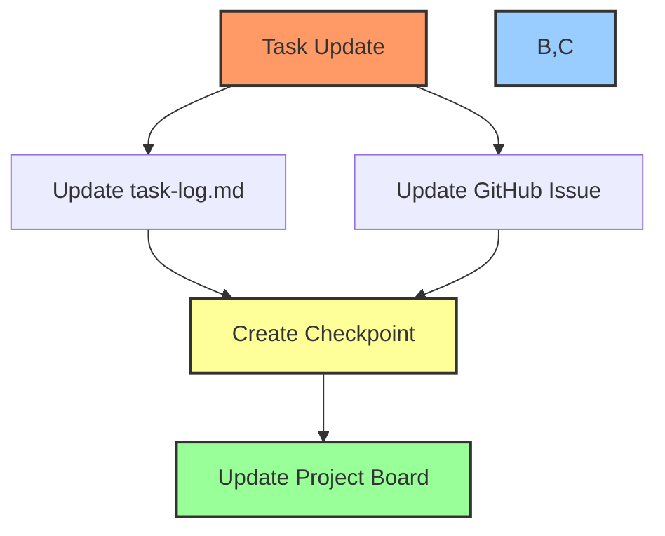
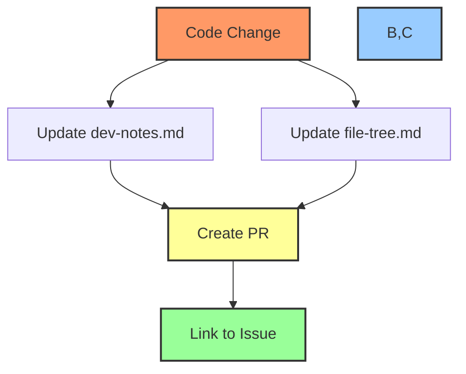

# 📝 Documentation Workflow Guide

## 📋 Table of Contents
- [🎯 Purpose](#purpose)
- [📚 Core Documentation Files](#core-documentation-files)
- [🔄 Update Workflows](#update-workflows)
- [📊 Integration with GitHub](#integration-with-github)
- [📝 Examples](#examples)

## 🎯 Purpose

This document outlines the workflow for maintaining project documentation in sync with GitHub issues and project boards. It covers:
- Core documentation file management
- Documentation update processes
- GitHub integration
- Automation and templates

## 📚 Core Documentation Files

### 1. task-log.md
```markdown
# 📋 Task Log

## Current Sprint
### 🔄 Active Tasks
- [ ] Task 1 (#123)
  - Status: In Progress
  - Progress: 75%
  - Updates: [Latest update details]

### ✅ Completed Tasks
- [x] Task 2 (#124)
  - Completed: 2024-01-20
  - Summary: [Implementation details]
```

### 2. file-tree.md
```markdown
# 📂 Project Structure

## Core Components
### 🤖 AI Engine
- src/ai/
  - models/
  - training/
  - inference/

### 💱 Trading System
- src/trading/
  - exchange/
  - orders/
  - portfolio/
```

### 3. dev-notes.md
```markdown
# 🔧 Development Notes

## Technical Decisions
### AI Model Architecture
- Framework: TensorFlow
- Model Type: LSTM
- Input Features: [Details]

### Trading Integration
- APIs: [List]
- Protocols: [Details]
```

## 🔄 Update Workflows

### 1. Task Progress Documentation


### 2. Technical Documentation


## 📊 Integration with GitHub

### Issue Templates
```markdown
## 📝 Implementation Details
### Current Status
- Progress: [percentage]
- Phase: [phase name]
- Dependencies: [list]

### Documentation Updates
- [ ] task-log.md updated
- [ ] file-tree.md updated
- [ ] dev-notes.md updated
```

### Automation Commands
```powershell
# Update task log
function Update-TaskLog {
    param(
        [string]$IssueNumber,
        [string]$Status,
        [string]$Progress
    )
    
    $timestamp = Get-Date -Format "yyyy-MM-dd HH:mm"
    $entry = @"
## Task #$IssueNumber Update - $timestamp
- Status: $Status
- Progress: $Progress
- [Link to issue](https://github.com/org/repo/issues/$IssueNumber)
"@
    
    Add-Content -Path "DEV/task-log.md" -Value $entry
}

# Update file tree
function Update-FileTree {
    param(
        [string]$Component,
        [string]$Path,
        [string]$Description
    )
    
    $entry = @"
### $Component
- $Path
  - Description: $Description
  - Added: $(Get-Date -Format "yyyy-MM-dd")
"@
    
    Add-Content -Path "DEV/file-tree.md" -Value $entry
}

# Update dev notes
function Update-DevNotes {
    param(
        [string]$Category,
        [string]$Decision,
        [string]$Rationale
    )
    
    $entry = @"
## $Category - $(Get-Date -Format "yyyy-MM-dd")
### Decision
$Decision

### Rationale
$Rationale
"@
    
    Add-Content -Path "DEV/dev-notes.md" -Value $entry
}
```

## 📝 Examples

### 1. Complete Task Documentation
```powershell
# 1. Update task log
Update-TaskLog -IssueNumber "123" -Status "Completed" -Progress "100%" 

# 2. Update GitHub issue
Add-IssueComment -IssueNumber "123" -Comment @"
## 📝 Implementation Complete

### Changes Made
- [List changes]

### Documentation Updated
- Updated task-log.md with completion status
- Added new components to file-tree.md
- Documented technical decisions in dev-notes.md

### Metrics
- Performance: [metrics]
- Coverage: [percentage]
"@

# 3. Update project board
Update-TaskStatus -IssueNumber "123" -NewStatus "Done" -ProjectNumber "1"
```

### 2. Technical Decision Documentation
```powershell
# 1. Update dev notes
Update-DevNotes -Category "AI Model" -Decision "Using LSTM architecture" -Rationale @"
- Better handling of sequential data
- Improved performance on time series
- Lower computational requirements
"@

# 2. Add to GitHub issue
Add-IssueComment -IssueNumber "123" -Comment @"
## 🔧 Technical Decision Update

### Architecture Decision
- Selected LSTM model architecture
- Updated dev-notes.md with rationale
- Added performance benchmarks

### Impact
- [List impacts]
"@
```

## 🔍 Best Practices

1. **Documentation Updates**
   - Update in real-time
   - Include relevant links
   - Maintain consistent format
   - Add context and rationale

2. **GitHub Integration**
   - Link all updates to issues
   - Include documentation checklist
   - Reference related PRs
   - Add implementation details

3. **Maintenance**
   - Regular cleanup
   - Verify links
   - Update templates
   - Archive completed items

## 📋 File Location Standards

```bash
# Primary locations
./task-log.md
./src/*/dev/task-log.md
./docs/task-log.md

# Dev documentation
./src/*/dev/dev-notes.md
./dev-notes.md
./docs/dev-notes.md

# Project structure
./src/*/dev/file-tree.md
./file-tree.md
./docs/file-tree.md
```

## 🔄 Regular Tasks

1. **Daily Updates**
   - Update task progress
   - Document decisions
   - Sync with GitHub

2. **Weekly Review**
   - Clean up task log
   - Update file tree
   - Review dev notes

3. **Monthly Maintenance**
   - Archive completed tasks
   - Update templates
   - Verify documentation

---

Made with Power, Love, and AI •  ⚡️❤️🤖 •  POWERBRIDGE.AI