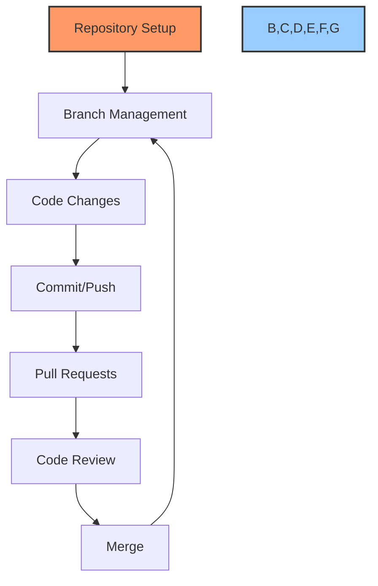

# 🌿 GitHub Workflow Standards

## 🔍 Overview

This document standardizes GitHub operations for all projects. AI agents should follow these precise instructions for repository management tasks to ensure consistency and security.



## 📋 Table of Contents
- [🌟 Initial Repository Setup](#-initial-repository-setup)
- [🔄 Branch Management](#-branch-management)
- [📝 Commit & Push Operations](#-commit--push-operations)
- [🔀 Pull Requests & Merging](#-pull-requests--merging)
- [🔒 Security & Ignoring Files](#-security--ignoring-files)
- [🛠️ Common Issues & Fixes](#-common-issues--fixes)

## 🌟 Initial Repository Setup

### Creating a New Repository

```bash
# Initialize a new repository
git init

# Set up remote origin (replace with actual repository URL)
git remote add origin git@github.com:username/repository-name.git

# Verify remote was added correctly
git remote -v
```

### Cloning an Existing Repository

```bash
# Clone via SSH (preferred for authentication)
git clone git@github.com:username/repository-name.git

# Clone via HTTPS (may require frequent authentication)
git clone https://github.com/username/repository-name.git

# Clone specific branch
git clone -b branch-name git@github.com:username/repository-name.git
```

### Essential Initial Configuration

```bash
# Set user name for commits
git config --local user.name "AI Agent Name"

# Set email for commits
git config --local user.email "email@example.com"

# Configure line ending behavior
git config --local core.autocrlf input  # For Unix/Mac
git config --local core.autocrlf true   # For Windows
```

## 🔄 Branch Management

### Creating and Switching Branches

```bash
# Create a new branch
git branch feature-name

# Create and switch to new branch
git checkout -b feature-name

# Switch to existing branch
git checkout branch-name

# List all branches (* indicates current branch)
git branch
```

### Branch Naming Conventions

| Type | Format | Example |
|------|--------|---------|
| Feature | `feature/short-description` | `feature/add-login` |
| Bugfix | `bugfix/issue-reference` | `bugfix/fix-null-error` |
| Hotfix | `hotfix/urgent-fix` | `hotfix/security-patch` |
| Release | `release/version` | `release/v1.2.0` |

### Managing Remote Branches

```bash
# Fetch all remote branches
git fetch origin

# List remote branches
git branch -r

# Create local branch tracking remote branch
git checkout -b local-branch origin/remote-branch

# Push local branch to remote
git push -u origin local-branch
```

## 📝 Commit & Push Operations

### Staging and Committing Changes

```bash
# Check status of working directory
git status

# Stage specific file
git add filename.ext

# Stage all changes
git add .

# Stage parts of files interactively
git add -p

# Commit with message
git commit -m "Brief, specific commit message"
```

### Commit Message Standards

Always follow this format:
```
<type>: <concise description>

<optional detailed description>
```

Types:
- `feat`: New feature
- `fix`: Bug fix
- `docs`: Documentation changes
- `style`: Formatting changes
- `refactor`: Code refactoring
- `test`: Adding/modifying tests
- `chore`: Maintenance tasks

Example:
```
feat: add user authentication system

Implements OAuth2 login via Google and GitHub providers
with JWT token generation for API access
```

### Pushing Changes

```bash
# Push to current branch
git push

# Push new branch for the first time
git push -u origin branch-name

# Force push (USE WITH EXTREME CAUTION)
git push --force-with-lease  # Safer than --force
```

## 🔀 Pull Requests & Merging

### Creating Pull Requests

```bash
# First push your branch
git push -u origin feature-branch

# Then create PR via GitHub UI or GitHub CLI:
gh pr create --title "Feature: Add user authentication" --body "Implements login functionality"
```

### Merging Strategies

```bash
# Update your branch with target branch changes first
git checkout feature-branch
git pull origin main

# Fix any conflicts
# Then create a merge commit
git merge main

# Or rebase (for cleaner history)
git rebase main

# Push changes
git push
```

### Cleanup After Merge

```bash
# Delete local branch after merge
git branch -d feature-branch

# Delete remote branch
git push origin --delete feature-branch

# Prune deleted remote branches references
git fetch --prune
```

## 🔒 Security & Ignoring Files

### Setting Up .gitignore

Create `.gitignore` file in repository root:

```
# Environment variables
.env
.env.*
!.env.example

# Virtual environments
venv/
env/
ENV/
.venv/

# Python cache files
__pycache__/
*.py[cod]
*$py.class
.pytest_cache/

# JavaScript dependencies
node_modules/
npm-debug.log

# Build directories
dist/
build/
*.egg-info/

# IDE files
.idea/
.vscode/
*.swp
*.swo

# OS files
.DS_Store
Thumbs.db

# Logs
*.log
logs/

# Temporary files
tmp/
temp/

# Database files
*.sqlite
*.db

# Credentials
*.pem
*.key
*_rsa
*_dsa
*.p12
```

### Creating .cursor.ignore

Create `.cursor.ignore` file in repository root:

```
# Large model files
*.pt
*.onnx
*.h5
*.pb

# Large datasets
datasets/
data/raw/
*.csv
*.parquet

# Generated outputs
output/
results/

# Sensitive configuration
**/config/secrets.json
**/credentials/

# Terraform
.terraform/
terraform.tfstate
terraform.tfstate.backup

# Jupyter notebooks (often large)
*.ipynb_checkpoints/
```

### Protecting Sensitive Information

```bash
# Remove sensitive file that was accidentally committed
git rm --cached sensitive_file.txt

# Update .gitignore to prevent future commits
echo "sensitive_file.txt" >> .gitignore

# Commit the change
git commit -m "chore: remove sensitive file and update gitignore"
```

## 🛠️ Common Issues & Fixes

### Authentication Issues

```bash
# Generate SSH key
ssh-keygen -t ed25519 -C "email@example.com"

# Start SSH agent
eval "$(ssh-agent -s)"

# Add SSH key to agent
ssh-add ~/.ssh/id_ed25519

# Display public key to add to GitHub
cat ~/.ssh/id_ed25519.pub
```

### Reverting Changes

```bash
# Discard all local changes in working directory
git reset --hard HEAD

# Revert specific commit (creates new reverting commit)
git revert commit-hash

# Reset to specific commit (CAUTION: destructive)
git reset --hard commit-hash
```

### Fixing Commit History

```bash
# Amend most recent commit
git commit --amend -m "New commit message"

# Interactive rebase to edit multiple commits
git rebase -i HEAD~3  # Last 3 commits
```

### Large File Management

```bash
# Install Git LFS
apt-get install git-lfs  # Debian/Ubuntu
brew install git-lfs     # macOS

# Initialize Git LFS
git lfs install

# Track large file types
git lfs track "*.psd"
git lfs track "*.zip"

# Add .gitattributes to repository
git add .gitattributes
git commit -m "chore: configure Git LFS"
```

## 📋 Task-Specific Command Sequences

### Starting a New Feature

```bash
git checkout main
git pull
git checkout -b feature/new-feature-name
# Make changes
git add .
git commit -m "feat: implement new feature"
git push -u origin feature/new-feature-name
# Create PR via GitHub UI
```

### Fixing a Bug

```bash
git checkout main
git pull
git checkout -b bugfix/issue-reference
# Fix bug
git add .
git commit -m "fix: resolve issue with X"
git push -u origin bugfix/issue-reference
# Create PR via GitHub UI
```

### Releasing a Version

```bash
git checkout main
git pull
git checkout -b release/v1.0.0
# Make final changes
git add .
git commit -m "chore: prepare for v1.0.0 release"
git push -u origin release/v1.0.0
# Create PR to main
# After merge, tag the release:
git checkout main
git pull
git tag -a v1.0.0 -m "Version 1.0.0"
git push origin v1.0.0
```

## 💡 Best Practices

1. **Never commit directly to main/master branch**
2. **Keep commits atomic** - one logical change per commit
3. **Pull before push** to minimize merge conflicts
4. **Regularly update feature branches** from main
5. **Use meaningful branch names** following conventions
6. **Verify what's being committed** before every commit
7. **Write descriptive commit messages**
8. **Review .gitignore regularly** to ensure it's catching all necessary files
9. **Use SSH authentication** over HTTPS when possible
10. **Clean up branches** after they're merged

---

Made with Power, Love, and AI •  ⚡️❤️🤖 •  POWERBRIDGE.AI