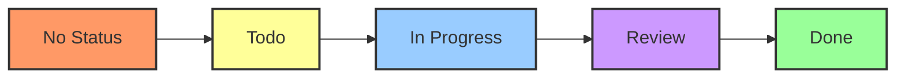
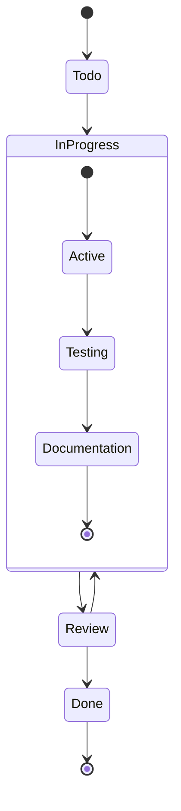
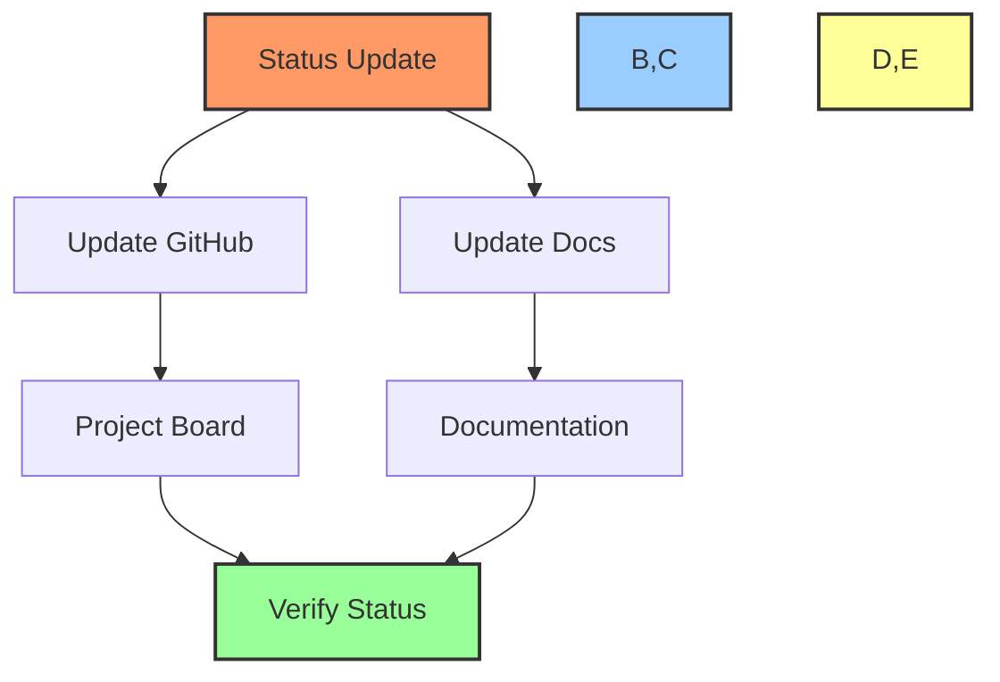

# 📊 GitHub Project Board Workflow Guide

## 📋 Table of Contents
- [🎯 Purpose](#purpose)
- [🛠️ Project Board Structure](#project-board-structure)
- [📊 Status Management](#status-management)
- [🔄 Automation Rules](#automation-rules)
- [📝 Examples](#examples)

## 🎯 Purpose

This document outlines the workflow for managing GitHub project boards, including:
- Board structure and organization
- Status management
- Automation rules
- Integration with documentation

## 🛠️ Project Board Structure

### Board Layout


### Available Commands

#### Project Creation and Setup
```bash
# Create new project
gh project create --title "Project Name" --owner org

# Create project column
gh project field-create PROJECT_NUMBER --owner org --name "Status" --type "single-select" --data-type "text"

# Add status options
gh project field-update PROJECT_NUMBER --owner org --field-id FIELD_ID --name "Status" --data-type "single-select" --options "Todo,In Progress,Review,Done"
```

#### Item Management
```bash
# Add item to project
gh project item-add PROJECT_NUMBER --owner org --url ISSUE_URL

# Move item to column
gh project item-edit PROJECT_NUMBER --owner org --id ITEM_ID --field-value "In Progress"

# List items in project
gh project item-list PROJECT_NUMBER --owner org

# Get item details
gh project item-view PROJECT_NUMBER --owner org --id ITEM_ID
```

## 📊 Status Management

### Status Workflow


### Status Update Commands
```powershell
# Using MCP Functions
Update-TaskStatus -IssueNumber "123" -NewStatus "In Progress" -ProjectNumber "1"

# Using GitHub CLI
gh project item-edit 1 --owner org --id 123 --field-value "In Progress"

# Update with Documentation
Update-TaskStatus -IssueNumber "123" -NewStatus "Done" -ProjectNumber "1" -UpdateTimeline
```

## 🔄 Automation Rules

### 1. Status Transitions
```yaml
# When issue is assigned
- trigger: issue_assigned
  action: set_status
  status: "Todo"

# When PR is created
- trigger: pr_created
  action: set_status
  status: "In Progress"

# When PR is merged
- trigger: pr_merged
  action: set_status
  status: "Done"
```

### 2. Documentation Updates
```yaml
# When status changes to "In Progress"
- trigger: status_changed
  condition: new_status == "In Progress"
  actions:
    - update_task_log
    - create_checkpoint

# When status changes to "Done"
- trigger: status_changed
  condition: new_status == "Done"
  actions:
    - update_task_log
    - update_file_tree
    - create_final_checkpoint
```

## 📝 Examples

### 1. Create New Project Board
```powershell
# 1. Create project
$projectNumber = gh project create --title "Gainchain AI Development" --owner PowerBridge-ai

# 2. Set up columns
gh project field-create $projectNumber --owner PowerBridge-ai --name "Status" --type "single-select" --data-type "text"

# 3. Add status options
gh project field-update $projectNumber --owner PowerBridge-ai --field-id "Status" --data-type "single-select" --options "Todo,In Progress,Review,Done"

# 4. Create initial view
gh project view-create $projectNumber --owner PowerBridge-ai --name "Development Board" --layout "board"
```

### 2. Manage Task Progress
```powershell
# 1. Move task to In Progress
Update-TaskStatus -IssueNumber "123" -NewStatus "In Progress" -ProjectNumber "1"

# 2. Add progress update
Add-IssueComment -IssueNumber "123" -Comment @"
## 🔄 Progress Update
Current Status: In Progress
Progress: 60%

### 📝 Updates
- Implemented core functionality
- Started testing
- Documentation in progress

### 📊 Next Steps
1. Complete testing
2. Finalize documentation
3. Prepare for review
"@

# 3. Update project board
gh project item-edit 1 --owner PowerBridge-ai --id 123 --field-value "In Progress"
```

## 🔍 Best Practices

1. **Status Updates**
   - Always include progress details
   - Update documentation in sync
   - Create checkpoints at key stages

2. **Board Organization**
   - Keep columns focused
   - Use labels consistently
   - Maintain clear status definitions

3. **Automation**
   - Review automation rules regularly
   - Verify status transitions
   - Monitor documentation updates

## 📋 Integration Points

### 1. Documentation Integration


### 2. Workflow Integration
- Links with task-update-workflow.md
- Connects to documentation-workflow.md
- Integrates with checkpoint-workflow.md

## 🔄 Regular Maintenance

1. **Daily**
   - Review board status
   - Update task progress
   - Sync documentation

2. **Weekly**
   - Clean up completed items
   - Verify automation rules
   - Update project metrics

3. **Monthly**
   - Archive completed items
   - Review board efficiency
   - Update workflow processes

---

Made with Power, Love, and AI •  ⚡️❤️🤖 •  POWERBRIDGE.AI