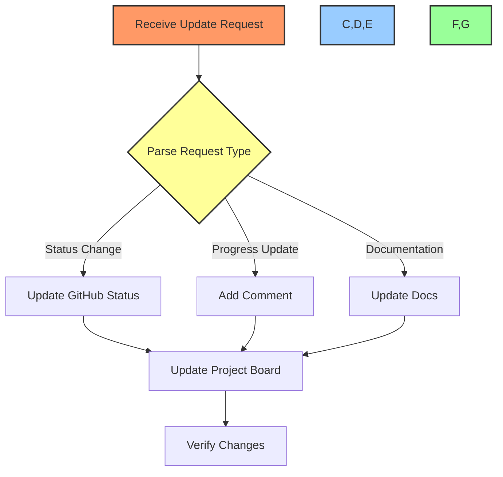
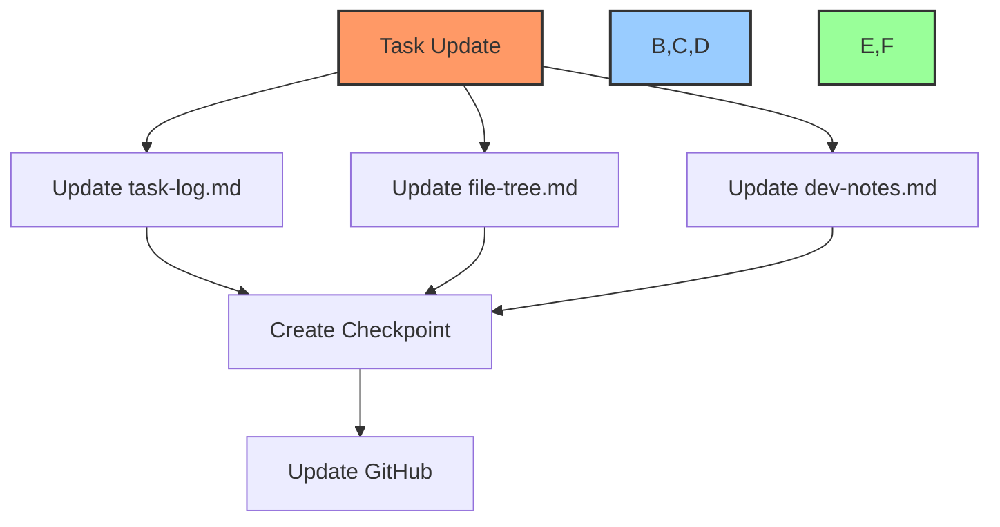

# 🔄 Task Update Workflow Guide

## 📋 Table of Contents
- [🎯 Purpose](#purpose)
- [🛠️ Available Commands](#available-commands)
- [📊 Workflow Steps](#workflow-steps)
- [📝 Examples](#examples)
- [🔍 Troubleshooting](#troubleshooting)

## 🎯 Purpose

This document outlines the workflow for updating task (GitHub issue) status and documentation across:
- GitHub Projects
- Task Log Documentation
- File Tree Updates
- Development Notes
- Checkpoint Documentation

## 🛠️ Available Commands

### MCP Server Commands
```bash
# Get issue details
mcp_github_get_issue -owner "org" -repo "repo" -issue_number "123"

# Update issue
mcp_github_update_issue -owner "org" -repo "repo" -issue_number "123" -state "open/closed"

# Add comment
mcp_github_add_issue_comment -owner "org" -repo "repo" -issue_number "123" -body "comment"

# Get comments
mcp_github_get_issue_comments -owner "org" -repo "repo" -issue_number "123"
```

### GitHub CLI Commands
```bash
# List issues
gh issue list --repo org/repo

# View issue
gh issue view 123 --repo org/repo

# Create issue
gh issue create --title "Title" --body "Body" --repo org/repo

# Close issue
gh issue close 123 --repo org/repo

# Reopen issue
gh issue reopen 123 --repo org/repo

# Add to project
gh project item-add PROJECT_NUMBER --owner org --url issue_url

# Move in project board
gh project item-edit PROJECT_NUMBER --owner org --id ITEM_ID --field-value "In Progress"
```

## 📊 Workflow Steps

### 1. Task Status Update Process


### 2. Documentation Update Process


## 📝 Examples

### 1. Complete Task Update
```powershell
# 1. Update GitHub issue status
Update-TaskStatus -IssueNumber "123" -NewStatus "Done" -ProjectNumber "1" -UpdateTimeline

# 2. Add implementation details
Add-IssueComment -IssueNumber "123" -Comment @"
## 📝 Implementation Update
- Completed feature X
- Added tests
- Updated documentation

### 📊 Metrics
- Coverage: 95%
- Performance: +15%

### 📋 Documentation Updated
- Updated task-log.md
- Updated file-tree.md
- Added checkpoint
"@

# 3. Update project board
gh project item-edit 1 --owner org --id 123 --field-value "Done"
```

### 2. Progress Update
```powershell
# 1. Add progress comment
Add-IssueComment -IssueNumber "123" -Comment @"
## 🔄 Progress Update
- Implemented core functionality
- Working on tests
- Documentation in progress

### 📊 Current Status
- Progress: 75%
- Remaining: Test coverage, Documentation
"@

# 2. Update project board status
gh project item-edit 1 --owner org --id 123 --field-value "In Progress"
```

## 🔍 Troubleshooting

### Common Issues and Solutions

1. **Issue Not Found**
```powershell
# Verify issue exists
gh issue view $IssueNumber --repo $org/$repo

# Check project access
gh project view $ProjectNumber --owner $org
```

2. **Project Board Update Failed**
```powershell
# Get project field information
gh project field-list $ProjectNumber --owner $org

# Verify item in project
gh project item-list $ProjectNumber --owner $org
```

3. **Documentation Update Failed**
```powershell
# Check file permissions
Test-Path "DEV/task-log.md"
Get-Acl "DEV/task-log.md"

# Verify file content
Get-Content "DEV/task-log.md" -Tail 10
```

## 📋 Integration with Other Workflows

This workflow integrates with:
- [checkpoint-workflow.md](./checkpoint-workflow.md)
- [documentation-workflow.md](./documentation-workflow.md)
- [project-board-workflow.md](./project-board-workflow.md)

## 🔄 Regular Maintenance

1. **Daily Tasks**
   - Review open issues
   - Update progress on active tasks
   - Sync project board status

2. **Weekly Tasks**
   - Clean up completed tasks
   - Update documentation
   - Create progress checkpoints

3. **Monthly Tasks**
   - Archive completed tasks
   - Review workflow efficiency
   - Update automation scripts

---

Made with Power, Love, and AI •  ⚡️❤️🤖 •  POWERBRIDGE.AI