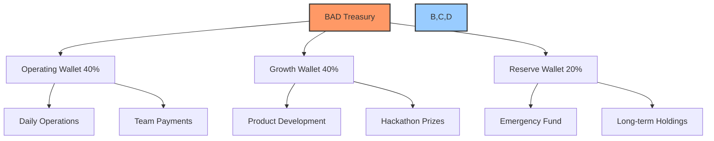
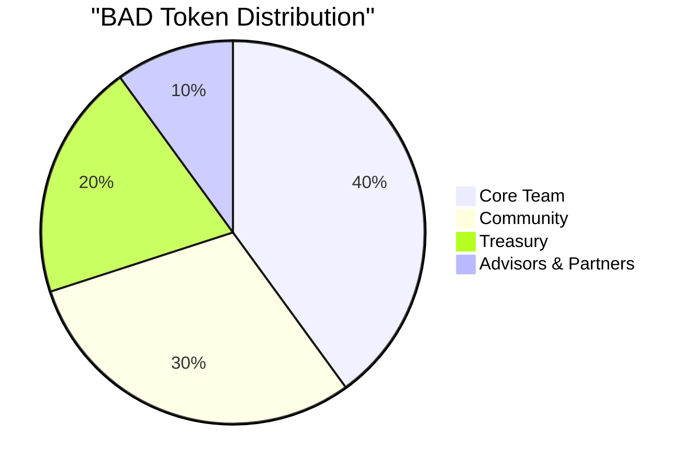

# 🏗️ BAD Aragon DAO Implementation Guide

## 📋 Table of Contents
- [🔍 Overview](#overview)
- [🎯 Key Objectives](#key-objectives)
- [⚙️ Technical Requirements](#technical-requirements)
- [🏦 Treasury Configuration](#treasury-configuration)
- [🪙 Token Setup](#token-setup)
- [🗳️ Governance System](#governance-system)
- [📅 14-Day Implementation Timeline](#14-day-implementation-timeline)
- [🔄 Revenue Stream Integration](#revenue-stream-integration)
- [🔐 Security Measures](#security-measures)
- [🚀 Launch Checklist](#launch-checklist)

## 🔍 Overview

The Build a DAO (BAD) project is a bootstrap-ready organization designed for revenue generation and project incubation. This implementation guide provides detailed instructions for setting up the BAD DAO on the Aragon platform with a focus on two primary revenue streams:

1. **AI Grant & Proposal Writing Studio**
2. **Hackathon Discovery & Incubation Platform**

This guide ensures the DAO is fully operational within a 14-day timeframe, with particular emphasis on the treasury configuration and voting mechanisms needed to support these revenue-generating activities.

## 🎯 Key Objectives

1. **Establish a Bootstrap-Optimized Treasury** - Configure multi-sig wallets and capital allocation for lean operations
2. **Create a Governance Token** - Deploy the BAD token for decentralized decision-making
3. **Implement Streamlined Voting** - Set up specialized voting templates for different proposal types
4. **Enable Revenue Integration** - Configure treasury to connect with AI Grant and Hackathon systems
5. **Ensure 14-Day Launch** - Provide a detailed timeline for expedited implementation

## ⚙️ Technical Requirements

### Platform Selection
- **Network**: Ethereum (mainnet for production, Sepolia testnet for development)
- **Aragon Version**: Latest Aragon OSx framework (v1.0.0 or higher)
- **Smart Contract Framework**: Aragonese and ERC-20 token standards
- **Frontend**: Aragon App UI with custom integrations for revenue streams

### Development Environment
- Web3 provider (MetaMask or similar)
- Ethers.js or Web3.js for contract interactions
- Node.js environment for development
- Hardhat/Truffle for testing

## 🏦 Treasury Configuration

### Initial Treasury Structure



### Wallet Setup Instructions

1. **Operating Wallet Configuration**
   - Create a 3/5 multi-signature wallet for daily operations
   - Allocate 40% of initial funds (primarily in stablecoins)
   - Set transaction limit of 5% of total treasury value per transaction
   - Configure 2/5 signatures for transactions under $1,000

2. **Growth Wallet Configuration**
   - Create a 3/5 multi-signature wallet for product development
   - Allocate 40% of initial funds (mixed stablecoins and ETH)
   - Set transaction limit of 10% of total treasury value per transaction
   - Lock 50% of funds with 7-day timelock for larger expenditures

3. **Reserve Wallet Configuration**
   - Create a 4/5 multi-signature wallet for long-term holdings
   - Allocate 20% of initial funds (primarily in ETH)
   - Implement 30-day timelock for any withdrawals
   - Configure emergency override requiring 5/5 signatures

### Revenue Stream Allocations

Configure automated smart contract allocations for incoming revenue:

| Revenue Source | Operating | Growth | Reserve |
|----------------|-----------|--------|---------|
| Grant Success Fees | 60% | 30% | 10% |
| Hackathon Platform Fees | 50% | 40% | 10% |
| Service Revenue | 70% | 20% | 10% |

## 🪙 Token Setup

### Token Parameters

- **Name**: BAD Token
- **Symbol**: BAD
- **Decimals**: 18
- **Initial Supply**: 1,000,000 BAD
- **Token Type**: ERC-20 Governance Token

### Token Distribution



- **Core Team (40%)**: Vested over 24 months with 6-month cliff
- **Community (30%)**: Reserved for governance participation and incentives
- **Treasury (20%)**: Controlled by the DAO for operations and growth
- **Advisors & Partners (10%)**: 12-month vesting schedule

### Token Deployment Process

1. Deploy the BAD token using Aragon's token deployment interface
2. Configure the vesting schedules for team and advisor allocations
3. Transfer the treasury allocation to the DAO's treasury
4. Lock the community allocation in a dedicated contract
5. Configure token for use in governance system

## 🗳️ Governance System

### Voting Configuration

Create specialized voting templates with the following parameters:

| Decision Type | Support Threshold | Minimum Participation | Voting Duration | Creation Threshold |
|---------------|-------------------|------------------------|----------------|-------------------|
| Treasury Allocation | 75% | 25% | 72 hours | 5,000 BAD |
| Grant Approvals | 60% | 15% | 48 hours | 2,500 BAD |
| Operational Decisions | 51% | 10% | 48 hours | 1,000 BAD |
| Emergency Actions | 80% | 30% | 24 hours | 10,000 BAD |

### Proposal Templates

1. **Treasury Allocation Template**
   - Required fields: Amount, Destination, Purpose, Expected ROI
   - Documentation: Budget breakdown, Timeline for use
   - Approval workflow: Review → Community discussion → Vote

2. **Grant Approval Template**
   - Required fields: Grant amount, Project details, Success metrics
   - Documentation: Project proposal, Team background
   - Approval workflow: AI evaluation → Review → Vote

3. **Operational Decision Template**
   - Required fields: Decision description, Implementation plan
   - Documentation: Impact assessment, Resource requirements
   - Approval workflow: Internal review → Vote

4. **Emergency Action Template**
   - Required fields: Issue description, Proposed solution, Urgency level
   - Documentation: Risk assessment, Alternative options
   - Approval workflow: Expedited review → Immediate vote

### Early Execution

Configure the governance system to allow early execution of proposals if:
- Support threshold is exceeded
- Minimum participation is met
- Remaining votes mathematically cannot change outcome

## 📅 14-Day Implementation Timeline

```mermaid
gantt
    title BAD DAO 14-Day Implementation Plan
    dateFormat  YYYY-MM-DD
    axisFormat %d
    
    section Setup Phase
    Research & Planning           :a1, day 1, 1d
    Aragon Environment Setup      :a2, day 1, 1d
    Token Contract Development    :a3, day 2, 1d
    
    section Development Phase
    Token Deployment              :b1, day 3, 1d
    Treasury Wallet Configuration :b2, day 3, 1d
    Governance System Setup       :b3, day 4, 2d
    
    section Integration Phase
    Grant Studio API Integration  :c1, day 6, 2d
    Hackathon Platform Connection :c2, day 6, 2d
    Treasury Automation Scripts   :c3, day 8, 2d
    
    section Testing Phase
    Governance System Testing     :d1, day 10, 1d
    Revenue Flow Testing          :d2, day 11, 1d
    Security Audit                :d3, day 12, 1d
    
    section Launch Phase
    Documentation Finalization    :e1, day 13, 1d
    Team Onboarding               :e2, day 13, 1d
    Public Launch                 :e3, day 14, 1d
```

### Day-by-Day Implementation Plan

#### Days 1-2: Foundation & Setup
- **Day 1**: Complete research, select network, set up development environment
- **Day 2**: Develop and test token contract, design treasury structure

#### Days 3-5: Core Components
- **Day 3**: Deploy token contract, set up initial treasury wallets
- **Day 4-5**: Configure governance system, set up voting templates

#### Days 6-9: Integration
- **Day 6-7**: Integrate Grant Studio API with treasury
- **Day 6-7**: Connect Hackathon Platform to DAO infrastructure
- **Day 8-9**: Develop treasury automation scripts for revenue allocation

#### Days 10-12: Testing & Security
- **Day 10**: Test governance system with simulated proposals
- **Day 11**: Verify revenue flows with test transactions
- **Day 12**: Conduct security audit of all deployed components

#### Days 13-14: Launch
- **Day 13**: Finalize documentation, onboard core team members
- **Day 14**: Official public launch of the BAD DAO

## 🔄 Revenue Stream Integration

### AI Grant Concierge Integration

1. **API Endpoint Setup**
   - Configure webhook endpoints for grant notifications
   - Set up authentication for secure communication
   - Implement event listeners for status updates

2. **Smart Contract Integration**
   - Deploy integration contract for treasury access
   - Configure permission levels for fund transfers
   - Set up success fee calculation and distribution

3. **Proposal Automation**
   - Create template for grant application submissions
   - Implement automatic proposal creation for qualified opportunities
   - Configure voting thresholds based on grant amounts

### Hackathon Discovery Integration

1. **Opportunity Pipeline**
   - Set up data flow from discovery engine to DAO
   - Configure filters for hackathon qualification
   - Implement notification system for new opportunities

2. **Team Formation Interface**
   - Create permission system for team assembly
   - Configure token staking for team commitment
   - Set up reward distribution contracts

3. **Prize Fund Management**
   - Deploy dedicated vault for hackathon prizes
   - Configure multi-sig release requirements
   - Implement success tracking and fee collection

## 🔐 Security Measures

### Treasury Protection

1. **Multi-signature Requirements**
   - Operating Wallet: 3/5 signers required
   - Growth Wallet: 3/5 signers required
   - Reserve Wallet: 4/5 signers required

2. **Transaction Limits**
   - Tiered approval requirements based on transaction size
   - Daily/weekly maximum withdrawal limits
   - Cooling periods between large transactions

3. **Time-Lock Mechanisms**
   - 24-hour delay on transactions exceeding 5% of treasury
   - 72-hour delay on transactions exceeding 10% of treasury
   - Emergency override requiring full consensus (5/5 signers)

### Smart Contract Safety

1. **Code Audit Requirements**
   - All contracts must pass automated security scans
   - Manual code review required for treasury-related contracts
   - Formal verification for critical functions

2. **Emergency Response Plan**
   - Circuit breaker functionality for suspicious activity
   - Pre-approved emergency response team
   - Documentation of recovery procedures

3. **Access Control**
   - Role-based permission system
   - Key rotation schedule for administrative functions
   - Regular security audits and updates

## 🚀 Launch Checklist

### Pre-Launch Verification

- [ ] Token contract deployed and verified on Etherscan
- [ ] Treasury wallets configured with correct signers
- [ ] Governance system tested with sample proposals
- [ ] Revenue stream integration endpoints verified
- [ ] Security audit completed with no critical issues
- [ ] Documentation updated with final contract addresses

### Launch Day Procedures

1. **Technical Deployment**
   - Activate governance system
   - Enable proposal submissions
   - Connect revenue stream integrations
   - Monitor system health metrics

2. **Team Onboarding**
   - Distribute initial tokens to core team
   - Set up multi-sig wallet access
   - Train team on governance procedures
   - Configure monitoring and alerts

3. **Community Launch**
   - Announce launch through official channels
   - Provide documentation and tutorials
   - Begin initial proposal process
   - Activate first revenue-generating activities

### Post-Launch Monitoring

- [ ] Track treasury balances and transaction flow
- [ ] Monitor proposal creation and voting participation
- [ ] Verify revenue collection from integrated streams
- [ ] Check system performance and security metrics
- [ ] Collect feedback for immediate improvements 