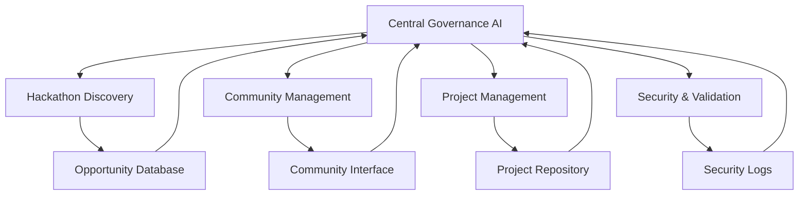

# AI System Architecture

## Overview
The AI system serves as the autonomous brain of the Web4.0 incubator platform, managing operations, decision-making, and community interactions through a network of specialized AI agents.

## Core AI Components

### 1. 🧠 Central Governance AI
- **Purpose**: High-level decision making and system coordination
- **Responsibilities**:
  - Policy generation and enforcement
  - Resource allocation
  - Risk assessment
  - Performance optimization
  - System-wide coordination

### 2. 🔍 Hackathon Discovery Agent
- **Purpose**: Autonomous hackathon opportunity detection
- **Capabilities**:
  - Web crawling and monitoring
  - Opportunity evaluation
  - Timeline management
  - Prize analysis
  - Requirements assessment

### 3. 👥 Community Management AI
- **Purpose**: Handle community interactions and support
- **Features**:
  - Natural language communication
  - Query resolution
  - Community moderation
  - Content generation
  - Social media management

### 4. 📊 Project Management AI
- **Purpose**: Guide project development and team coordination
- **Functions**:
  - Task assignment
  - Progress tracking
  - Resource allocation
  - Documentation generation
  - Quality assurance

### 5. 🔐 Security & Validation AI
- **Purpose**: Ensure system security and code quality
- **Capabilities**:
  - Code analysis
  - Security auditing
  - Performance monitoring
  - Compliance checking
  - Risk detection

## AI Integration Architecture

### Data Flow

### Communication Protocols
1. Inter-agent messaging system
2. Event-driven updates
3. Real-time data synchronization
4. Priority-based task execution
5. Feedback loop mechanisms

## AI Agent Specifications

### System Message Templates
- Governance directives
- Community interaction guidelines
- Project management protocols
- Security validation rules
- Documentation standards

### Learning & Adaptation
- Performance metrics tracking
- Behavior optimization
- Pattern recognition
- Strategy adjustment
- Knowledge base updates

### Decision Making Framework
1. Data collection
2. Analysis
3. Risk assessment
4. Option evaluation
5. Action execution
6. Result monitoring

## Security Measures

### Access Control
- Role-based permissions
- Authentication protocols
- Activity monitoring
- Audit trails
- Incident response

### Data Protection
- Encryption standards
- Privacy controls
- Backup systems
- Recovery protocols
- Compliance checks

## Performance Optimization

### Monitoring Metrics
- Response times
- Decision accuracy
- Resource utilization
- Error rates
- User satisfaction

### Improvement Protocols
- Performance analysis
- System optimization
- Resource allocation
- Capability enhancement
- Feature updates

## Implementation Guidelines

### Phase 1: Core Setup
1. Deploy central AI system
2. Initialize agent network
3. Establish communication protocols
4. Configure security measures
5. Test basic operations

### Phase 2: Integration
1. Connect with platform components
2. Implement data flows
3. Setup monitoring systems
4. Deploy security measures
5. Test interactions

### Phase 3: Optimization
1. Gather performance data
2. Analyze system behavior
3. Implement improvements
4. Enhance capabilities
5. Scale operations

## Maintenance & Updates

### Regular Tasks
- System health checks
- Performance optimization
- Security updates
- Feature enhancements
- Documentation updates

### Emergency Procedures
1. Issue detection
2. System isolation
3. Problem analysis
4. Solution implementation
5. Recovery verification

## Success Criteria
1. Autonomous operation capability
2. Decision accuracy rates
3. Response time metrics
4. Security incident rates
5. User satisfaction levels
6. System reliability scores 