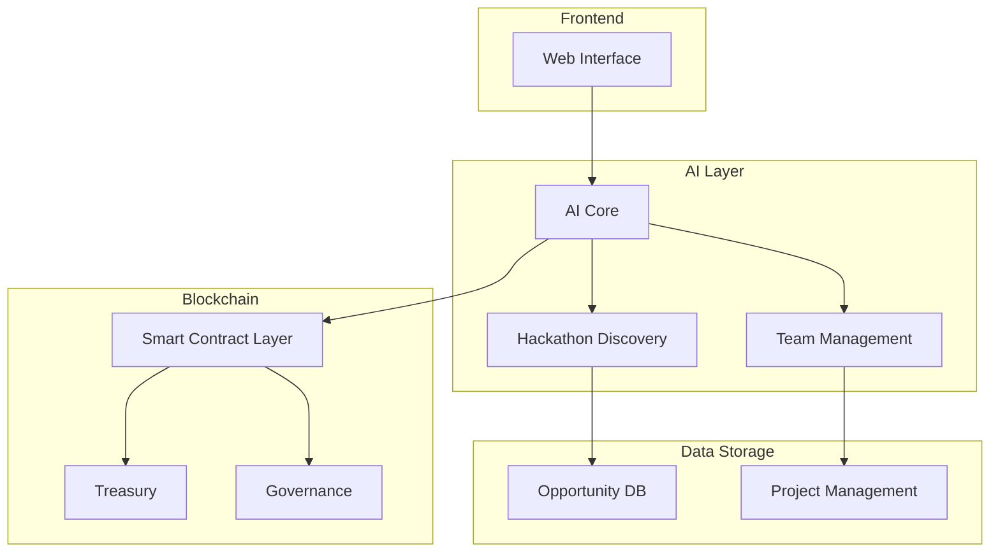
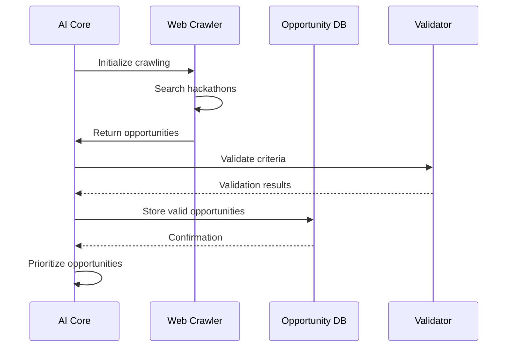
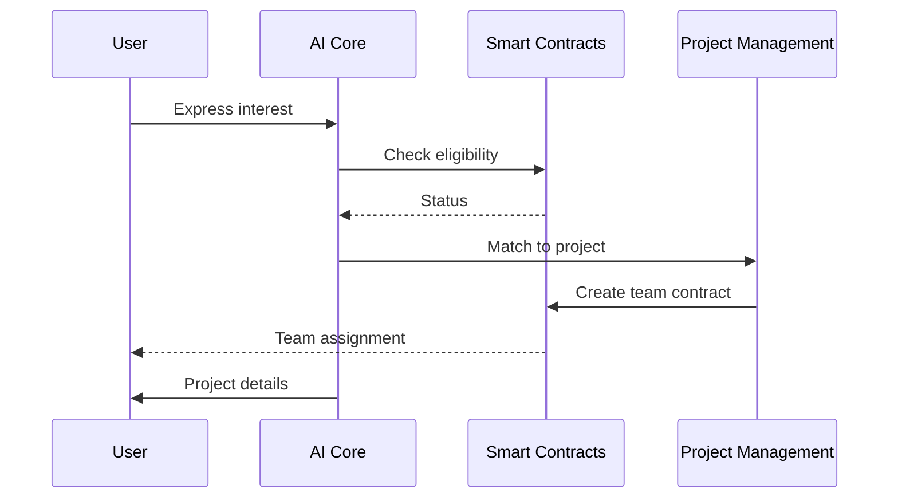
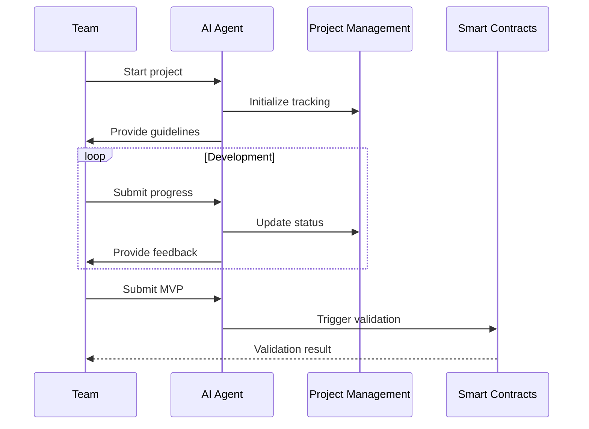

# Platform Workflow & Interaction Model

## System Overview

### Platform Architecture


## Workflow Sequences

### 1. Hackathon Discovery & Evaluation


### 2. Team Formation & Project Assignment


### 3. Project Development Lifecycle


## Detailed Workflows

### 1. Platform Entry & Onboarding

#### User Registration
1. **Initial Contact**
   - User visits platform
   - AI agent initiates welcome sequence
   - Basic information collection
   - Skill assessment

2. **Profile Creation**
   - Blockchain wallet connection
   - Skill verification
   - Role assignment
   - Team preference recording

3. **Orientation**
   - Platform tutorial
   - Documentation access
   - Community introduction
   - Initial task assignment

### 2. Hackathon Discovery Process

#### Continuous Monitoring
1. **Data Collection**
   - Web crawling (14-day window)
   - Social media monitoring
   - Community submissions
   - Partner notifications

2. **Opportunity Analysis**
   - Prize evaluation
   - Timeline assessment
   - Resource requirements
   - Success probability

3. **Selection Criteria**
   - Prize value threshold
   - Technical complexity
   - Resource availability
   - Timeline feasibility

### 3. Project Initialization

#### Setup Phase
1. **Project Creation**
   ```mermaid
   graph TD
       A[Opportunity Selected] --> B[Team Formation]
       B --> C[Resource Allocation]
       C --> D[Timeline Setup]
       D --> E[Documentation Init]
   ```

2. **Resource Allocation**
   - Budget assignment
   - Team member selection
   - Tool access provision
   - Repository creation

3. **Timeline Management**
   - Milestone definition
   - Deadline tracking
   - Progress monitoring
   - Alert system setup

### 4. Development Process

#### Daily Operations
1. **Morning Routine**
   - Status check
   - Priority assessment
   - Task distribution
   - Team sync

2. **Development Cycle**
   - Code commits
   - AI review
   - Documentation updates
   - Progress tracking

3. **Evening Wrap-up**
   - Progress summary
   - Next day planning
   - Resource adjustment
   - Status reporting

### 5. AI Interaction Framework

#### Communication Channels
1. **Direct Interaction**
   - Natural language interface
   - Command line tools
   - Web interface
   - Mobile access

2. **Automated Processes**
   - Code review
   - Documentation generation
   - Performance monitoring
   - Security checks

3. **Decision Support**
   - Risk assessment
   - Resource optimization
   - Strategy recommendations
   - Problem resolution

### 6. Smart Contract Integration

#### Contract Interactions
1. **Treasury Operations**
   ```mermaid
   graph TD
       A[Fund Request] --> B[Validation]
       B --> C[Approval Process]
       C --> D[Fund Release]
       D --> E[Transaction Record]
   ```

2. **Governance Actions**
   - Proposal submission
   - Voting process
   - Execution
   - Record keeping

3. **Project Management**
   - Team assignments
   - Milestone tracking
   - Payment processing
   - Status updates

### 7. Quality Assurance

#### Validation Process
1. **Code Quality**
   - Automated testing
   - Style checking
   - Performance analysis
   - Security scanning

2. **Documentation Quality**
   - Completeness check
   - Accuracy verification
   - Format validation
   - Version control

3. **Deliverable Validation**
   - Requirement matching
   - Performance testing
   - Security audit
   - User acceptance

### 8. Community Engagement

#### Interaction Model
1. **Support System**
   - Query handling
   - Problem resolution
   - Knowledge sharing
   - Feedback collection

2. **Collaboration Tools**
   - Team channels
   - Project spaces
   - Resource sharing
   - Event coordination

3. **Growth Mechanisms**
   - Skill development
   - Achievement tracking
   - Reputation system
   - Reward distribution

## Success Tracking

### Metrics & KPIs

#### Performance Indicators
1. **Project Metrics**
   - Completion rate
   - Quality scores
   - Timeline adherence
   - Budget compliance

2. **Team Metrics**
   - Productivity
   - Collaboration
   - Skill growth
   - Satisfaction

3. **Platform Metrics**
   - System uptime
   - Response times
   - User engagement
   - Resource utilization

### Continuous Improvement

#### Optimization Cycle
1. **Data Collection**
   - Performance metrics
   - User feedback
   - System logs
   - Market data

2. **Analysis Process**
   - Trend identification
   - Pattern recognition
   - Problem detection
   - Opportunity spotting

3. **Implementation**
   - System updates
   - Process refinement
   - Resource optimization
   - Feature enhancement

## Emergency Procedures

### Incident Response

#### Response Protocol
1. **Detection**
   - Monitoring alerts
   - User reports
   - System checks
   - Performance anomalies

2. **Assessment**
   - Impact evaluation
   - Cause analysis
   - Resource check
   - Solution planning

3. **Resolution**
   - System stabilization
   - Fix implementation
   - Validation
   - Documentation

4. **Recovery**
   - Service restoration
   - Data verification
   - User notification
   - Prevention planning 