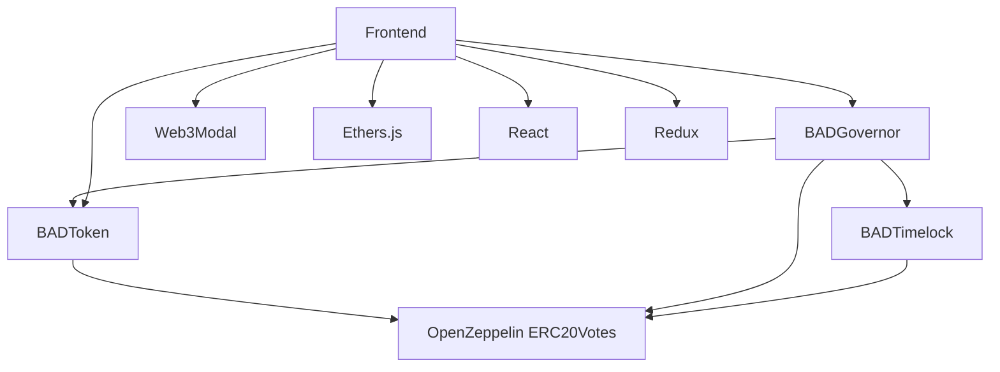

# BAD DAO Project File Structure

## Project Overview
```
/
├── contracts/           # Smart contract source files
├── scripts/             # Deployment and utility scripts
├── frontend/            # React-based web application
├── test/                # Smart contract tests
├── docs/                # Project documentation
├── tasks/               # Custom Hardhat tasks
└── config/              # Configuration files
```

## Smart Contracts

```
/contracts
├── token/
│   ├── BADToken.sol               # Main ERC20 token with voting capabilities
│   └── interfaces/
│       └── IBADToken.sol          # Token interface definitions
├── governance/
│   ├── BADGovernor.sol            # Main governance contract
│   ├── BADTimelock.sol            # Timelock controller
│   └── interfaces/
│       ├── IBADGovernor.sol       # Governor interface
│       └── IBADTimelock.sol       # Timelock interface
├── access/
│   └── Roles.sol                  # Role-based access control
└── utils/
    └── AddressRegistry.sol        # Registry for contract addresses
```

### Token Contract Details
- **BADToken.sol**: 196 lines
  - ERC20 implementation with governance extensions
  - Includes snapshot functionality for voting
  - Delegation mechanics for voting power
  - Features: minting, burning, delegation

### Governance Contract Details
- **BADGovernor.sol**: 248 lines
  - Proposal creation and management
  - Voting mechanisms
  - Execution logic
  - Extensions for various governance features
- **BADTimelock.sol**: 112 lines
  - Delayed execution security mechanism
  - Role-based access control
  - Proposal scheduling and cancellation

## Frontend Application

```
/frontend
├── public/
│   ├── index.html
│   ├── favicon.ico
│   └── assets/
│       └── images/
├── src/
│   ├── components/
│   │   ├── common/
│   │   │   ├── Button.jsx
│   │   │   ├── Card.jsx
│   │   │   ├── Modal.jsx
│   │   │   └── Spinner.jsx
│   │   ├── layout/
│   │   │   ├── Header.jsx
│   │   │   ├── Footer.jsx
│   │   │   └── Sidebar.jsx
│   │   ├── token/
│   │   │   ├── TokenBalance.jsx
│   │   │   ├── TransferForm.jsx
│   │   │   └── DelegationForm.jsx
│   │   ├── governance/
│   │   │   ├── ProposalList.jsx
│   │   │   ├── ProposalCard.jsx
│   │   │   ├── ProposalDetail.jsx
│   │   │   ├── VotingInterface.jsx
│   │   │   └── ProposalForm.jsx
│   │   └── wallet/
│   │       ├── WalletConnect.jsx
│   │       └── NetworkSwitch.jsx
│   ├── hooks/
│   │   ├── useWeb3.js
│   │   ├── useToken.js
│   │   ├── useGovernance.js
│   │   └── useProposals.js
│   ├── contexts/
│   │   ├── Web3Context.js
│   │   └── AppContext.js
│   ├── services/
│   │   ├── web3Service.js
│   │   ├── tokenService.js
│   │   ├── governanceService.js
│   │   └── apiService.js
│   ├── utils/
│   │   ├── formatters.js
│   │   ├── validators.js
│   │   └── constants.js
│   ├── pages/
│   │   ├── Home.jsx
│   │   ├── TokenPage.jsx
│   │   ├── GovernancePage.jsx
│   │   └── ProposalPage.jsx
│   ├── App.jsx
│   └── index.js
├── package.json
├── .env
└── config-overrides.js
```

### Key Frontend Components
- **WalletConnect.jsx**: 145 lines - Wallet connection interface
- **ProposalDetail.jsx**: 208 lines - Detailed view of governance proposals
- **VotingInterface.jsx**: 187 lines - Interface for casting votes
- **TokenBalance.jsx**: 92 lines - Token balance display and management

## Test Files

```
/test
├── token/
│   ├── BADToken.test.js            # Token functionality tests
│   └── TokenVoting.test.js         # Token voting capability tests
├── governance/
│   ├── Governor.test.js            # Governance functionality tests
│   ├── Proposals.test.js           # Proposal creation and execution tests
│   └── Timelock.test.js            # Timelock functionality tests
├── integration/
│   ├── GovernanceFlow.test.js      # End-to-end governance flow tests
│   └── TokenGovernance.test.js     # Token and governance integration tests
└── utils/
    ├── fixtures.js                 # Test fixtures and setup
    └── helpers.js                  # Test helper functions
```

## Deployment Scripts

```
/scripts
├── deploy/
│   ├── 01_deploy_token.js            # Token deployment script
│   ├── 02_deploy_timelock.js         # Timelock deployment script
│   ├── 03_deploy_governor.js         # Governor deployment script
│   └── 04_setup_roles.js             # Role configuration script
├── verify/
│   ├── verify_token.js               # Token verification script
│   ├── verify_timelock.js            # Timelock verification script
│   └── verify_governor.js            # Governor verification script
└── utils/
    ├── network.js                    # Network utilities
    └── addresses.js                  # Contract address management
```

## Documentation

```
/docs
├── contracts/
│   ├── BADToken.md                 # Token documentation
│   ├── BADGovernor.md              # Governor documentation
│   └── BADTimelock.md              # Timelock documentation
├── architecture/
│   ├── overview.md                 # System architecture overview
│   └── security.md                 # Security considerations
├── guides/
│   ├── deployment.md               # Deployment guide
│   ├── governance.md               # Governance guide
│   └── token.md                    # Token management guide
└── api/
    └── endpoints.md                # API documentation
```

## Configuration Files

```
/config
├── networks.js                    # Network configurations
├── contracts.js                   # Contract configurations
└── deployment.js                  # Deployment configurations
```

## Database Scripts

```
/db
├── schema/
│   ├── schema.sql                  # Database schema
│   └── migrations/                 # Schema migrations
├── queries/
│   ├── proposals.sql               # Proposal-related queries
│   ├── votes.sql                   # Vote-related queries
│   └── tokens.sql                  # Token-related queries
└── scripts/
    ├── init.sql                    # Database initialization
    ├── backup.sh                   # Backup script
    └── restore.sh                  # Restore script
```

## Dependency Map



## Key Size Metrics

| Component | Files | Lines of Code | Size (KB) |
|-----------|-------|---------------|-----------|
| Contracts | 8     | 820           | 32        |
| Frontend  | 32    | 3,500         | 120       |
| Tests     | 10    | 1,200         | 45        |
| Scripts   | 12    | 650           | 26        |
| Docs      | 15    | 900           | 35        |
| **Total** | **77**| **7,070**     | **258**   |

## Component Relationships

### Smart Contract Inheritance

```
ERC20 ← ERC20Permit ← ERC20Votes ← BADToken
Governor ← GovernorSettings ← GovernorVotes ← GovernorTimelockControl ← BADGovernor
TimelockController ← BADTimelock
```

### Frontend Component Dependencies

```
App
├── Web3Context
│   └── WalletConnect
├── Home
├── TokenPage
│   ├── TokenBalance
│   ├── TransferForm
│   └── DelegationForm
├── GovernancePage
│   └── ProposalList
│       └── ProposalCard
└── ProposalPage
    ├── ProposalDetail
    └── VotingInterface
```

## Feature Mapping

| Feature               | Primary Files                                       | Status    |
|-----------------------|----------------------------------------------------|-----------|
| Token Creation        | BADToken.sol, deploy_token.js                      | ✅ Complete |
| Token Transfer        | BADToken.sol, TransferForm.jsx                     | ✅ Complete |
| Vote Delegation       | BADToken.sol, DelegationForm.jsx                   | 🟡 In Progress |
| Proposal Creation     | BADGovernor.sol, ProposalForm.jsx                  | 🟡 In Progress |
| Voting                | BADGovernor.sol, VotingInterface.jsx               | 🟡 In Progress |
| Proposal Execution    | BADGovernor.sol, BADTimelock.sol                   | 🔴 Not Started |
| Frontend Deployment   | config-overrides.js, netlify.toml                  | 🔴 Not Started |
| Contract Verification | verify_*.js                                        | 🔴 Not Started |

## Database Schema Diagram

```
proposals
+----------------+     +----------------+     +----------------+
| proposal_id PK |---->| id PK          |     | id PK          |
| title          |     | proposal_id FK |     | proposal_id FK |
| description    |     | target_address |     | voter          |
| proposer       |     | value          |     | support        |
| start_block    |     | signature      |     | weight         |
| end_block      |     | calldata       |     | reason         |
| status         |     | execution_order|     | voted_at       |
| created_at     |     +----------------+     +----------------+
+----------------+           |                       |
     proposal_actions        |                       |
                             +-------+-------+
                                     |
                                    votes
```

## Environment Setup

### Development Environment
```bash
# Install dependencies
npm install

# Start local development
npm run dev

# Run tests
npm test

# Deploy contracts (testnet)
npm run deploy:testnet

# Verify contracts (testnet)
npm run verify:testnet
```

### Production Environment
```bash
# Build frontend
npm run build

# Deploy contracts (mainnet)
npm run deploy:mainnet

# Verify contracts (mainnet)
npm run verify:mainnet

# Deploy frontend
npm run deploy:frontend
```

## Build and Deployment Flow

1. **Local Development**
   - Contract development and testing in local Hardhat network
   - Frontend development with local contract instances

2. **Testnet Deployment**
   - Deploy contracts to Base Goerli
   - Verify contracts on Basescan
   - Deploy frontend to staging environment
   - Test complete flow on testnet

3. **Mainnet Deployment**
   - Deploy contracts to Base
   - Verify contracts on Basescan
   - Deploy frontend to production
   - Monitor initial transactions and governance 