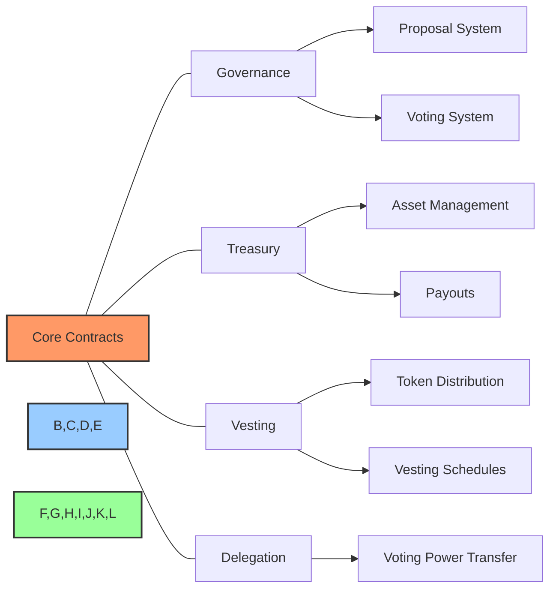
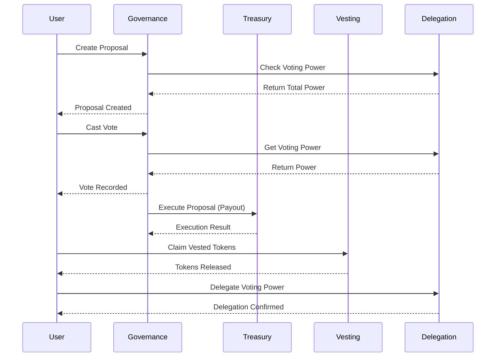

# 🔐 BAD DAO UI - Smart Contract Specifications

## 🔍 Overview

This document provides detailed specifications for the smart contracts used in the BAD DAO UI platform. The project leverages Thirdweb SDK v4 for smart contract deployment and interaction, with a focus on four core contract types: Governance, Treasury, Vesting, and Delegation.

## 🏗️ Contract Architecture

The BAD DAO UI utilizes a modular smart contract architecture with interconnected contracts to provide comprehensive DAO functionality.



## 📄 Contract Specifications

### 1. Governance Contract

#### Purpose
The Governance contract manages DAO governance processes, including proposal creation, voting, and execution.

#### Key Features
- Proposal creation and management
- Voting mechanisms
- Proposal execution
- Vote delegation
- Quorum and threshold settings

#### Interface

```solidity
// SPDX-License-Identifier: MIT
pragma solidity ^0.8.0;

interface IGovernance {
    // Proposal states
    enum ProposalState {
        Pending,
        Active,
        Canceled,
        Defeated,
        Succeeded,
        Queued,
        Expired,
        Executed
    }

    // Proposal structure
    struct Proposal {
        uint256 id;
        address proposer;
        string title;
        string description;
        uint256 startBlock;
        uint256 endBlock;
        address[] targets;
        uint256[] values;
        bytes[] calldatas;
        bool executed;
        uint256 forVotes;
        uint256 againstVotes;
        uint256 abstainVotes;
        mapping(address => bool) hasVoted;
    }

    // Functions
    function propose(
        address[] memory targets,
        uint256[] memory values,
        bytes[] memory calldatas,
        string memory title,
        string memory description
    ) external returns (uint256);

    function castVote(uint256 proposalId, uint8 support) external returns (uint256);
    function castVoteWithReason(uint256 proposalId, uint8 support, string calldata reason) external returns (uint256);
    function execute(uint256 proposalId) external;
    function getProposalState(uint256 proposalId) external view returns (ProposalState);
    function getProposalCount() external view returns (uint256);
    function getProposal(uint256 proposalId) external view returns (
        address proposer,
        string memory title,
        string memory description,
        uint256 startBlock,
        uint256 endBlock,
        bool executed,
        uint256 forVotes,
        uint256 againstVotes,
        uint256 abstainVotes
    );
}
```

#### Configuration Options
| Parameter | Description | Default |
|-----------|-------------|---------|
| `votingDelay` | Blocks before voting starts | 1 block (~12 seconds) |
| `votingPeriod` | Duration of voting period | 45818 blocks (~1 week) |
| `proposalThreshold` | Minimum tokens to submit proposal | 100 tokens |
| `quorumVotes` | Minimum votes for proposal to pass | 4% of total supply |

#### Security Considerations
- Limited proposal creation to members with sufficient tokens
- Timelock for proposal execution
- Emergency pause mechanism
- Gas optimization for large DAOs

### 2. Treasury Contract

#### Purpose
The Treasury contract manages the financial assets of the DAO, handling deposits, withdrawals, and asset allocation.

#### Key Features
- Token custody
- Multi-signature authorization
- Spending proposals
- Asset tracking
- Allocation management

#### Interface

```solidity
// SPDX-License-Identifier: MIT
pragma solidity ^0.8.0;

interface ITreasury {
    // Asset type enum
    enum AssetType {
        Native,
        ERC20,
        ERC721,
        ERC1155
    }

    // Asset structure
    struct Asset {
        AssetType assetType;
        address tokenAddress;
        uint256 tokenId;
        uint256 amount;
    }

    // Functions
    function deposit(AssetType assetType, address token, uint256 tokenId, uint256 amount) external payable;
    function withdraw(address to, AssetType assetType, address token, uint256 tokenId, uint256 amount) external returns (bool);
    function allocate(address to, AssetType assetType, address token, uint256 tokenId, uint256 amount) external returns (bool);
    function getBalance(AssetType assetType, address token, uint256 tokenId) external view returns (uint256);
    function getAllAssets() external view returns (Asset[] memory);
    function isAuthorized(address account) external view returns (bool);
}
```

#### Configuration Options
| Parameter | Description | Default |
|-----------|-------------|---------|
| `withdrawalThreshold` | Amount requiring multi-sig | 1 ETH / 1000 tokens |
| `requiredSignatures` | Signatures for large withdrawals | 3 signers |
| `withdrawalDelay` | Timelock for withdrawals | 24 hours |
| `allocatedLimit` | Max % for automatic allocation | 5% of total |

#### Security Considerations
- Multi-signature for large withdrawals
- Withdrawal limits and delays
- Comprehensive audit logging
- Separation of concerns from governance

### 3. Vesting Contract

#### Purpose
The Vesting contract manages token distribution with time-based vesting schedules for team members, investors, and community contributors.

#### Key Features
- Customizable vesting schedules
- Cliff and linear vesting options
- Token claim functionality
- Schedule revocation (optional)
- Transfer restrictions during vesting

#### Interface

```solidity
// SPDX-License-Identifier: MIT
pragma solidity ^0.8.0;

interface IVesting {
    // Vesting type
    enum VestingType {
        Linear,
        Cliff,
        Hybrid
    }

    // Vesting schedule
    struct VestingSchedule {
        uint256 id;
        address beneficiary;
        uint256 start;
        uint256 cliff;
        uint256 duration;
        uint256 totalAmount;
        uint256 releasedAmount;
        bool revocable;
        bool revoked;
        VestingType vestingType;
    }

    // Functions
    function createVesting(
        address beneficiary,
        uint256 start,
        uint256 cliff,
        uint256 duration,
        uint256 amount,
        bool revocable,
        VestingType vestingType
    ) external returns (uint256);

    function release(uint256 scheduleId) external returns (uint256);
    function revoke(uint256 scheduleId) external returns (bool);
    function vestedAmount(uint256 scheduleId) external view returns (uint256);
    function getVestingSchedule(uint256 scheduleId) external view returns (VestingSchedule memory);
    function getVestingSchedulesForBeneficiary(address beneficiary) external view returns (uint256[] memory);
}
```

#### Configuration Options
| Parameter | Description | Default |
|-----------|-------------|---------|
| `minCliffDuration` | Minimum cliff period | 0 (no minimum) |
| `maxVestingDuration` | Maximum vesting duration | 4 years |
| `adminRole` | Address that can revoke | Governance contract |
| `releaseFrequency` | How often tokens can be claimed | 1 day |

#### Security Considerations
- Reentrancy protection for claims
- Prevent duplicate schedules
- Authorized revocation only
- Token ownership verification

### 4. Delegation Contract

#### Purpose
The Delegation contract allows token holders to delegate their voting power to other addresses without transferring ownership of tokens.

#### Key Features
- Voting power delegation
- Delegation history tracking
- Self-delegation option
- Delegation expiration
- Conditional delegation

#### Interface

```solidity
// SPDX-License-Identifier: MIT
pragma solidity ^0.8.0;

interface IDelegation {
    // Delegation info
    struct DelegationInfo {
        address delegator;
        address delegatee;
        uint256 amount;
        uint256 expiration;
        bool conditional;
        bytes32 conditionHash;
    }

    // Functions
    function delegate(address delegatee, uint256 amount) external returns (bool);
    function delegateWithExpiration(address delegatee, uint256 amount, uint256 expiration) external returns (bool);
    function delegateWithCondition(address delegatee, uint256 amount, bytes32 conditionHash) external returns (bool);
    function undelegate(address delegatee) external returns (bool);
    function getVotingPower(address account) external view returns (uint256);
    function getDelegatedPower(address account) external view returns (uint256);
    function getDelegationInfo(address delegator, address delegatee) external view returns (DelegationInfo memory);
    function isDelegating(address delegator) external view returns (bool);
}
```

#### Configuration Options
| Parameter | Description | Default |
|-----------|-------------|---------|
| `maxDelegationRatio` | Max % delegatable | 100% |
| `delegationDelay` | Blocks before delegation active | 1 block |
| `maxDelegationDuration` | Max time for delegation | 365 days |
| `delegationTransitivity` | Allow re-delegation | False |

#### Security Considerations
- Prevent circular delegation
- Delegation amount validation
- Expiration enforcement
- Gas optimized for large DAOs

## 💼 Contract Integration Flow

The following sequence diagram illustrates how the contracts interact during typical DAO operations:



## 🛠️ Contract Deployment Specifications

### Deployment Order
1. Deploy Governance Token
2. Deploy Delegation Contract
3. Deploy Vesting Contract
4. Deploy Treasury Contract
5. Deploy Governance Contract
6. Configure contract permissions
7. Transfer ownership to Governance

### Network Requirements
- EVM-compatible blockchain
- Gas optimization for deployment
- Recommended networks:
  - Ethereum Mainnet (production)
  - Polygon (scaling solution)
  - Mumbai (testing)

### Deployment Parameters

```typescript
// Governance deployment
const deployGovernance = async () => {
  const contractAddress = await sdk.deployer.deployGovernance({
    voting_token_address: tokenAddress,
    voting_delay_in_blocks: 1,
    voting_period_in_blocks: 45818, // ~1 week
    proposal_threshold: ethers.utils.parseEther("100"),
    voting_quorum_fraction: 4,
  });
  return contractAddress;
};

// Treasury deployment
const deployTreasury = async () => {
  const contractAddress = await sdk.deployer.deployTreasury({
    governing_contract_address: governanceAddress,
    withdrawl_delay_in_seconds: 86400, // 24 hours
    required_signatures: 3,
  });
  return contractAddress;
};

// Vesting deployment
const deployVesting = async () => {
  const contractAddress = await sdk.deployer.deployVesting({
    token_address: tokenAddress,
    admin_address: governanceAddress,
  });
  return contractAddress;
};

// Delegation deployment
const deployDelegation = async () => {
  const contractAddress = await sdk.deployer.deployDelegation({
    token_address: tokenAddress,
    max_delegation_ratio: 100, // 100%
    delegation_delay_in_blocks: 1,
  });
  return contractAddress;
};
```

## 📊 Contract Monitoring

### Events to Monitor
| Contract | Event | Description |
|----------|-------|-------------|
| Governance | `ProposalCreated` | New proposal submitted |
| Governance | `VoteCast` | Vote registered |
| Governance | `ProposalExecuted` | Proposal executed |
| Treasury | `AssetWithdrawn` | Assets withdrawn |
| Treasury | `AssetDeposited` | Assets deposited |
| Vesting | `VestingCreated` | New vesting schedule |
| Vesting | `TokensReleased` | Tokens claimed from vesting |
| Delegation | `DelegationCreated` | New delegation created |
| Delegation | `DelegationRevoked` | Delegation canceled |

### Metrics to Track
- Proposal success rate
- Voting participation
- Treasury growth rate
- Vesting completion percentage
- Delegation utilization

## 🧪 Testing Requirements

### Unit Tests
- Function-level testing of all contract methods
- Boundary condition testing
- Error condition handling

### Integration Tests
- Cross-contract interactions
- Full proposal lifecycle tests
- Multi-user scenarios

### Security Tests
- Reentrancy attacks
- Front-running vulnerabilities
- Denial of service scenarios
- Access control validation

## 📝 Maintenance and Upgrades

### Upgrade Strategy
- Use transparent proxy pattern for upgradability
- Governance proposal for contract upgrades
- Backwards compatibility for data
- Comprehensive test suite for upgrades

### Maintenance Procedures
- Regular security audits
- Gas optimization reviews
- Compliance with new EIPs
- Documentation updates

## 🔄 Cross-References

- See [technical/architecture.md](../technical/architecture.md) for system architecture details
- See [blockchain/contract-architecture.md](./contract-architecture.md) for contract relationships
- See [blockchain/deployment-guide.md](./deployment-guide.md) for deployment procedures
- See [blockchain/gas-optimization.md](./gas-optimization.md) for gas usage details

---

**Last Updated:** 2025-05-02  
**Maintained By:** PowerBridge.AI Team

---

Made with Power, Love, and AI •  ⚡️❤️🤖 •  POWERBRIDGE.AI 