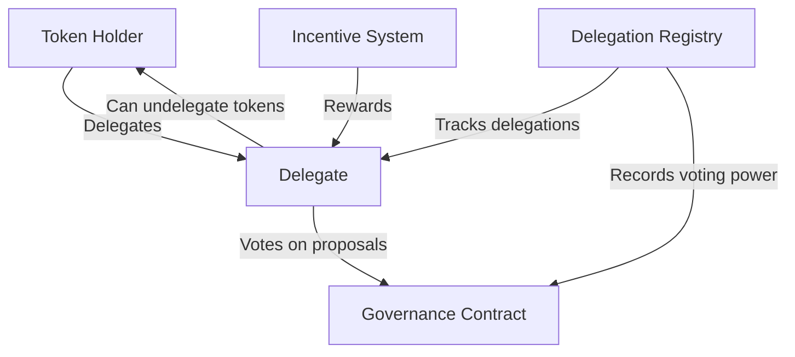

# BAD DAO Development Notes

## Technical Specifications

### Network Information
- **Primary Network**: Base
- **Testnet**: Base Goerli
- **Block Explorer**: [Basescan](https://basescan.org)
- **Gas Token**: ETH (Layer 2 cost is ~0.1-5% of Ethereum mainnet)
- **Deployment Cost**: <$10 for token and governance suite

### Development Environment
- **Solidity Version**: 0.8.20
- **Framework**: Hardhat
- **Testing Framework**: Chai/Mocha
- **OpenZeppelin Version**: 4.9.3
- **Node Version**: 16.x
- **Frontend**: React 18
- **Web3 Integration**: ethers.js 6.x
- **UI Framework**: Tailwind CSS

## Smart Contract Architecture

### BAD Token
```solidity
// SPDX-License-Identifier: MIT
pragma solidity ^0.8.20;

import "@openzeppelin/contracts/token/ERC20/extensions/ERC20Votes.sol";
import "@openzeppelin/contracts/access/Ownable.sol";

contract BADToken is ERC20Votes, Ownable {
    // Token implementation with governance capabilities
    // Includes snapshot functionality for voting
    // Allows delegation for governance power
    // Manages token supply and distribution
}
```

Key Features:
- ERC20 with voting capabilities
- Snapshot mechanism for vote counting
- Delegation of voting power
- Initial supply: 100 million tokens
- Decimal places: 18
- Token symbol: BAD

### Governance System

#### BADGovernor
```solidity
// SPDX-License-Identifier: MIT
pragma solidity ^0.8.20;

import "@openzeppelin/contracts/governance/Governor.sol";
import "@openzeppelin/contracts/governance/extensions/GovernorSettings.sol";
import "@openzeppelin/contracts/governance/extensions/GovernorCountingSimple.sol";
import "@openzeppelin/contracts/governance/extensions/GovernorVotes.sol";
import "@openzeppelin/contracts/governance/extensions/GovernorTimelockControl.sol";

contract BADGovernor is 
    Governor, 
    GovernorSettings, 
    GovernorCountingSimple, 
    GovernorVotes, 
    GovernorTimelockControl 
{
    // Governance implementation
    // Manages proposals, voting, and execution
    // Integrates with timelock for delayed execution
}
```

#### TimelockController
```solidity
// SPDX-License-Identifier: MIT
pragma solidity ^0.8.20;

import "@openzeppelin/contracts/governance/TimelockController.sol";

// Standard OpenZeppelin TimelockController with custom configuration
// Enforces delay period before execution
// Secures governance system against sudden changes
```

### Governance Parameters
- Voting delay: 1 day (7200 blocks)
- Voting period: 5 days (36000 blocks)
- Proposal threshold: 1% of total supply
- Quorum: 4% of total supply
- Timelock delay: 2 days (14400 blocks)

## Database Schema

### Proposal Metadata
```sql
CREATE TABLE proposals (
    proposal_id VARCHAR(66) PRIMARY KEY,
    title VARCHAR(100) NOT NULL,
    description TEXT NOT NULL,
    proposer VARCHAR(42) NOT NULL,
    start_block INT NOT NULL,
    end_block INT NOT NULL,
    status VARCHAR(20) NOT NULL,
    created_at TIMESTAMP DEFAULT CURRENT_TIMESTAMP
);

CREATE TABLE proposal_actions (
    id SERIAL PRIMARY KEY,
    proposal_id VARCHAR(66) REFERENCES proposals(proposal_id),
    target_address VARCHAR(42) NOT NULL,
    value NUMERIC(78,0) DEFAULT 0,
    signature VARCHAR(100),
    calldata BYTEA,
    execution_order INT NOT NULL
);

CREATE TABLE votes (
    id SERIAL PRIMARY KEY,
    proposal_id VARCHAR(66) REFERENCES proposals(proposal_id),
    voter VARCHAR(42) NOT NULL,
    support SMALLINT NOT NULL,
    weight NUMERIC(78,0) NOT NULL,
    reason TEXT,
    voted_at TIMESTAMP DEFAULT CURRENT_TIMESTAMP,
    UNIQUE(proposal_id, voter)
);
```

## Frontend Architecture

### Component Structure
```
/src
  /components
    /common
      Button.jsx
      Card.jsx
      Modal.jsx
      Spinner.jsx
    /layout
      Header.jsx
      Footer.jsx
      Sidebar.jsx
    /token
      TokenBalance.jsx
      TransferForm.jsx
      DelegationForm.jsx
    /governance
      ProposalList.jsx
      ProposalCard.jsx
      ProposalDetail.jsx
      VotingInterface.jsx
      ProposalForm.jsx
    /wallet
      WalletConnect.jsx
      NetworkSwitch.jsx
```

### State Management
- React Context API for global state
- Redux for complex state management
- Web3 provider context for blockchain interaction

### API Integration
```javascript
// Web3 Service for contract interaction
export class Web3Service {
  constructor(provider) {
    this.provider = provider;
    this.signer = provider.getSigner();
    this.tokenContract = new ethers.Contract(
      TOKEN_ADDRESS, 
      TOKEN_ABI, 
      this.signer
    );
    this.governorContract = new ethers.Contract(
      GOVERNOR_ADDRESS,
      GOVERNOR_ABI,
      this.signer
    );
  }
  
  // Token methods
  async getBalance(address) {...}
  async transfer(to, amount) {...}
  async delegate(delegatee) {...}
  
  // Governance methods
  async getProposals() {...}
  async createProposal(targets, values, calldatas, description) {...}
  async castVote(proposalId, support) {...}
  async execute(proposalId) {...}
}
```

## Performance Considerations

### Smart Contract Gas Optimization
- Minimize storage usage
- Batch operations where possible
- Use calldata instead of memory for function parameters
- Remove unnecessary modifiers
- Use packed storage slots

### Frontend Performance
- Implement code splitting
- Use React.memo for expensive components
- Lazy load components
- Implement virtual scrolling for long lists
- Cache blockchain data locally

## Security Measures

### Smart Contract Security
- Follow OpenZeppelin best practices
- Implement access control
- Use reentrancy guards
- Add emergency pause functionality
- Limit token minting capabilities
- Implement proper owner management

### Frontend Security
- Implement proper input validation
- Use secure wallet connection methods
- Handle transaction errors gracefully
- Implement proper error boundaries
- Validate transaction parameters

## Testing Strategy

### Smart Contract Testing
- Unit tests for all contracts
- Integration tests for contract interactions
- Fuzz testing for edge cases
- Gas optimization tests
- Slither and Mythril static analysis

### Frontend Testing
- Component unit tests with React Testing Library
- Integration tests with Cypress
- Mock blockchain provider for testing
- End-to-end tests for critical flows
- Contract mocking for frontend testing

## Deployment Workflow

### Contract Deployment
1. Deploy BADToken contract
2. Deploy TimelockController
3. Deploy BADGovernor with token and timelock addresses
4. Set up roles on TimelockController
5. Verify contracts on Basescan
6. Test governance flow end-to-end

```bash
# Example deployment commands
npx hardhat run scripts/deploy.js --network base_goerli
npx hardhat verify --network base_goerli <CONTRACT_ADDRESS> <CONSTRUCTOR_ARGS>
```

### Frontend Deployment
1. Build React application
2. Deploy to IPFS or Vercel
3. Set up CI/CD pipeline
4. Configure environment variables
5. Test network connectivity

```bash
# Frontend deployment
npm run build
npx vercel deploy --prod
```

## Technical Decisions Log

### 2023-08-15
- Selected Base network due to lower gas costs and Ethereum compatibility
- Chose OpenZeppelin contracts for governance to ensure security and standardization
- Decided to use ERC20Votes extension for token to enable on-chain governance
- Selected Hardhat over Truffle for development due to better plugin ecosystem

### 2023-08-18
- Implemented snapshot-based voting instead of traditional balance-based voting
- Decided on 1% proposal threshold to balance accessibility and spam prevention
- Chose 5-day voting period to give community sufficient time to participate
- Implemented 2-day timelock to provide security without excessive delays

## Configuration Details

### Hardhat Configuration
```javascript
module.exports = {
  solidity: {
    version: "0.8.20",
    settings: {
      optimizer: {
        enabled: true,
        runs: 200
      }
    }
  },
  networks: {
    hardhat: {},
    base_goerli: {
      url: "https://goerli.base.org",
      accounts: [process.env.PRIVATE_KEY],
      chainId: 84531
    },
    base: {
      url: "https://mainnet.base.org",
      accounts: [process.env.PRIVATE_KEY],
      chainId: 8453
    }
  },
  etherscan: {
    apiKey: {
      base: process.env.ETHERSCAN_API_KEY,
      baseGoerli: process.env.ETHERSCAN_API_KEY
    },
    customChains: [
      {
        network: "base",
        chainId: 8453,
        urls: {
          apiURL: "https://api.basescan.org/api",
          browserURL: "https://basescan.org"
        }
      },
      {
        network: "baseGoerli",
        chainId: 84531,
        urls: {
          apiURL: "https://api-goerli.basescan.org/api",
          browserURL: "https://goerli.basescan.org"
        }
      }
    ]
  }
};
```

### Frontend Configuration
```javascript
// config.js
export const config = {
  networks: {
    base: {
      chainId: "0x2105", // 8453 in hex
      chainName: "Base",
      nativeCurrency: {
        name: "Ethereum",
        symbol: "ETH",
        decimals: 18
      },
      rpcUrls: ["https://mainnet.base.org"],
      blockExplorerUrls: ["https://basescan.org"]
    },
    baseGoerli: {
      chainId: "0x14a33", // 84531 in hex
      chainName: "Base Goerli",
      nativeCurrency: {
        name: "Ethereum",
        symbol: "ETH",
        decimals: 18
      },
      rpcUrls: ["https://goerli.base.org"],
      blockExplorerUrls: ["https://goerli.basescan.org"]
    }
  },
  contracts: {
    mainnet: {
      tokenAddress: "0x...",
      governorAddress: "0x...",
      timelockAddress: "0x..."
    },
    testnet: {
      tokenAddress: "0x...",
      governorAddress: "0x...",
      timelockAddress: "0x..."
    }
  }
};
```

## Development Commands

### Smart Contract Development
```bash
# Installation
npm install

# Compile contracts
npx hardhat compile

# Run tests
npx hardhat test

# Deploy contracts
npx hardhat run scripts/deploy.js --network base_goerli
# Verify contracts
npx hardhat verify --network base_goerli <CONTRACT_ADDRESS> <CONSTRUCTOR_ARGS>

# Run local node
npx hardhat node

# Deploy to local node
npx hardhat run scripts/deploy.js --network localhost
```

### Frontend Development
```bash
# Installation
cd frontend
npm install

# Start development server
npm run dev

# Build for production
npm run build

# Run tests
npm test

# Run linting
npm run lint

# Deploy to Vercel
npx vercel deploy
```

## Database Commands
```bash
# Connect to database (using PGPASSWORD for security)
PGPASSWORD=ATI123#4567 psql -h localhost -U postgres -d bad_dao

# Create tables
PGPASSWORD=ATI123#4567 psql -h localhost -U postgres -d bad_dao -f scripts/schema.sql

# Backup database
PGPASSWORD=ATI123#4567 pg_dump -h localhost -U postgres -d bad_dao > backup.sql

# Restore database
PGPASSWORD=ATI123#4567 psql -h localhost -U postgres -d bad_dao < backup.sql
```

## Ongoing Development Notes

### Known Issues
- Token delegation UI needs improvement for better UX
- Governance proposal descriptions need markdown support
- Transaction confirmation modals need better error handling
- Contract verification script needs enhancement for complex contracts

### Planned Improvements
- Implement subgraph for efficient data indexing
- Add multiple language support
- Implement dark mode
- Add transaction history
- Enhance mobile responsiveness
- Add proposal execution simulation 

## BAD DAO Governance Framework - Technical Specification
**Date**: 2023-06-03

### 🏛️ Governance Structure Overview

The BAD DAO governance system implements a multi-tiered role-based structure with delegation capabilities and AI agent integration. This framework establishes clear responsibilities, qualification processes, and token vesting schedules for all participants.

#### Vesting Strategy Specifications

| Role | Initial Token Allocation | Vesting Period | Cliff | Release Schedule |
|------|--------------------------|----------------|-------|------------------|
| Core Team | 15% | 36 months | 6 months | Linear monthly |
| Contributors | 10% | 24 months | 3 months | Linear monthly |
| Early Adopters | 5% | 12 months | None | Linear monthly |
| Treasury | 40% | N/A | N/A | Controlled by governance |
| Community | 30% | None | None | Immediate availability |

```solidity
// Core vesting contract implementation
contract BADVesting {
    mapping(address => VestingSchedule) public vestingSchedules;
    
    struct VestingSchedule {
        uint256 totalAmount;
        uint256 startTime;
        uint256 cliffDuration;
        uint256 duration;
        uint256 released;
        bool revocable;
        bool revoked;
    }
    
    // Key functions (simplified):
    function createVestingSchedule(address beneficiary, uint256 amount, uint256 cliff, uint256 duration) external;
    function release() external;
    function revoke(address beneficiary) external onlyGovernance;
}
```

#### Governance Qualification Process

1. **Core Team Qualification**:
   - Minimum 12 months direct project experience
   - Holding minimum 100,000 BAD tokens in locked governance contract
   - Successful completion of governance qualification process
   - Multi-sig key holder requirements

2. **Contributor Qualification**:
   - Minimum 5 successful proposals or contributions
   - Holding minimum 25,000 BAD tokens
   - Community reputation score ≥ 85%
   - Technical expertise verification

3. **Delegate Qualification**:
   - Minimum 50,000 BAD tokens staked in delegation contract
   - Successful completion of delegation training
   - Established track record of participation

#### Delegation Mechanics



Delegation system implements:
- Time-locked token delegation with minimum 7-day commitment
- Performance-based delegation incentives (0.5-2% APY)
- Delegation power caps (max 5% of total supply per delegate)
- Slashing conditions for delegate misbehavior
- Reputation system integration

#### Treasury Automation

```solidity
// Treasury automation contract (simplified)
contract TreasuryAutomation {
    struct PaymentSchedule {
        address recipient;
        uint256 amount;
        uint256 frequency; // in seconds
        uint256 lastPaid;
    }
    
    mapping(uint256 => PaymentSchedule) public paymentSchedules;
    
    function createPaymentSchedule(address recipient, uint256 amount, uint256 frequency) external onlyGovernance;
    function executePayments() external;
    function pausePayment(uint256 scheduleId) external onlyGovernance;
}
```

Key automation features:
- Recurring payments for contributors and operations
- Revenue distribution automation
- Treasury rebalancing (maintaining allocations between stable and volatile assets)
- Emergency fund management
- Proposal funding mechanism

#### AI Agent Integration

The governance system integrates AI agents serving specific functions:

1. **Proposal Analyzer**:
   - Evaluates proposal completeness and feasibility
   - Identifies conflicts with existing governance
   - Estimates economic impact

2. **Voting Recommendation Agent**:
   - Analyzes proposal alignment with DAO objectives
   - Provides weighted scoring across evaluation criteria
   - Publishes recommendation reports for delegates

3. **Treasury Oversight Agent**:
   - Monitors treasury activity for anomalies
   - Recommends portfolio adjustments
   - Generates financial health reports

### Technical Implementation Notes

Backend integration requirements:
- PostgreSQL database for governance metrics and delegation tracking
- GraphQL API for frontend integration
- Ethereum node connection for on-chain verification
- IPFS integration for proposal documentation

Key smart contract dependencies:
- OpenZeppelin Governor contracts
- Custom voting power calculation with time-weighted mechanics
- Tally integration for governance dashboard

Security considerations:
- Multi-sig requirements for critical functions (minimum 4/7)
- Time-locks for significant treasury movements (48-hour minimum)
- Emergency pause capabilities with distributed control

Development milestones:
1. Deploy core vesting contracts - Due: 2023-06-05
2. Implement governance qualification system - Due: 2023-06-08
3. Deploy delegation mechanics - Due: 2023-06-12
4. Integrate treasury automation - Due: 2023-06-15
5. Deploy and configure AI governance agents - Due: 2023-06-17
