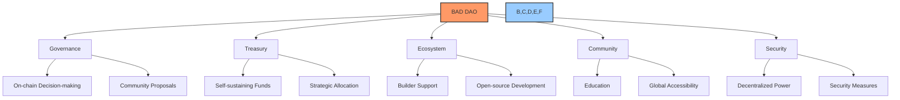
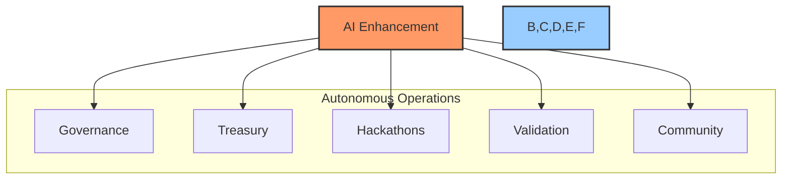
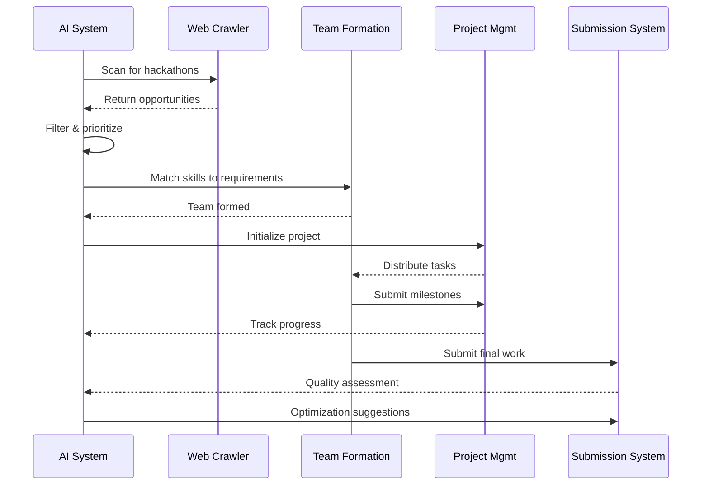
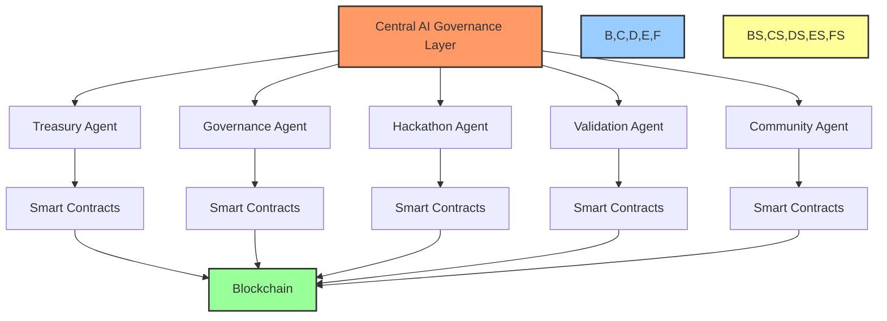
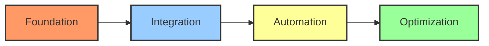
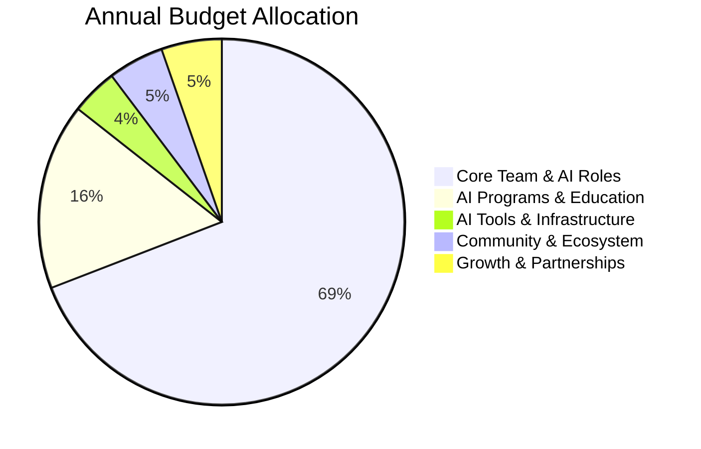

# 📊 AI Development: Build a DAO (BAD) Overview Summary

## 📑 Table of Contents
- [📝 Executive Summary](#executive-summary)
- [🔍 Original BAD Vision & Objectives](#original-bad-vision--objectives)
  - [🎯 Core Mission](#core-mission)
  - [✨ Key Features](#key-features)
  - [🧠 DAODiSM Philosophy](#daodism-philosophy)
  - [⚠️ Documentation Gaps](#documentation-gaps)
- [💡 AI Enhancement Opportunities](#ai-enhancement-opportunities)
  - [🏛️ Governance Automation](#1-governance-automation)
  - [💰 Treasury Management System](#2-treasury-management-system)
  - [🏆 Hackathon Discovery & Management](#3-hackathon-discovery--management)
  - [🔐 Self-Validation & Auditing](#4-self-validation--auditing)
  - [👥 Community Management](#5-community-management)
- [🏗️ Technical Implementation Framework](#technical-implementation-framework)
  - [🤖 AI System Architecture](#ai-system-architecture)
  - [📝 Smart Contract Structure](#smart-contract-structure)
  - [🛣️ Development Roadmap](#development-roadmap)
- [💹 Financial Sustainability Model](#financial-sustainability-model)
  - [💲 Revenue Streams](#revenue-streams)
  - [📊 Cost Structure](#cost-structure)
- [🔄 Conclusion](#conclusion)

## 📝 Executive Summary

Based on a comprehensive review of the BAD (Build a DAO) documentation, this document provides a clear understanding of the project's original vision, its limitations, and how AI integration can transform it into a fully automated, self-sustaining decentralized autonomous organization.

## 🔍 Original BAD Vision & Objectives

### 🎯 Core Mission
BAD was conceptualized as a decentralized autonomous organization focused on:
1. 🌐 Empowering the transition from Web2 to Web3
2. 🚀 Incubating meaningful Web3 projects, particularly in Africa
3. 👥 Nurturing a community of developers and non-developers
4. 📚 Documenting the DAO-building process as research

### ✨ Key Features
- 🏛️ **Governance Structure**: On-chain decision-making with community-driven proposals
- 💰 **Treasury Management**: Self-sustaining treasury for funding projects and operations
- 🌱 **Ecosystem Growth**: Support for builders, creators, and open-source development
- 🌍 **Community Impact**: Active engagement, education, and global accessibility
- 🔒 **Autonomy & Security**: Decentralized power structures with safeguard mechanisms

### 🧠 DAODiSM Philosophy
The project also introduced the concept of "DAODiSM" - a philosophical framework for their DAO with:
- 🌟 **Core Principles**: Decentralization, transparency, self-sovereignty, community-first, and sustainability
- 🙏 **The 8 Be-Attitudes**: A set of guiding principles for community participation
- 📜 **The DAODiSM Code**: Ethical guidelines for DAO operations
- 🗺️ **Community Engagement Roadmap**: Structured approach to growing the community

### ⚠️ Documentation Gaps
The existing documentation reveals several critical gaps:
- 🔴 Lack of actual code implementation
- 🔴 Absence of detailed AI integration plans despite mentions
- 🔴 Missing operational backbone (management team, leadership communication)
- 🔴 Insufficient technical framework for automation
- 🔴 Limited details on self-sustaining mechanisms
- 🔴 No concrete funding sources or financial plan
- 🔴 Absence of project management methodology

## 💡 AI Enhancement Opportunities

### 🏛️ 1. Governance Automation
- ✍️ **AI-Drafted Proposals**: Autonomous drafting of governance proposals based on community needs
- 👮 **Policy Enforcement**: AI monitoring and enforcement of established governance rules
- 📊 **Smart Voting Analysis**: Predictive analysis of proposal outcomes and impact
- 🤖 **Governance Agents**: 24/7 recommendation engines, proposal analysts, and engagement bots

### 💰 2. Treasury Management System
- 💸 **Automated Fund Allocation**: AI-driven distribution of resources based on project performance
- 📈 **Risk Assessment**: Continuous evaluation of investment strategies and financial health
- 🕵️ **Fraud Detection**: Pattern recognition to identify suspicious transactions or proposals
- 🔑 **Multi-signature Security**: AI-powered verification of treasury transactions

### 🏆 3. Hackathon Discovery & Management
- 🔍 **Opportunity Detection**: Automated scanning for hackathons with 14-day window opportunities
- 👥 **Team Formation**: AI matching of skills to project requirements
- 📋 **Project Management**: Automated milestone tracking and resource allocation
- 🚀 **Submission Optimization**: AI-enhanced quality control for hackathon submissions

### 🔐 4. Self-Validation & Auditing
- 🧪 **Code Validation**: Continuous code review and security assessment
- 📊 **Performance Auditing**: Automatic evaluation of project deliverables
- ✓ **Compliance Checking**: Ensuring adherence to regulatory requirements
- 🔍 **Governance Audits**: Regular assessment of governance system effectiveness

### 👥 5. Community Management
- 🗣️ **AI Agent Communication**: Intelligent bots for community support and engagement
- 📝 **Content Generation**: Automated documentation and educational materials
- ⭐ **Reputation System**: Data-driven assessment of member contributions
- 📊 **Community Analytics**: AI-powered insights into community health and engagement

## 🏗️ Technical Implementation Framework

### 🤖 AI System Architecture
- 🧠 **Central AI Governance Layer**: Coordinates all autonomous functions
- 🧩 **Specialized Agent Network**: Domain-specific AI agents for different operational areas
- ⛓️ **Blockchain Integration**: Direct interaction with smart contracts for automated execution
- 🔄 **Data Processing Pipeline**: Continuous learning and optimization based on DAO performance

### 📝 Smart Contract Structure
- 💰 **Treasury Management Contracts**: Automated fund allocation and distribution
- 🏛️ **Governance Execution Contracts**: Proposal creation, voting, and implementation
- 📋 **Project Management Contracts**: Team formation, milestone tracking, and reward distribution
- 🔐 **Validation Contracts**: Automated auditing and compliance verification

### 🛣️ Development Roadmap
1. 🏗️ **Foundation Phase**: AI system architecture setup and core contract development
2. 🔌 **Integration Phase**: Connection of AI agents with smart contracts and frontend
3. 🤖 **Automation Phase**: Implementation of autonomous decision-making capabilities
4. ⚙️ **Optimization Phase**: Self-improvement mechanisms and performance enhancement

## 💹 Financial Sustainability Model

### 💲 Revenue Streams
Based on BAD's documentation, especially the "How BaD generates revenue (AI Powered)" file, the following revenue streams have been identified:

#### 🏛️ 1. Governance-Related Revenue
- 🏗️ **DAO Governance Architecture Services**: One-time setup + optional retainer for customized governance systems
- 🔄 **Governance-as-a-Service (GaaS)**: Monthly subscription for external governance management
- ✍️ **Proposal & Grant Writing Studio**: Performance-based fees for successful proposals
- 🔍 **Governance Audits & Optimization**: Fixed project fees or quarterly retainers
- 📜 **Licensing of Governance Frameworks**: One-time or tiered license fees for governance blueprints
- 🤖 **AI-Powered Governance Agents**: Tiered deployment packages (Lite → Pro → Fully Autonomous)

#### 🎓 3. Education & Development Revenue
- 📚 **Web3 Education Programs**: Course fees for AI-powered learning experiences
- 🚀 **Developer Bootcamps**: Tuition for specialized training programs
- 🏅 **Certification Services**: Fees for issuing and verifying Web3 credentials

#### 🧩 4. Platform & Technology Revenue
- ⚙️ **DAO-as-a-Service**: Licensing the AI-powered DAO framework
- 🎯 **White-Label Solutions**: Custom implementations for other organizations
- 🔌 **API Access**: Fees for accessing the AI governance and discovery systems

### 📊 Cost Structure
The annual operational budget of approximately $243,000 covers:
- 👥 Core team and operations (including AI roles): $168,000
- 🎓 AI-enhanced programs and education: $40,000
- 🤖 AI tools and infrastructure: $10,000
- 🌐 Community and ecosystem development: $12,000
- 📈 Growth, partnerships, and grants: $13,000

## 🔄 Conclusion

The original BAD documentation presents a vision for a decentralized autonomous organization focused on Web3 education, project incubation, and community building. However, it lacks the technical implementation details and operational infrastructure necessary for true autonomy.

By integrating advanced AI systems throughout the DAO's operations, we can transform BAD into a fully automated, self-sustaining organization that operates 24/7 with minimal human intervention. This AI-enhanced version would be capable of:

1. 🔍 Discovering and participating in hackathons autonomously
2. 🏛️ Managing its treasury and governance with minimal founder input
3. 💰 Generating sustainable revenue through multiple streams
4. 👥 Building and supporting a community through intelligent agents
5. 📈 Continuously improving its own systems through self-optimization

The result would be a truly next-generation Web4.0 DAO that sets a new standard for decentralized organizations, combining the best aspects of blockchain technology with the power of artificial intelligence. 