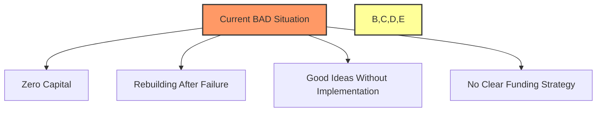
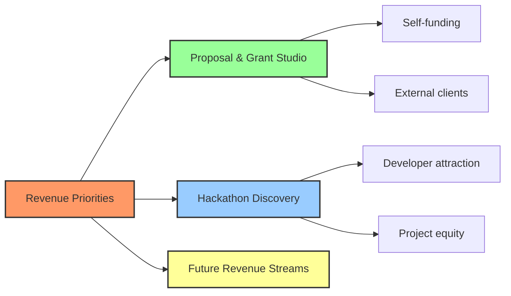
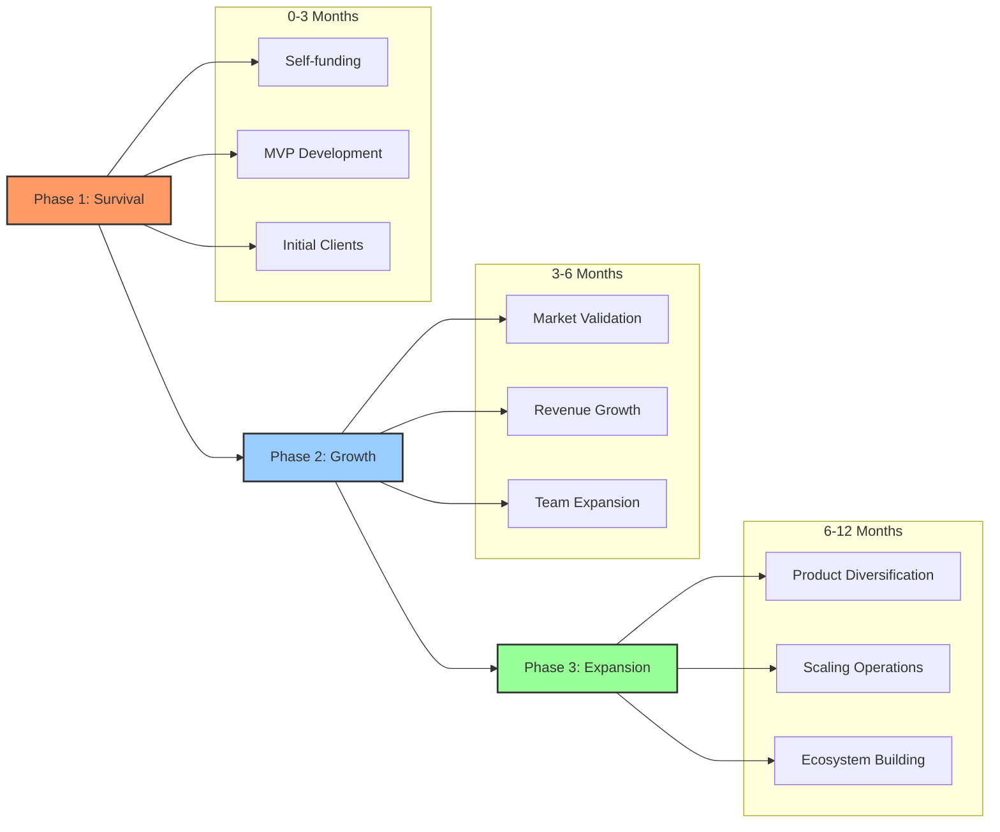
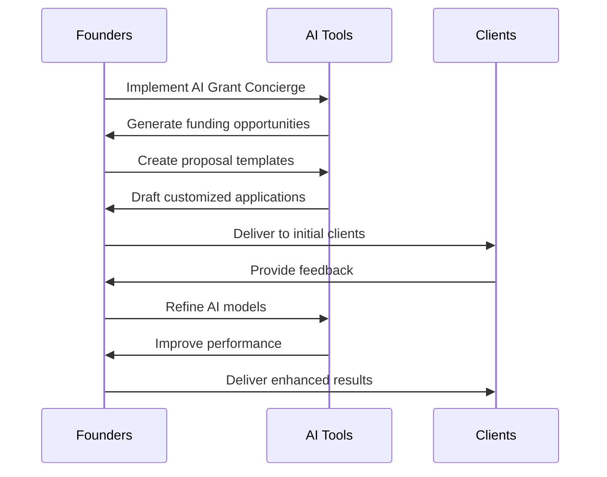
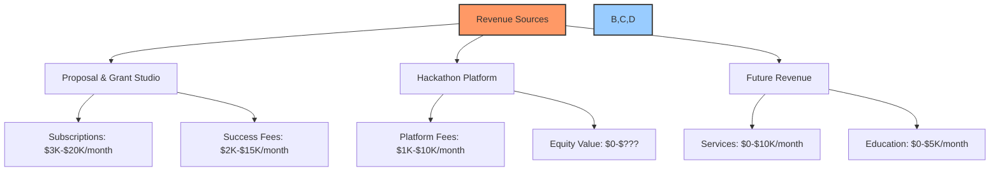
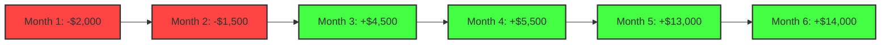

# 🚀 AI Development: DAO Launch 2.0

## 📑 Table of Contents
- [📊 Executive Summary](#executive-summary)
- [🔍 Current Situation Analysis](#current-situation-analysis)
  - [💰 Financial Reality](#financial-reality)
  - [👥 Team Reality](#team-reality)
  - [🛠️ Development Reality](#development-reality)
- [🎯 Prioritized Revenue Opportunities](#prioritized-revenue-opportunities)
  - [🥇 Proposal & Grant Writing Studio](#1-proposal--grant-writing-studio)
  - [🥈 Hackathon Discovery & Incubation](#2-hackathon-discovery--incubation)
  - [🥉 Additional Revenue Streams](#3-additional-revenue-streams)
- [🗺️ Realistic Implementation Roadmap](#realistic-implementation-roadmap)
  - [🌱 Phase 1: Survival & Foundation (0-3 Months)](#phase-1-survival--foundation-0-3-months)
  - [🌿 Phase 2: Growth & Proof (3-6 Months)](#phase-2-growth--proof-3-6-months)
  - [🌲 Phase 3: Expansion & Scaling (6-12 Months)](#phase-3-expansion--scaling-6-12-months)
- [⚙️ Implementation Framework](#implementation-framework)
  - [🤖 AI Tools Deployment](#ai-tools-deployment)
  - [📋 Project Management Approach](#project-management-approach)
  - [💼 Business Development Strategy](#business-development-strategy)
- [💰 Bootstrap Financial Plan](#bootstrap-financial-plan)
  - [📈 Revenue Projections](#revenue-projections)
  - [📉 Minimal Viable Expenses](#minimal-viable-expenses)
  - [⚖️ Break-Even Analysis](#break-even-analysis)
- [🔄 Conclusion & Next Steps](#conclusion--next-steps)

## 📊 Executive Summary

This document presents a realistic, phased approach to launching Build a DAO (BAD) 2.0 from its current zero-capital position to a self-sustaining organization. Unlike the previous documentation that presented an aspirational but unfunded vision, this plan focuses on immediate revenue generation and practical implementation, acknowledging the organization's need to rebuild after previous setbacks.

The strategy prioritizes the development of two key AI-driven products:
1. A Proposal & Grant Writing Studio with AI concierge service
2. A Hackathon Discovery & Incubation platform

These products not only serve as revenue generators but also tools the DAO itself needs, creating a "build for yourself first" approach that ensures product-market fit.

## 🔍 Current Situation Analysis

### 💰 Financial Reality
- 🔴 **Zero Starting Capital**: The organization currently has no funds
- 🔴 **No Active Revenue Streams**: No incoming cash flow
- 🔴 **Unrealistic Budget Projections**: Previous documentation cited a $243,000 annual budget without funding sources
- 🔴 **Need for Bootstrap Approach**: Must build with minimal resources

### 👥 Team Reality
- 🔶 **Recovering from Previous DAO Collapse**: Team has experienced a significant setback
- 🔶 **Limited Resources for Hiring**: Cannot afford traditional development team
- 🔶 **Need for Lean Operations**: Must operate with minimal overhead
- 🔶 **Founder-Driven Execution**: Heavy reliance on founders' efforts initially

### 🛠️ Development Reality
- 🔶 **Many Ideas, Limited Implementation**: Documentation shows concepts without execution
- 🔶 **No Clear Prioritization**: Multiple directions without focus
- 🔶 **Absence of Project Management**: Lack of structured development approach
- 🔶 **Need for Rapid MVPs**: Must create minimum viable products quickly

## 🎯 Prioritized Revenue Opportunities

After analyzing the potential revenue streams mentioned in the existing documentation, we've ranked them based on:
1. Speed to market
2. Initial capital requirements 
3. Revenue generation potential
4. Ability to bootstrap further development

### 🥇 1. Proposal & Grant Writing Studio

This represents the lowest-hanging fruit and addresses an immediate need for both BAD itself and potential clients.

#### 🎯 Product Vision
An AI-powered service that guides users through the entire funding acquisition process:

- 🤖 **AI Grant Concierge**: Personalized agent that walks users through the funding process
- 🔍 **Opportunity Discovery**: Automatically finds relevant grants, hackathons, and funding sources
- 📝 **Proposal Generation**: AI-assisted drafting of applications, pitch decks, and documentation
- 📊 **Application Management**: Tracking submissions, deadlines, and requirements
- 📈 **Iteration Engine**: Learning system that improves applications based on feedback
- 👔 **Pitch Preparation**: Coaching for presentations and investor meetings

#### 💰 Revenue Model
- **Tiered Subscription Plans**: Basic, Pro, and Enterprise levels
- **Success Fee Option**: Percentage of successfully secured funding (5-10%)
- **Customization Services**: Tailored solutions for specific industries
- **White Label Offerings**: For incubators and accelerators

#### 🏗️ Development Approach
- **Phase 1**: Build for BAD's own use first (self-dogfooding)
- **Phase 2**: Refine with 5-10 beta customers (possibly other DAOs)
- **Phase 3**: Launch publicly with tiered pricing

### 🥈 2. Hackathon Discovery & Incubation

This platform leverages the unique opportunity to connect developers with hackathons while creating a talent and project pipeline.

#### 🎯 Product Vision
An end-to-end platform that:

- 🔍 **Discovers Opportunities**: Automatically scans for hackathons with 14-day windows
- 👥 **Forms Teams**: Matches developers with complementary skills
- 🚀 **Accelerates Development**: AI-powered tools for rapid MVP creation
- 📋 **Manages Submissions**: Optimizes the quality of hackathon entries
- 💼 **Provides Incubation**: Post-hackathon support to transform winning projects into startups
- 💰 **Secures Funding**: Direct connection to the Proposal & Grant Studio

#### 💰 Revenue Model
- **Platform Fee**: Small fee from developers for team formation and tools
- **Equity Stake**: 5-15% equity in projects that receive incubation
- **Success Fee**: Percentage of hackathon winnings (10-20%)
- **Incubation Services**: Premium paid services for promising projects

#### 🏗️ Development Approach
- **Phase 1**: Build the hackathon discovery system and simple team matching
- **Phase 2**: Add AI-powered development tools for rapid prototyping
- **Phase 3**: Implement the full incubation program with equity arrangements

### 🥉 3. Additional Revenue Streams

These opportunities can be developed after establishing the primary revenue sources:

- 🏛️ **Governance-as-a-Service**: For established DAOs and Web3 organizations
- 📚 **Education Programs**: Web3 and AI development courses
- 🔧 **Technical Services**: Smart contract development and auditing
- 💼 **Consulting Services**: Web3 transition guidance for Web2 companies

## 🗺️ Realistic Implementation Roadmap

### 🌱 Phase 1: Survival & Foundation (0-3 Months)

The primary goal is to achieve operational self-sufficiency through immediate revenue generation.

#### 🎯 Key Objectives
1. **Develop MVP for Proposal & Grant Studio**
   - Create the basic AI concierge system
   - Build grant/funding opportunity database
   - Develop proposal templates and generation tools

2. **Apply the Tool for Self-Funding**
   - Use the tool to secure initial grants for BAD
   - Target minimum 3-5 funding applications per week
   - Aim for at least $50,000 in secured funding

3. **Establish First Paying Clients**
   - Convert 5-10 beta users to paying customers
   - Implement basic subscription model
   - Gather testimonials and case studies

4. **Begin Hackathon Discovery Development**
   - Create the opportunity scanning system
   - Build basic team formation functionality
   - Test with a small group of developers

#### 📊 Success Metrics
- Minimum $5,000 monthly recurring revenue
- At least one major grant secured for BAD
- 10+ active users on the platform
- MVP of both primary products functional

### 🌿 Phase 2: Growth & Proof (3-6 Months)

Focus on market validation and scaling initial success.

#### 🎯 Key Objectives
1. **Scale Proposal & Grant Studio**
   - Enhance AI capabilities based on user feedback
   - Implement success fee model
   - Expand marketing to reach more potential clients

2. **Launch Hackathon Discovery Platform**
   - Open public beta with at least 100 developers
   - Facilitate participation in 10+ hackathons
   - Secure first equity arrangements with promising projects

3. **Begin Building Community**
   - Create content showcasing successful funding cases
   - Host virtual events for users and developers
   - Build reputation in Web3 and DAO communities

4. **Optimize Operations**
   - Implement proper project management
   - Refine financial tracking and projections
   - Begin selective team expansion

#### 📊 Success Metrics
- $20,000+ monthly recurring revenue
- 50+ paying clients
- 5+ successful hackathon projects
- First equity stakes in promising startups

### 🌲 Phase 3: Expansion & Scaling (6-12 Months)

Diversify product offerings and scale operations.

#### 🎯 Key Objectives
1. **Launch Full Incubation Program**
   - Create formal process for post-hackathon incubation
   - Implement equity management system
   - Build mentorship network

2. **Develop Additional Revenue Streams**
   - Begin offering Governance-as-a-Service
   - Launch first educational programs
   - Explore technical services opportunities

3. **Scale Marketing and Outreach**
   - Implement comprehensive marketing strategy
   - Attend and sponsor industry events
   - Build partnerships with other Web3 organizations

4. **Formalize DAO Structure**
   - Implement governance mechanisms
   - Launch token (if appropriate)
   - Create transparent treasury management

#### 📊 Success Metrics
- $50,000+ monthly recurring revenue
- Portfolio of 10+ incubated projects
- Active community of 1,000+ developers
- Sustainable operation with 3+ months runway

## ⚙️ Implementation Framework

### 🤖 AI Tools Deployment

The $3,000 consulting package will focus on implementing these essential AI tools:

#### 🔧 Key AI Systems to Deploy
1. **Grant Discovery Engine**
   - Web crawler for funding opportunities
   - Classification and matching system
   - Deadline tracking and alerts

2. **Proposal Generation System**
   - Template library for different funding types
   - Customization engine
   - Quality assessment tools

3. **Hackathon Scanner**
   - Event detection and analysis
   - Requirements extraction
   - Compatibility matching for teams

4. **MVP Development Accelerators**
   - Code generation tools
   - Documentation creators
   - Testing and optimization assistants

### 📋 Project Management Approach

A lean, agile approach focusing on rapid iteration and delivery.

#### 🔄 Agile Implementation
- **Weekly Sprints**: Short cycles with clear deliverables
- **Daily Standups**: Quick coordination among team members
- **Continuous Deployment**: Regular releases to gather feedback

#### 📊 SWOT Analysis Framework
- **Regular Assessment**: Monthly review of strengths, weaknesses, opportunities, and threats
- **Adaptive Planning**: Adjust strategy based on SWOT findings
- **Risk Mitigation**: Identify and address potential issues early

### 💼 Business Development Strategy

Focus on building relationships and demonstrating value.

#### 🎯 Target Audiences
1. **Early-Stage DAOs**: Organizations similar to BAD needing funding
2. **Web3 Developers**: Individuals seeking hackathon opportunities
3. **Incubators/Accelerators**: Partners for white-labeled solutions
4. **Grant Programs**: Sources of funding for BAD itself

#### 📣 Marketing Approach
- **Content Marketing**: Case studies of successful funding
- **Community Building**: Active presence in DAO and Web3 communities
- **Strategic Partnerships**: Collaborations with complementary services
- **Testimonials**: Showcase client success stories

## 💰 Bootstrap Financial Plan

A realistic financial approach starting from zero capital.

### 📈 Revenue Projections

#### Month-by-Month Projection (First 6 Months)

| Month | Proposal Studio | Hackathon Platform | Other | Total Revenue |
|-------|----------------|-------------------|-------|---------------|
| 1     | $1,000         | $0                | $0    | $1,000        |
| 2     | $3,000         | $500              | $0    | $3,500        |
| 3     | $6,000         | $1,500            | $0    | $7,500        |
| 4     | $10,000        | $3,000            | $500  | $13,500       |
| 5     | $15,000        | $5,000            | $1,000| $21,000       |
| 6     | $20,000        | $8,000            | $2,000| $30,000       |

### 📉 Minimal Viable Expenses

Extremely lean operation focused only on essential expenses.

#### Monthly Expense Structure

| Expense Category | Month 1-3 | Month 4-6 | Month 7-12 |
|------------------|-----------|-----------|------------|
| Core Team (Minimum) | $2,000    | $5,000    | $10,000    |
| AI Tools & APIs     | $500      | $1,000    | $2,000     |
| Infrastructure      | $200      | $500      | $1,000     |
| Marketing           | $300      | $1,000    | $2,000     |
| Legal & Compliance  | $0        | $500      | $1,000     |
| **Total**           | **$3,000**| **$8,000**| **$16,000**|

### ⚖️ Break-Even Analysis

- **Break-Even Point**: Expected in Month 3
- **Cumulative Profit by Month 6**: ~$33,500
- **Reinvestment Strategy**: 70% of profits reinvested for growth
- **Emergency Fund**: 20% allocated to runway extension

## 🔄 Conclusion & Next Steps

This realistic approach transforms Build a DAO from an aspirational concept to a practical, revenue-generating organization by:

1. 🎯 **Focusing on Immediate Revenue**: Prioritizing services that can generate cash flow quickly
2. 🧠 **Leveraging AI for Efficiency**: Using AI to minimize human resource requirements
3. 🌱 **Building for Self-Use First**: Creating tools the DAO itself needs
4. 💰 **Establishing Financial Foundation**: Creating sustainable revenue before scaling
5. 🏢 **Operating as a Parent Company**: Taking equity stakes in incubated projects

### 📋 Immediate Action Items

1. **Implement AI Tools Package**: Deploy the $3,000 consulting solution
2. **Develop Grant Concierge MVP**: Create the initial version within 2 weeks
3. **Apply for First Funding**: Submit 5 applications in first month
4. **Recruit Beta Testers**: Find 5-10 initial users for feedback
5. **Begin Building Community**: Create initial social media presence

By following this plan, BAD can transform from a concept with no funding into a self-sustaining organization with multiple revenue streams and a growing portfolio of incubated projects within 6-12 months. 