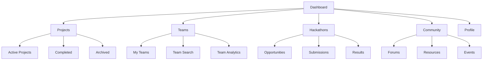
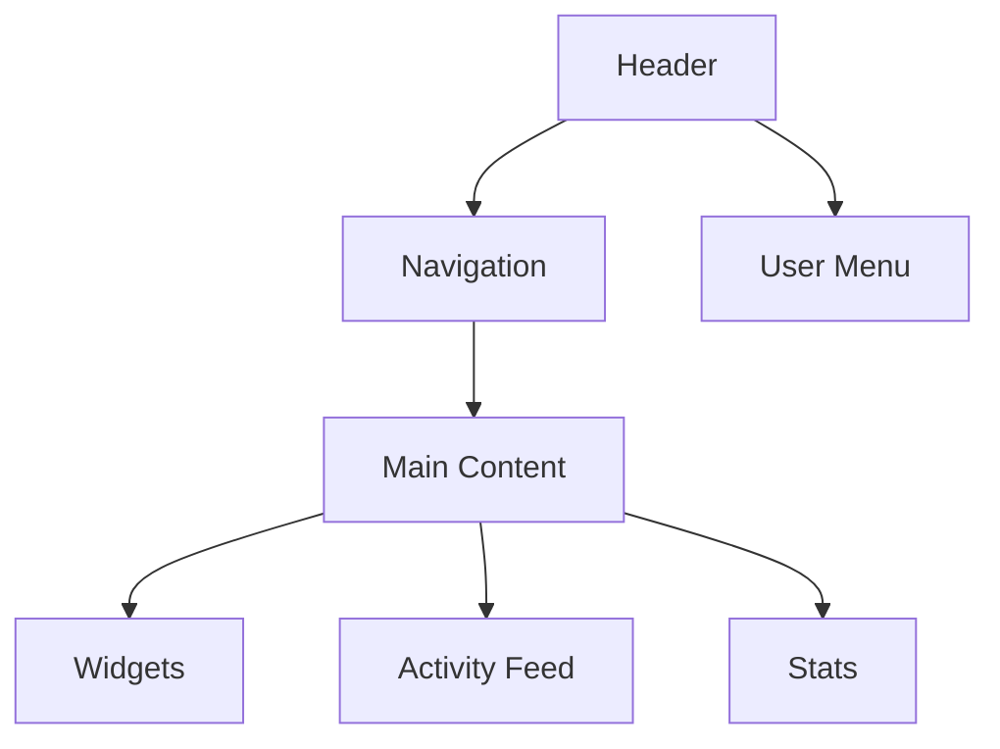
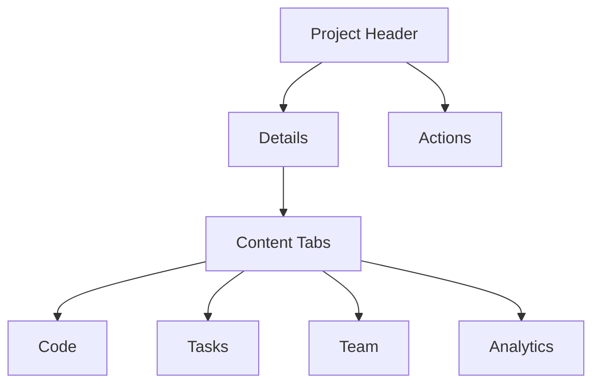
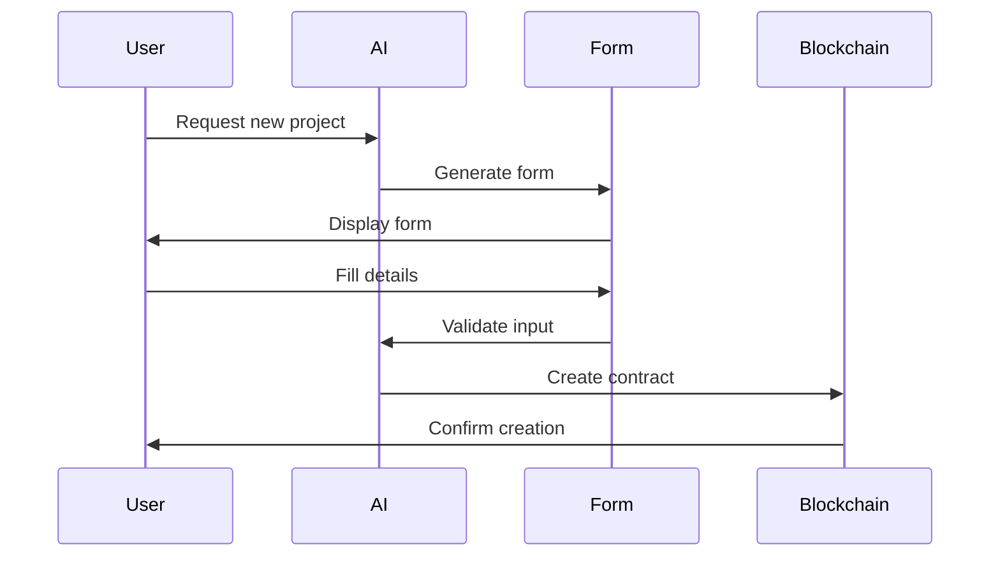

# UI/UX Design Documentation

## Design Philosophy

### Core Principles
1. **AI-First Interaction**
   - Natural language interface
   - Contextual assistance
   - Predictive suggestions
   - Adaptive learning

2. **Web3 Integration**
   - Seamless wallet connection
   - Transaction transparency
   - Blockchain status indicators
   - Gas optimization hints

3. **Community Focus**
   - Team collaboration tools
   - Social engagement features
   - Reputation system
   - Knowledge sharing

## User Interface Components

### 1. Navigation Structure


### 2. Component Library

#### Core Components
```typescript
// Button variants
interface ButtonProps {
    variant: 'primary' | 'secondary' | 'ghost';
    size: 'sm' | 'md' | 'lg';
    loading?: boolean;
    icon?: ReactNode;
    children: ReactNode;
}

// Card components
interface CardProps {
    title: string;
    subtitle?: string;
    image?: string;
    actions?: ReactNode[];
    children: ReactNode;
}

// Input components
interface InputProps {
    type: 'text' | 'number' | 'date';
    label: string;
    error?: string;
    helper?: string;
    value: string;
    onChange: (value: string) => void;
}
```

### 3. Page Layouts

#### Dashboard Layout


#### Project View Layout


## Interaction Patterns

### 1. AI Assistant Interface
```typescript
interface AIAssistant {
    // Visual components
    avatar: ReactNode;
    messageContainer: ReactNode;
    actionButtons: ReactNode[];
    
    // Interaction states
    isTyping: boolean;
    isListening: boolean;
    isProcessing: boolean;
    
    // Methods
    sendMessage(text: string): Promise<void>;
    startVoice(): Promise<void>;
    suggestActions(): Promise<Action[]>;
}
```

### 2. Project Creation Flow


### 3. Team Collaboration
```typescript
interface CollaborationTools {
    // Chat system
    chat: {
        sendMessage(msg: Message): void;
        startThread(topic: string): Thread;
        shareFile(file: File): void;
    };
    
    // Code review
    codeReview: {
        submitReview(code: string): Promise<Review>;
        addComment(comment: Comment): void;
        requestChanges(changes: Change[]): void;
    };
    
    // Task management
    tasks: {
        create(task: Task): void;
        assign(task: Task, user: User): void;
        updateStatus(task: Task, status: Status): void;
    };
}
```

## Visual Design System

### 1. Color Palette
```css
:root {
    /* Primary colors */
    --primary-100: #E3F2FD;
    --primary-500: #2196F3;
    --primary-900: #0D47A1;
    
    /* Secondary colors */
    --secondary-100: #F3E5F5;
    --secondary-500: #9C27B0;
    --secondary-900: #4A148C;
    
    /* Semantic colors */
    --success: #4CAF50;
    --warning: #FFC107;
    --error: #F44336;
    --info: #2196F3;
    
    /* Neutral colors */
    --neutral-100: #F5F5F5;
    --neutral-500: #9E9E9E;
    --neutral-900: #212121;
}
```

### 2. Typography
```css
:root {
    /* Font families */
    --font-primary: 'Inter', sans-serif;
    --font-code: 'Fira Code', monospace;
    
    /* Font sizes */
    --text-xs: 0.75rem;
    --text-sm: 0.875rem;
    --text-base: 1rem;
    --text-lg: 1.125rem;
    --text-xl: 1.25rem;
    --text-2xl: 1.5rem;
    
    /* Line heights */
    --leading-none: 1;
    --leading-tight: 1.25;
    --leading-normal: 1.5;
    --leading-loose: 2;
}
```

### 3. Spacing System
```css
:root {
    /* Spacing scale */
    --space-1: 0.25rem;
    --space-2: 0.5rem;
    --space-3: 0.75rem;
    --space-4: 1rem;
    --space-6: 1.5rem;
    --space-8: 2rem;
    --space-12: 3rem;
    --space-16: 4rem;
}
```

## Responsive Design

### 1. Breakpoints
```typescript
const breakpoints = {
    sm: '640px',
    md: '768px',
    lg: '1024px',
    xl: '1280px',
    '2xl': '1536px',
};

const mediaQueries = {
    sm: `@media (min-width: ${breakpoints.sm})`,
    md: `@media (min-width: ${breakpoints.md})`,
    lg: `@media (min-width: ${breakpoints.lg})`,
    xl: `@media (min-width: ${breakpoints.xl})`,
    '2xl': `@media (min-width: ${breakpoints['2xl']})`,
};
```

### 2. Layout Grid
```css
.grid-container {
    display: grid;
    grid-template-columns: repeat(12, 1fr);
    gap: var(--space-4);
    
    @media (max-width: 768px) {
        grid-template-columns: repeat(6, 1fr);
    }
    
    @media (max-width: 480px) {
        grid-template-columns: repeat(4, 1fr);
    }
}
```

## Animation System

### 1. Transition Presets
```typescript
const transitions = {
    fast: '100ms ease-in-out',
    normal: '200ms ease-in-out',
    slow: '300ms ease-in-out',
    
    entrance: {
        fade: 'fade 200ms ease-out',
        slideUp: 'slideUp 200ms ease-out',
        scale: 'scale 200ms ease-out',
    },
    
    exit: {
        fade: 'fade 150ms ease-in',
        slideDown: 'slideDown 150ms ease-in',
        scale: 'scale 150ms ease-in',
    },
};
```

### 2. Animation Keyframes
```css
@keyframes fade {
    from { opacity: 0; }
    to { opacity: 1; }
}

@keyframes slideUp {
    from {
        transform: translateY(20px);
        opacity: 0;
    }
    to {
        transform: translateY(0);
        opacity: 1;
    }
}

@keyframes scale {
    from {
        transform: scale(0.95);
        opacity: 0;
    }
    to {
        transform: scale(1);
        opacity: 1;
    }
}
```

## Accessibility Guidelines

### 1. ARIA Roles
```typescript
const ariaRoles = {
    navigation: 'navigation',
    main: 'main',
    complementary: 'complementary',
    banner: 'banner',
    contentinfo: 'contentinfo',
    search: 'search',
    form: 'form',
};
```

### 2. Focus Management
```typescript
const FocusTrap: React.FC = ({ children }) => {
    const ref = useRef<HTMLDivElement>(null);
    
    useEffect(() => {
        const element = ref.current;
        if (!element) return;
        
        const focusableElements = element.querySelectorAll(
            'button, [href], input, select, textarea, [tabindex]:not([tabindex="-1"])'
        );
        
        const firstFocusable = focusableElements[0];
        const lastFocusable = focusableElements[focusableElements.length - 1];
        
        // Focus trap implementation
    }, []);
    
    return <div ref={ref}>{children}</div>;
};
```

## Performance Optimization

### 1. Image Loading
```typescript
const ImageLoader: React.FC<ImageProps> = ({
    src,
    alt,
    sizes,
    loading = 'lazy',
}) => {
    return (
        <picture>
            <source
                srcSet={`${src}?w=400 400w, ${src}?w=800 800w`}
                sizes={sizes}
            />
            
        </picture>
    );
};
```

### 2. Component Code Splitting
```typescript
const DynamicComponent = dynamic(() => import('./Component'), {
    loading: () => <Skeleton />,
    ssr: false,
});
```

## Testing Guidelines

### 1. Component Testing
```typescript
describe('Button Component', () => {
    it('renders with different variants', () => {
        const { getByRole } = render(
            <Button variant="primary">Click me</Button>
        );
        
        const button = getByRole('button');
        expect(button).toHaveClass('btn-primary');
    });
    
    it('handles click events', () => {
        const onClick = jest.fn();
        const { getByRole } = render(
            <Button onClick={onClick}>Click me</Button>
        );
        
        fireEvent.click(getByRole('button'));
        expect(onClick).toHaveBeenCalled();
    });
});
```

### 2. Visual Regression Testing
```typescript
describe('Visual Regression', () => {
    it('matches screenshot', async () => {
        const { container } = render(<Component />);
        expect(container).toMatchImageSnapshot();
    });
}); 