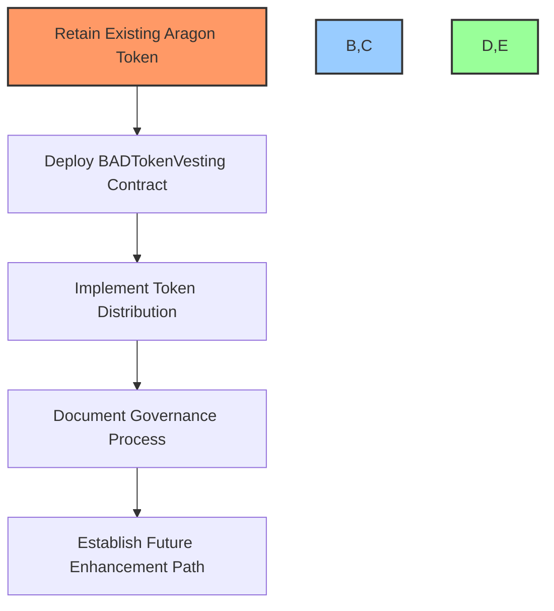
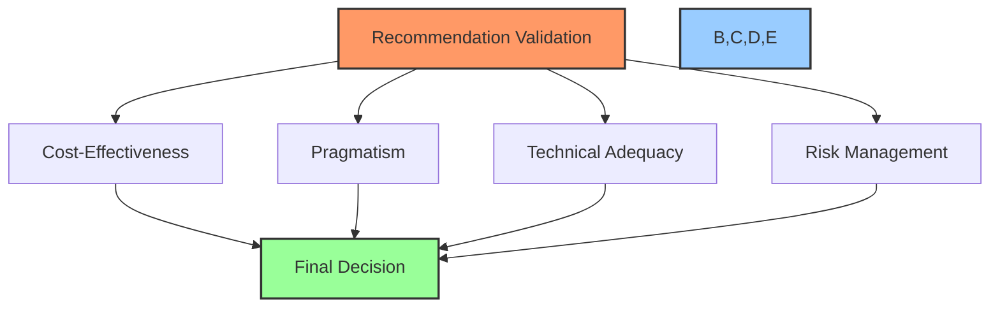
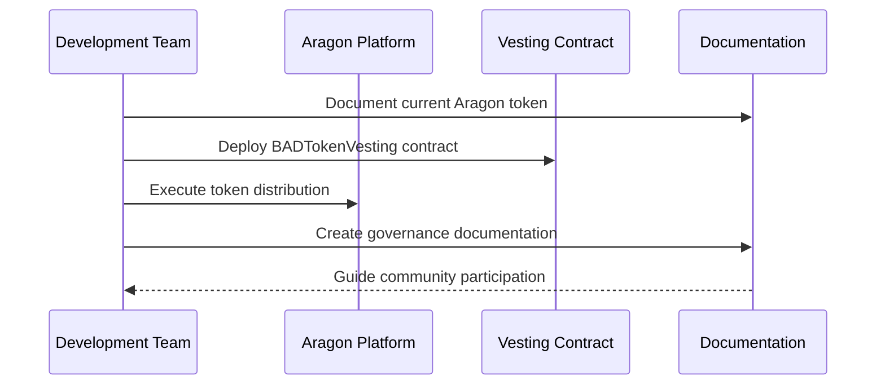

# 📊 BAD DAO Token Implementation Evaluation

## 📋 Table of Contents
- [🔍 Overview](#overview)
- [📈 Comparative Analysis](#comparative-analysis)
- [🔬 Detailed Analysis](#detailed-analysis)
  - [💰 Token Functionality](#1-token-functionality)
  - [🗳️ Governance Capabilities](#2-governance-capabilities)
  - [⏳ Vesting and Token Distribution](#3-vesting-and-token-distribution)
  - [🚀 Deployment and Cost Considerations](#4-deployment-and-cost-considerations)
  - [🔒 Security and Auditing](#5-security-and-auditing)
- [✅ Recommended Approach](#recommended-approach)
- [🧐 Validation of Recommendation](#validation-of-recommendation)
- [📝 Summary and Next Steps](#summary-and-next-steps)

## 🔍 Overview <a name="overview"></a>

This evaluation compares two options for the BAD DAO token implementation:
1. **Aragon's Current Implementation** - Using the existing token already deployed on Base network via Aragon's platform
2. **Custom Smart Contract Implementation** - Deploying the custom BADToken and supporting contracts developed in the bad-dao repository

Based on comprehensive analysis, **I recommend continuing with the Aragon implementation** with some targeted enhancements to address current limitations. This approach balances pragmatism, cost-effectiveness, and technical requirements while leveraging the work already completed.

[↑ Back to Top](#table-of-contents) | [→ Next: Comparative Analysis](#comparative-analysis)

## 📈 Comparative Analysis <a name="comparative-analysis"></a>

| Aspect | Aragon Implementation | Custom Implementation | Winner |
|--------|------------------------|------------------------|--------|
| **Current Status** | ✅ Already deployed on Base network | ❌ Not deployed, requires gas fees | Aragon |
| **Governance Integration** | ✅ Native integration with Aragon DAO | ⚠️ Requires custom integration work | Aragon |
| **Development Effort** | ✅ Minimal (already implemented) | ❌ Higher (deployment, testing, security audit needed) | Aragon |
| **Gas Costs** | ✅ Already paid | ❌ New costs for deployment | Aragon |
| **Token Standard** | ✅ ERC-20 with governance capabilities | ✅ ERC20Votes (OpenZeppelin) | Tie |
| **Custom Functionality** | ❌ Limited to Aragon's capabilities | ✅ Full customization possible | Custom |
| **Vesting Support** | ❌ No built-in vesting | ✅ BADTokenVesting contract available | Custom |
| **Mint Capability** | ⚠️ Depends on Aragon configuration | ✅ Owner-controlled mint function | Custom |
| **Security** | ✅ Aragon's battle-tested contracts | ⚠️ Requires audit | Aragon |
| **Long-term Flexibility** | ❌ Limited by Aragon's platform | ✅ Full control and extensibility | Custom |

[↑ Back to Top](#table-of-contents) | [← Previous: Overview](#overview) | [→ Next: Detailed Analysis](#detailed-analysis)

## 🔬 Detailed Analysis <a name="detailed-analysis"></a>

### 💰 Token Functionality <a name="1-token-functionality"></a>

**Aragon Implementation:**
- ✅ Standard ERC-20 token with governance capabilities
- 🖥️ Created through Aragon's user-friendly interface
- 📝 Token parameters (name, symbol, supply) already set
- 👤 Current holder is the wallet that created the Aragon DAO

**Custom Implementation:**
- ✅ ERC20Votes token (OpenZeppelin implementation)
- 💯 1,000,000 initial supply with 18 decimals
- 🔄 Owner-controlled mint function for future adjustments
- 🛠️ Full customization possibilities
- 🚀 Requires deployment and setup

**Analysis:** Both implementations provide the core token functionality needed for governance. The custom implementation offers more flexibility, but the Aragon implementation is already deployed and functional.

[↑ Back to Top](#table-of-contents) | [→ Next: Governance Capabilities](#2-governance-capabilities)

### 🗳️ Governance Capabilities <a name="2-governance-capabilities"></a>

**Aragon Implementation:**
- 🔌 Native integration with Aragon governance system
- ⚙️ Pre-configured voting parameters
- 👥 User-friendly interface for proposal creation and voting
- 🔒 Limited customization options

**Custom Implementation:**
- 🧩 BADGovernor contract based on OpenZeppelin Governor
- ⏱️ BADTimelock contract for proposal execution delay
- 🔧 Highly configurable parameters
- 🖥️ Requires front-end development for user interaction

**Analysis:** The Aragon implementation offers a ready-to-use governance system with minimal development overhead. The custom implementation provides more control but requires significant development effort for the governance UI.

[↑ Back to Top](#table-of-contents) | [← Previous: Token Functionality](#1-token-functionality) | [→ Next: Vesting and Token Distribution](#3-vesting-and-token-distribution)

### ⏳ Vesting and Token Distribution <a name="3-vesting-and-token-distribution"></a>

**Aragon Implementation:**
- ❌ No built-in vesting capabilities
- 🔄 Manual distribution to different wallets
- 📝 Manual tracking of vesting schedules off-chain

**Custom Implementation:**
- ✅ BADTokenVesting contract for programmatic vesting
- ⏱️ Configurable vesting schedules with cliff periods
- 🔄 Revocable vesting options for team members
- 🤖 Automated release of tokens based on vesting schedule

**Analysis:** The custom implementation offers a significant advantage in token vesting and distribution. However, this can be achieved through a hybrid approach where the existing Aragon token is used with a separate vesting contract.

[↑ Back to Top](#table-of-contents) | [← Previous: Governance Capabilities](#2-governance-capabilities) | [→ Next: Deployment and Cost Considerations](#4-deployment-and-cost-considerations)

### 🚀 Deployment and Cost Considerations <a name="4-deployment-and-cost-considerations"></a>

**Aragon Implementation:**
- ✅ Already deployed on Base network
- 💰 No additional gas costs
- 🏗️ Infrastructure already in place

**Custom Implementation:**
- 📋 Requires deployment of multiple contracts
- 💸 Gas costs for contract deployment
- 🧪 Testing and verification costs
- ⏱️ Additional time for deployment and setup

**Analysis:** The Aragon implementation has clear advantages in terms of current deployment status and cost savings. Redeploying would incur unnecessary gas costs and development time.

[↑ Back to Top](#table-of-contents) | [← Previous: Vesting and Token Distribution](#3-vesting-and-token-distribution) | [→ Next: Security and Auditing](#5-security-and-auditing)

### 🔒 Security and Auditing <a name="5-security-and-auditing"></a>

**Aragon Implementation:**
- ✅ Aragon contracts are well-audited and battle-tested
- 🛡️ Lower risk of security vulnerabilities
- 👥 Community-reviewed code

**Custom Implementation:**
- 🧪 Would require security audit
- ⚠️ Potential for undetected vulnerabilities
- 🔍 Custom code increases risk surface

**Analysis:** The Aragon implementation offers security advantages due to its well-established codebase. The custom implementation would require a thorough security audit before deployment.

[↑ Back to Top](#table-of-contents) | [← Previous: Deployment and Cost Considerations](#4-deployment-and-cost-considerations) | [→ Next: Recommended Approach](#recommended-approach)

## ✅ Recommended Approach <a name="recommended-approach"></a>

**Recommendation: Continue with the Aragon implementation while addressing its limitations through complementary contracts.**

### 🛠️ Implementation Plan



1. **🔄 Retain Existing Aragon Token**
   - Continue using the already deployed token on Base network
   - Save gas costs and development time

2. **⏳ Deploy BADTokenVesting Contract**
   - Deploy only the vesting contract to handle team and advisor allocations
   - Connect it to the existing Aragon token
   - This provides the vesting functionality missing in Aragon

3. **🏦 Implement Token Distribution**
   ```mermaid
   pie
       title "BAD Token Distribution"
       "Core Team" : 40
       "Community" : 30
       "Treasury" : 20
       "Advisors & Partners" : 10
   ```
   - Transfer 40% of tokens to the vesting contract for team allocation
   - Transfer 20% to the DAO treasury
   - Reserve 30% for community distribution
   - Allocate 10% for advisors

4. **📝 Document Governance Process**
   - Create detailed documentation for governance participation
   - Document token distribution and vesting schedules
   - Establish clear governance parameters within Aragon's constraints

5. **🔄 Future Enhancement Path**
   - If limitations become critical in the future, prepare for a token migration
   - Document potential migration plan for token holders

[↑ Back to Top](#table-of-contents) | [← Previous: Security and Auditing](#5-security-and-auditing) | [→ Next: Validation of Recommendation](#validation-of-recommendation)

## 🧐 Validation of Recommendation <a name="validation-of-recommendation"></a>



1. **💰 Cost-Effectiveness**
   - Reuses existing deployed contracts, saving gas costs
   - Minimizes additional development effort

2. **🧠 Pragmatism**
   - Leverages work already completed
   - Balances immediate needs with future flexibility

3. **🛠️ Technical Adequacy**
   - Addresses the core requirement of a governance token
   - Provides a solution for vesting through a hybrid approach

4. **🛡️ Risk Management**
   - Reduces deployment risk by using established contracts
   - Minimizes potential for errors or vulnerabilities

[↑ Back to Top](#table-of-contents) | [← Previous: Recommended Approach](#recommended-approach) | [→ Next: Summary and Next Steps](#summary-and-next-steps)

## 📝 Summary and Next Steps <a name="summary-and-next-steps"></a>

The Aragon implementation offers a pragmatic, cost-effective solution that leverages the work already done. While the custom implementation provides more flexibility, the benefits do not outweigh the costs and risks of redeployment.

### 🚀 Next Steps Sequence



1. 📝 Document the current Aragon token address and parameters
2. 🚀 Deploy the BADTokenVesting contract to work with the existing token
3. 🔄 Execute the token distribution plan
4. 📊 Create governance documentation to guide community participation

This hybrid approach delivers the best of both worlds: the security and simplicity of Aragon with the vesting capabilities of the custom implementation.

[↑ Back to Top](#table-of-contents) | [← Previous: Validation of Recommendation](#validation-of-recommendation)
