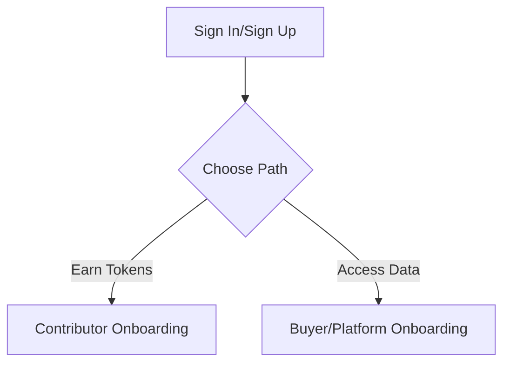
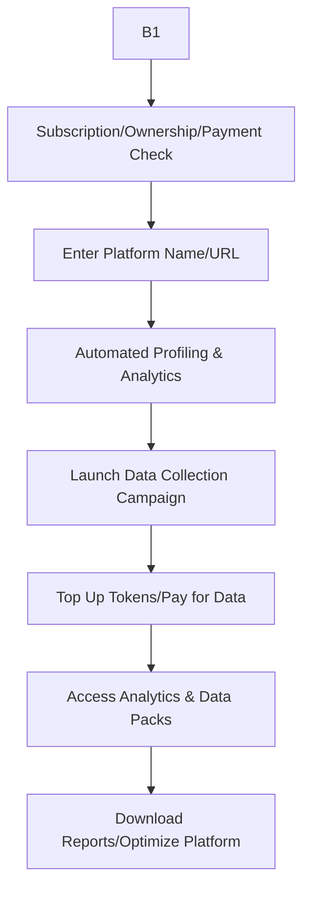
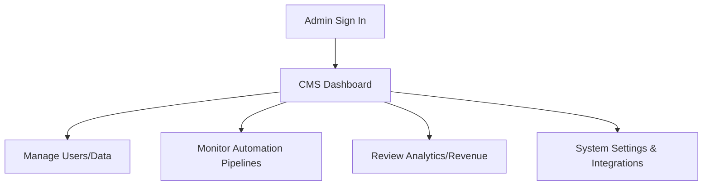
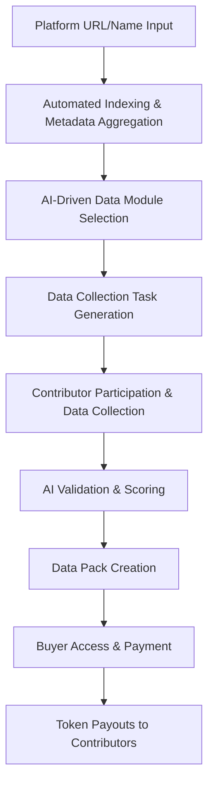

# 🪙 Data Mint – Automated Data Collection & Analytics Platform

## 📋 Overview
Data Mint is an automated, AI-powered platform for minting, valuing, and selling data. It enables organizations, platforms, and DAOs to gather, refine, and monetize valuable user feedback, market data, and platform analytics—rewarding contributors with tokens and providing advanced analytics to platform owners, developers, and data brokers.

---

## 🎯 Purpose & Value Proposition
- **For Contributors (Earn Tokens):**
  - Earn tokens for contributing data (via surveys, platform evaluations, and other data streams)
  - Cash out tokens for USDT/USDC, platform tokens, or other rewards (once sponsor pays)
  - Participate in non-intrusive, valuable data collection that helps shape products and services
- **For Data Buyers (Access Data):**
  - Access fresh, validated, and cross-platform analytics and insights
  - Launch targeted data collection campaigns (surveys, evaluations, etc.)
  - Pay for data access (subscription, platform ownership, or direct purchase)
  - Data is owned by Data Mint; platform owners can opt in to sell with us, but by accessing/buying data, users agree it is not theirs
- **For the DAO:**
  - Generate recurring revenue from data sales, analytics subscriptions, and platform partnerships
  - Grow community engagement and value through incentivized participation

---

## 🛠️ Business Model & Revenue Streams
- **Data Sales:** Data buyers pay to access analytics, reports, and raw data
- **Token Top-Ups:** Sponsors/platforms buy tokens to activate contributor payouts
- **Subscription Plans:** Recurring revenue for ongoing analytics and data access
- **Premium Analytics:** Advanced reporting, cross-platform insights, and AI-driven recommendations
- **Referral/Lead Gen:** Commissions for contributors who refer new clients, contributors, or sponsors

---

## 🔄 User & Buyer Flows
### 👤 Contributor Flow (Earn Tokens)
1. Sign up (Google/crypto wallet)
2. Choose "Earn Tokens" path
3. Onboarding tooltip guides user
4. Browse available data contribution opportunities (surveys, evaluations, etc.)
5. Contribute data (voice/text/screenshots/metadata)
6. Earn tokens (tracked in dashboard)
7. Cash out tokens once sponsor tops up (USDT/USDC, platform token, etc.)
8. Refer others for bonus tokens/commissions

### 🏢 Data Buyer/Platform Flow (Access Data)
1. Sign up (Google/crypto wallet)
2. Choose "Access Data" path
3. Must have a subscription, be a platform owner, or pay for data access
4. Enter platform name/URL (for platform owners)
5. Automated platform profiling and analytics setup
6. Launch data collection campaign (surveys, evaluations, etc.)
7. Top up tokens/pay for data
8. Access analytics, reports, and data packs
9. Download/export data and optimize platform

### 🛡️ Data Ownership & Rights
- Data Mint owns all collected data
- Platform owners can opt in to sell data with us (revenue share)
- If platform owners opt out, Data Mint retains the right to sell data independently
- By accessing/buying data, users agree they are purchasing access, not ownership

---

## 🖥️ UI/UX Design Principles
- **Grid Layout:** Modern, responsive grid with banners for top data opportunities and analytics
- **Onboarding Tooltips:** User-friendly pop-ups guiding new users through the interface
- **Seamless Sign-In:** One-click sign-in with Google or crypto wallet; users can immediately choose their path
- **Two Main Paths:**
  - **Earn Tokens:** Contribute data, take surveys, participate in evaluations
  - **Access Data:** Buy analytics, launch campaigns, or access as a platform owner
- **Three User Types:**
  - **Contributor:** Earns tokens for data
  - **Data Buyer/Platform Owner:** Accesses analytics, launches campaigns
  - **Admin:** CMS and system management for platform operations
- **Voice Input:** All data entry supports voice-to-text for accessibility and speed

---

## 🤖 Full Automation & Platform Discovery
- **Automated Platform Indexing:** Owner/developer enters a platform name or URL; system auto-discovers, indexes, and profiles the platform
- **Metadata Aggregation:** Automated research gathers pricing, user estimates, features, and all available metadata
- **Template-Based Data Modules:**
  - Pre-built templates for onboarding, customer support, UX, etc.
  - Dynamic placeholders auto-fill platform-specific details
  - Contributors answer with text, screenshots, timestamps, and voice input
- **Automated Data Collection:** AI creates and assigns data collection tasks based on platform type and buyer needs
- **Automated Data Pack Creation:** Data is packaged and sold to buyers for business development, marketing, and analytics

---

## 🗺️ Workflow Diagrams

### Entry Point & User Path Selection


### Contributor Flow
```mermaid
flowchart TD
    U1 --> U2[Browse Data Opportunities]
    U2 --> U3[Contribute Data (Voice/Text/Screenshot)]
    U3 --> U4[Earn Tokens]
    U4 --> U5[Cash Out (if sponsor paid)]
    U4 --> U6[Refer Others]
```

### Data Buyer/Platform Flow


### Admin Flow


### Automation Pipeline


---

## 🧩 Business Development & Data Value
- **Data Packs:** Buyers purchase actionable data for onboarding, customer support, UX, and more
- **AI-Driven Insights:** Automated suggestions for platform optimization, marketing, and business development
- **Revenue Model:** Data packs, subscriptions, and token top-ups
- **Buyer Benefits:**
  - Understand user onboarding, support, and engagement
  - Receive actionable recommendations (e.g., load balancing, feature requests)
  - Optimize for marketing, analytics, and business growth

---

## 🛒 Data Marketplace & Shopping Cart Experience

### 🎨 Marketplace Layout & Navigation
- **Seamless Grid Layout:**
  - Uncluttered, modern grid with strategic categories (user data, social analytics, platform analytics, investor/sponsor/partnership reviews, etc.)
  - Each data pack is presented as a clean, icon-driven card with 3D layering and clear visual cues
- **Quick Data Access:**
  - Timers show how long until each data pack is ready
  - Real-time status updates for data collection and analysis
  - Cost per token is clearly displayed for each data pack or add-on
- **Money-Back Guarantee:**
  - All data packs come with a quality guarantee (validated, no hallucinations, source-backed)
- **Goal-Oriented Navigation:**
  - Platform owners start by selecting their business goal (e.g., grow user base, increase engagement, optimize UX, get investor/sponsor reviews)
  - Marketplace suggests relevant data packs and add-ons to achieve those goals
- **Add-Ons & Premium Features:**
  - Social analytics, deep learning insights, partnership reviews, and more are available as premium or subscription-based add-ons
  - Add-ons are seamlessly integrated—no clutter, no overwhelming price lists
- **Shopping Cart & Checkout:**
  - Simple, intuitive cart for selecting multiple data packs/add-ons
  - Transparent pricing, token usage, and payment options (subscription, one-time, etc.)
- **Actionable Outcomes:**
  - Each data pack includes recommendations and use cases (e.g., "Use this data to grow your following by 10%" or "Optimize your onboarding for higher conversion")
  - Data Mint is not just about data—it's about enabling business growth and real-world results

### 🧭 Example Data Pack Categories
- **User Data:** Onboarding feedback, user experience, satisfaction scores
- **Social Analytics:** Social media engagement, sentiment analysis, influencer mapping
- **Platform Analytics:** Usability, UI/UX, feature adoption, performance metrics
- **Investor Reviews:** Feedback from real investors, readiness assessments
- **Sponsor/Partnership Reviews:** Attractiveness to sponsors, partnership opportunities
- **Custom Add-Ons:** Deep learning insights, cross-platform analysis, network recommendations

### 🖼️ UI/UX Principles
- **Modern, Icon-Driven Cards:** Each data pack/add-on is visually distinct, easy to scan
- **3D Layering & Visual Depth:** Subtle 3D effects for a premium, high-tech feel
- **No Clutter:** Minimalist, focused design—no endless price lists or overwhelming options
- **Guided Experience:** Tooltips, onboarding, and goal-based suggestions help users find the right data quickly

---

*All workflows and documentation follow enhanced documentation workflow and formatting standards. For more, see `_PM/BD-project-managment.md`.* 