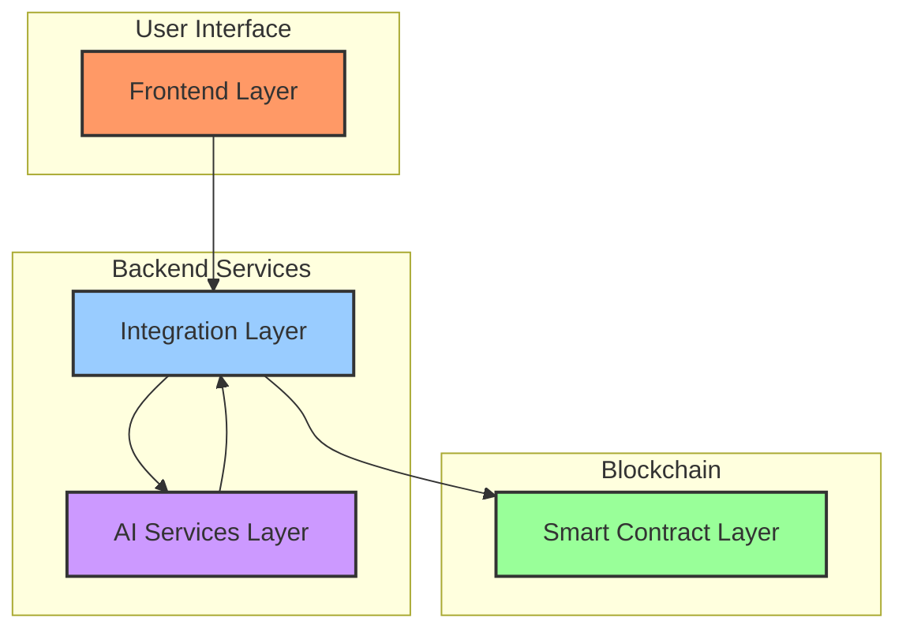
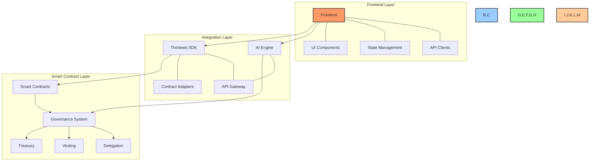
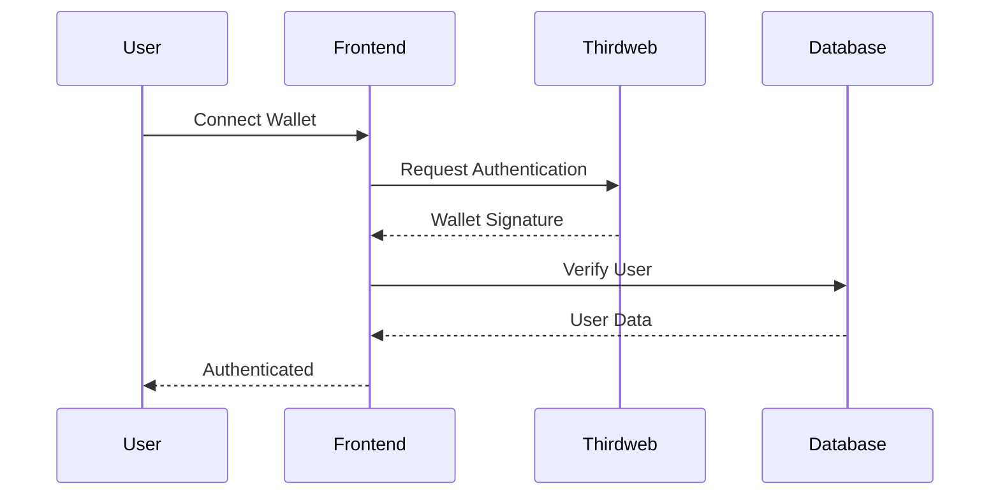
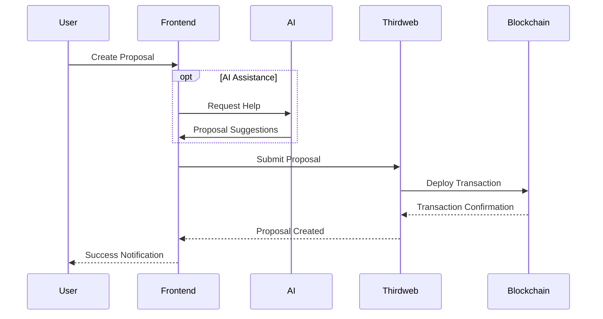
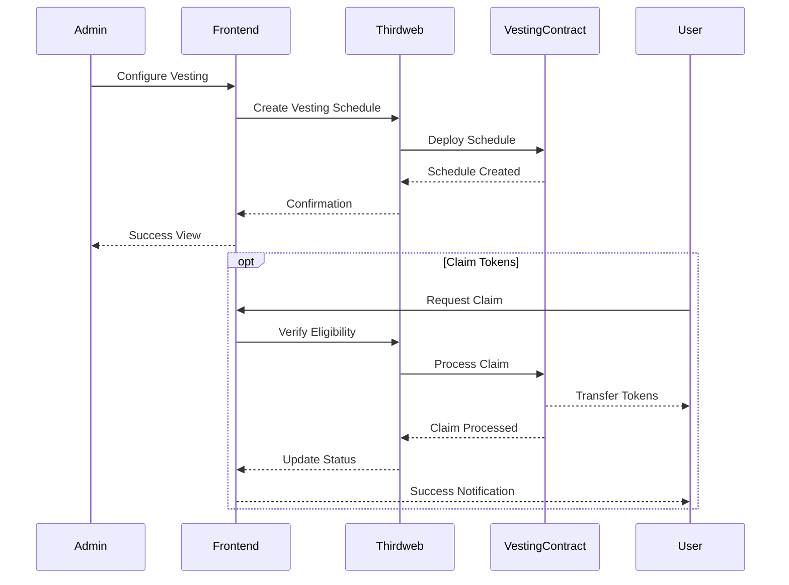
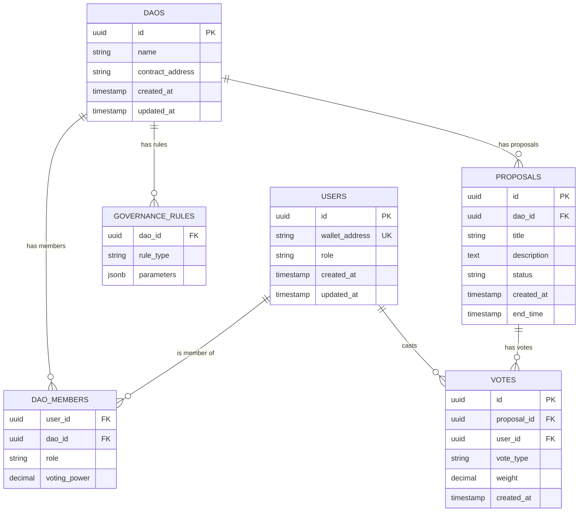
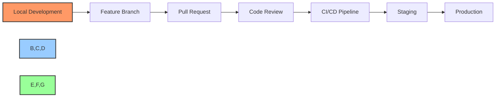
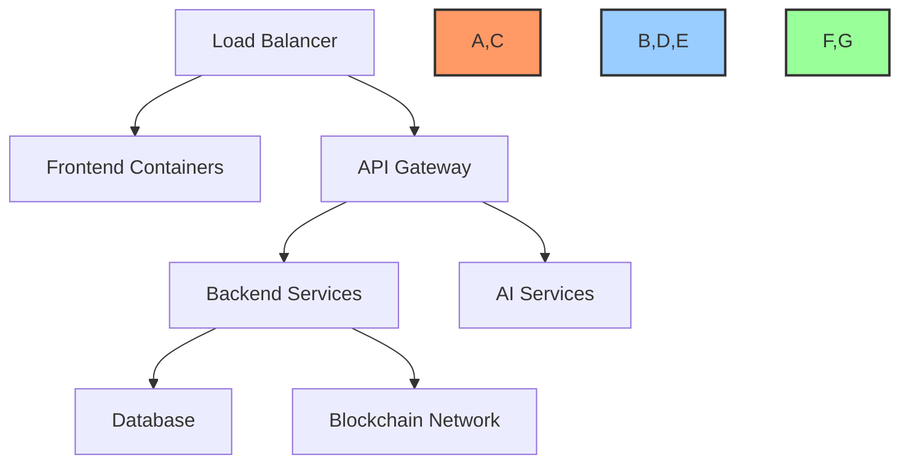
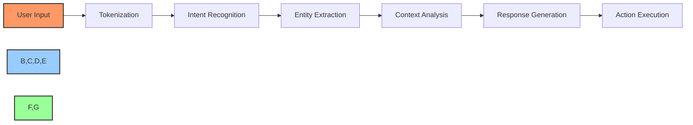
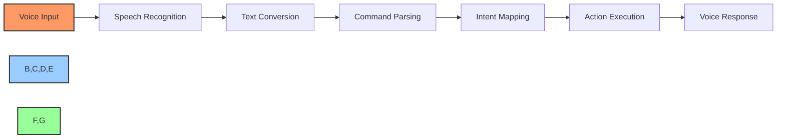

# 🏗️ BAD DAO UI - Architecture Documentation

## 🔍 Overview

The BAD DAO UI is a no-code/low-code platform for managing decentralized autonomous organizations (DAOs). It provides a comprehensive interface for DAO governance, treasury management, token vesting, and voting power delegation, all integrated with advanced AI capabilities for improved usability and governance assistance.

## 🏛️ System Architecture

The system is built using a modern, modular architecture with clearly separated concerns between the frontend, integration layer, and smart contract layers.

### High-Level Architecture Diagram



### Detailed Component Architecture



## 📦 Component Descriptions

### Frontend Layer

The frontend layer is built using Next.js 14, React, and Tailwind CSS with shadcn/ui components, providing a responsive and user-friendly interface for DAO management.

| Component | Description | Status |
|-----------|-------------|--------|
| **UI Components** | Reusable React components following shadcn/ui design system | 🟡 In Progress |
| **State Management** | Redux Toolkit for centralized state management | 🟡 In Progress |
| **API Clients** | Services to communicate with backend APIs | 🟡 In Progress |
| **Feature Modules** | Governance, Treasury, Vesting, and Delegation interfaces | 🔴 Not Started |
| **AI Integration** | Voice commands and AI-assisted actions | 🔴 Not Started |

### Integration Layer

The integration layer connects the frontend with blockchain smart contracts and provides AI processing capabilities.

| Component | Description | Status |
|-----------|-------------|--------|
| **Thirdweb SDK** | Facilitates blockchain interactions and contract management | 🟡 In Progress |
| **Contract Adapters** | Type-safe wrappers around smart contract functions | 🟡 In Progress |
| **API Gateway** | Unified API management for various services | 🔴 Not Started |
| **AI Engine** | Processes natural language and voice commands | 🔴 Not Started |
| **Authentication Service** | Wallet-based authentication and session management | 🔴 Not Started |

### Smart Contract Layer

The smart contract layer handles on-chain governance, treasury management, vesting, and delegation functions through Thirdweb-managed contracts.

| Component | Description | Status |
|-----------|-------------|--------|
| **Governance Contracts** | DAO proposal and voting mechanisms | 🔴 Not Started |
| **Treasury Contracts** | Management of DAO financial resources | 🔴 Not Started |
| **Vesting Contracts** | Token vesting schedules and distributions | 🔴 Not Started |
| **Delegation Contracts** | Voting power delegation mechanisms | 🔴 Not Started |
| **Multi-sig** | Multi-signature security for high-value transactions | 🔴 Not Started |

### AI Services Layer

The AI services layer provides intelligent assistance for governance activities and improved user interactions.

| Component | Description | Status |
|-----------|-------------|--------|
| **NLP Pipeline** | Natural language processing for commands and queries | 🔴 Not Started |
| **Voice Recognition** | Web Speech API integration for voice commands | 🔴 Not Started |
| **Proposal Generator** | AI-assisted governance proposal creation | 🔴 Not Started |
| **Context Analyzer** | Contextual awareness for better assistance | 🔴 Not Started |

## 🔄 Data Flow Diagrams

### User Authentication Flow



### Governance Proposal Flow



### Vesting Schedule Management Flow



## 🔌 API Architecture

The system exposes several API endpoints for frontend-backend communication:

### Smart Contract Deployment API

```
POST /api/deploy-contract
Content-Type: application/json

{
  "contractType": "governance" | "vesting" | "delegation" | "treasury",
  "params": {
    // Contract-specific parameters
  }
}

Response:
{
  "contractAddress": "0x...",
  "transactionHash": "0x...",
  "deploymentStatus": "success" | "failed",
  "metadata": {}
}
```

### Contract Interaction API

```
POST /api/contract-interaction
Content-Type: application/json

{
  "contractAddress": "0x...",
  "method": "createProposal" | "vote" | "delegate" | "withdraw",
  "params": {
    // Method-specific parameters
  }
}

Response:
{
  "transactionHash": "0x...",
  "status": "success" | "pending" | "failed",
  "result": {},
  "events": []
}
```

### AI Processing API

```
POST /api/generate-proposal
Content-Type: application/json

{
  "prompt": "Create a proposal to increase treasury allocation for marketing",
  "context": {
    "daoId": "123",
    "currentTreasury": 100000,
    "existingProposals": []
  }
}

Response:
{
  "proposalTitle": "Increase Marketing Budget by 10%",
  "proposalDescription": "...",
  "proposalParameters": {},
  "confidence": 0.92
}
```

## 🗄️ Database Architecture

The BAD DAO UI uses a relational database to store user data, DAO configurations, and off-chain information.

### Entity Relationship Diagram



## 🛠️ Technology Stack

### Frontend Technologies
- **Framework**: Next.js 14
- **UI Library**: React 18
- **State Management**: Redux Toolkit
- **Styling**: Tailwind CSS 3.3+
- **Component Library**: shadcn/ui
- **Testing**: Jest + React Testing Library

### Backend/Integration Technologies
- **Blockchain SDK**: Thirdweb SDK v4
- **Smart Contracts**: Solidity (EVM compatible)
- **API**: RESTful + GraphQL
- **Authentication**: Wallet-based (EIP-4361)
- **Database**: PostgreSQL

### AI Technologies
- **NLP**: OpenAI API
- **Voice Recognition**: Web Speech API
- **Context Processing**: Custom NLP Pipeline
- **Proposal Generation**: Finetuned Language Model

## 🔒 Security Architecture

### Authentication & Authorization

The system implements secure authentication using blockchain wallet signatures:

1. User initiates wallet connection
2. Backend generates a random nonce
3. User signs the nonce with their private key
4. Backend verifies the signature and issues a session token
5. All subsequent requests include the session token
6. Role-based access control enforces permissions

### Multi-Signature Security

Critical transactions require multiple approvals:

1. Transaction is proposed
2. Required signers receive notification
3. Each signer independently reviews and signs
4. Transaction executes only after threshold signatures
5. All signing activities are logged for audit

### Data Protection

- **Encryption**: Sensitive data encrypted at rest and in transit
- **Private Keys**: Never stored on server, managed by user wallets
- **API Security**: Rate limiting, input validation, CORS
- **Smart Contract Security**: Audited contracts with emergency recovery
- **Infrastructure**: Secure deployment with least privilege access

## 🔄 Development & Deployment Architecture

### Development Workflow



### CI/CD Pipeline

1. **Build Stage**: Compile and build frontend and backend
2. **Test Stage**: Run unit and integration tests
3. **Contract Stage**: Deploy and test contracts in testnet
4. **Deploy Stage**: Deploy to staging or production
5. **Verify Stage**: Run post-deployment verification

### Deployment Architecture

The application is deployed using a containerized architecture in a scalable cloud environment:



## 📊 Performance Architecture

### Response Time Targets
- **Page Load**: < 2 seconds
- **Transaction Submission**: < 3 seconds
- **Contract Interaction**: < 5 seconds
- **AI Processing**: < 3 seconds
- **Voice Command**: < 2 seconds

### Scalability Design
- **Horizontal Scaling**: Container orchestration for dynamic scaling
- **Database Scaling**: Read replicas and sharding for high load
- **Caching Strategy**: Multi-layer caching for blockchain data
- **Asynchronous Processing**: Background workers for long-running tasks

### Throughput Capacity
- **Transactions**: 1000 TPS
- **API Requests**: 10,000 RPS
- **AI Requests**: 100 RPS
- **Voice Processing**: 50 RPS

## 🔄 Interaction with Other Systems

### External Integrations
- **Blockchain Networks**: Ethereum, Polygon, other EVM chains
- **Thirdweb Ecosystem**: Contract deployment and management
- **OpenAI API**: Advanced language processing
- **External Data Sources**: Market data, governance metrics

### Integration Patterns
- **API Gateway**: Single entry point for all external services
- **Event-Driven**: Message queues for asynchronous processing
- **Webhook Support**: Notifications for external systems
- **OAuth**: Integration with identity providers

## 🧠 AI Architecture

### NLP Pipeline



### Voice Command Architecture



## 🔄 Cross-References

- See [dev-notes.md](../dev-notes.md) for detailed technical specifications
- See [technical/api-documentation.md](./api-documentation.md) for API details
- See [technical/data-model.md](./data-model.md) for detailed database schema
- See [blockchain/contract-specs.md](../blockchain/contract-specs.md) for smart contract specifications
- See [technical/security.md](./security.md) for security implementation details

---

**Last Updated:** 2025-05-02  
**Maintained By:** PowerBridge.AI Team

---

Made with Power, Love, and AI •  ⚡️❤️🤖 •  POWERBRIDGE.AI 